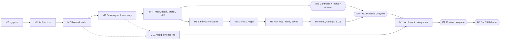

# Bus Driver — Implementation Roadmap

> **Status:** v1.0 · 2026-09-29 · **the authoritative spec for building the game.**
> This document replaces `docs/GAME_SPEC.md` (v4) and absorbs the fixes from `docs/BusDriver-architecture-review.md`. `docs/ART_CONTRACT.md` stays as the artist-facing guide; its technical content is defined here in **Appendix A**, and **if the two disagree, this document wins.**
>
> **Goal:** a finished, playable horror game released on itch.io. The first major gate is **G1 — Playable Greybox** (end of Phase A). In Phase B, artist models and audio replace the greybox views with **no gameplay code changes**. Phase C is the release.
>
> **How to read it:**
> - §0 explains how to work from this document.
> - §1 defines the product.
> - §2 gives the complete game rules.
> - §3 has the Route 1 data.
> - §4 is the architecture.
> - §5 is the roadmap: milestones broken into tickets with dependencies and blockers.
> - §6 tracks status.
> - Appendices: A is the art and audio contract, B maps existing code to its fate, C is the glossary, D holds ideas that are out of scope.

---

## 0. How to use this document

### 0.1 Authority
1. **Precedence:** this document, then the code and data assets it describes, then everything else. A design change is made **here first** (or in the same change as the code), and gets a new row in the decisions log (§1.6).
2. **Seeding:** numbers marked **[TUNE]** are first-pass values. They're seeded into data assets once (§4.15). After that, the asset is the runtime source of truth, and this document records the *initial* value and the *meaning* of each field.
3. **Keywords:** **MUST / SHOULD / MAY** follow RFC 2119. Anything not marked MUST is negotiable within its ticket.

### 0.2 Conventions
| Mark | Meaning |
|---|---|
| **[TUNE]** | A first-pass number. Change it in the data asset, not in code |
| **[HUMAN]** | A step that needs a person: an account, an installation, Unity Editor UI that has no scripting API, or a playtest |
| **[ART] / [AUDIO]** | Blocked until an artist or audio engineer delivers assets that meet Appendix A |
| **[DECISION]** | A call the team still has to make. There are very few; each has a default the implementer uses if nobody answers |
| `T-Mx-nn` | A ticket ID (§5) |
| `Dnn` | A decision ID (§1.6) |
| `§x.y` | A section of this document |

Money is always **integer cents** in code and data (`350` = $3.50). Distances are metres, times are seconds, and angles are degrees unless stated otherwise.

### 0.3 Protocol for the implementing agent
Follow these rules when implementing from this document, whether you're an AI agent or a person:
1. **Read first.** Before the first ticket, read §0–§4 in full. Before each ticket, re-read the sections it cites.
2. **Order.** Work one ticket at a time, following the dependency graph (§5.0). Tickets with no dependency on each other may go in any order. Don't start a ticket whose **Depends on** list isn't complete.
3. **Blockers.** If a ticket has an unresolved **[HUMAN] / [ART] / [AUDIO]** blocker, skip it. Continue with the next unblocked ticket and **report the blocker** in your summary. Never fake a blocked step. Placeholders are allowed only where the ticket says so.
4. **Generated vs owned files** (§4.15):
   - Never hand-edit anything under `Assets/Generated/`; change the builder and re-run it.
   - Never write under `Assets/Art/` except in Phase B tickets that say exactly what may be written.
   - Data assets under `Assets/Data/` are seeded once, then edited directly (YAML edits are fine). Never silently reseed them.
5. **Unity batch mode** only works while the Editor has the project closed. Check `BusDriver/Temp/UnityLockfile` first. If the Editor is open, use the Unity CLI recompile path (§0.5) for compile checks, and ask the human before anything that takes over their Editor session.
6. **Ambiguity.** Choose the simplest reading that is consistent with the pillars (§1.2). Record it as a new `Dnn (agent)` row, then continue. Don't stall.
7. **Scope.** Implement what the ticket says. Ideas go to Appendix D, not into the code.
8. **Keep this document true.** If a ticket renames something, changes a number's meaning, or changes behaviour, update this document in the same change. Tick the ticket in §6.
9. **Git:**
   - The human owns branches.
   - Don't create, switch, merge or reset branches unless asked.
   - Commit only if the human asked for commits in this session. Otherwise, leave the tree ready to commit and give a suggested commit message for each ticket.
   - Before starting work, check that the branch actually contains the tickets this one depends on.
10. **Code style.** Match the existing code:
    - 4 spaces, K&R braces with `}else {`
    - comments explain *why*, not what
    - `namespace BusDriver.<Assembly>[.<Area>]`.

    Also the hard rules of §4.1.

### 0.4 Definition of Done (every ticket)
- [ ] It compiles with **zero errors** and **no new warnings** in the `BusDriver.*` assemblies.
- [ ] **All EditMode tests pass.** New logic in a pure-C# core ships with EditMode tests.
- [ ] The ticket's **Acceptance** items are met. The automated ones are backed by a named test.
- [ ] If the ticket touches play: the relevant PlayMode test or smoke scenario passes, with **no Console errors or exceptions**.
- [ ] If the ticket touches builders: `BuildAll` succeeds from a clean `Assets/Generated/`.
- [ ] No `Find*`, `GameObject.Find`, `SendMessage` or new static mutable state in runtime code (§4.1).
- [ ] This document is updated (names, numbers, the status tracker in §6).

A **milestone** is done when all its tickets are done, `tools/verify.sh full` passes (§0.5), and its **Milestone acceptance** is met.

### 0.5 Verification commands
- The Unity project root is `BusDriver/`. The Editor binary on the lead's Mac is `/Applications/Unity/Hub/Editor/6000.6.0f1/Unity.app/Contents/MacOS/Unity`. Scripts read `UNITY_PATH` and fall back to that path.
- T-M0-10 creates `tools/verify.sh` with these modes:

| Mode | What it runs |
|---|---|
| `quick` | Compile (batch mode, `-quit`), then EditMode tests |
| `content` | `BusDriver.Editor.Builders.BuildAll.Run` (all builders), then EditMode tests |
| `playmode` | PlayMode tests (`-runTests -testPlatform PlayMode`) |
| `smoke` | `BusDriver.Editor.Smoke.SmokeTest.Run`. It exits by itself (code 0 = pass) and writes captures to `Logs/smoke/*.png`. **Don't** pass `-nographics` |
| `build` | Standalone build for the current OS (`BusDriver.Editor.Build.BuildScripts.BuildCurrent`) |
| `full` | `content` + `playmode` + `smoke` + `build` |

Since T-M1-16, `content` runs `BuildAll` alone (the legacy builders are deleted) and `smoke` plays the generated Menu, starts a New Run through `RunFlow` and drives the night. `tools/unity.sh <args>` runs the Editor in batch mode, and `docs/CONTRIBUTING.md` §6 has the details.

Raw forms (run from `BusDriver/`):
```
$UNITY -batchmode -projectPath "$PWD" -quit -logFile Logs/compile.log                      # compile
$UNITY -batchmode -projectPath "$PWD" -runTests -testPlatform EditMode -testResults Logs/editmode.xml -logFile Logs/editmode.log
$UNITY -batchmode -projectPath "$PWD" -runTests -testPlatform PlayMode -testResults Logs/playmode.xml -logFile Logs/playmode.log
$UNITY -batchmode -projectPath "$PWD" -executeMethod BusDriver.Editor.Builders.BuildAll.Run -quit -logFile Logs/content.log
$UNITY -batchmode -projectPath "$PWD" -executeMethod BusDriver.Editor.Smoke.SmokeTest.Run -logFile Logs/smoke.log
```
- **What to check after each run:**
  - Grep the log for `error CS`, `Exception` and `no serialized field`.
  - Check the test XML for `result="Failed"`.
  - For the smoke test, grep `^\[SMOKE\]`.
- **With the Editor open:**
  - `~/.unity/bin/unity --no-banner command --project-path "$PWD" recompile`
  - Poll `recompile_status` until it reports `completed`, then read `console_status` and `console --json`.
- Check whether the Editor is open with `ls BusDriver/Temp/UnityLockfile`, never with `pgrep -fl` (the process arguments contain an access token).

### 0.6 Ticket format
```
#### T-Mx-nn · Title
- Size: S (≤ ½ day) | M (≤ 2 days) | L (≤ 4 days)   · Type: code | content | tooling | test | [HUMAN] | [ART] | [AUDIO]
- Depends on: tickets that must be Done first
- Blocks: tickets that wait on this one
- Blockers: external conditions (none | [HUMAN] … | [ART] … | [AUDIO] … | [DECISION] …, with its default)
- Spec: sections to follow
- Do: the concrete work, with file paths
- Acceptance: checkable results; automated items name their test
```

---

## 1. Product definition

### 1.1 Pitch
You drive the night bus on a single road through the forested mountains. Some of your passengers aren't human.
- **Driving:** keep the bus on a winding road with no guardrail at Dead Man's Bend.
- **Watching:** cycle the cabin CCTV to watch the passengers.
- **Kicking out:** stop the bus, walk the aisle and throw out whatever is wrong. If you pick the wrong one, you've thrown out a paying innocent.

Fares are paid on boarding, early arrivals earn tips, and money buys tools at the depot between nights. Survive five nights to win the run. Die once (a monster's kill, a sanity blackout, or the cliff) and the run is gone. Only the monster journal persists.

### 1.2 Design pillars
Every rule in §2 serves at least one pillar. When in doubt, the pillar decides.
1. **Divided attention is the game.** Every system pulls your eyes away from either the road or the cabin, and neither can safely be ignored for long.
2. **Readable dread, fair deaths.** Every monster has an observable tell and a telegraphed escalation. A death should feel like "I should have checked", never "that was random".
3. **Doubt has a cost.** Kicking out an innocent loses money and sanity; keeping a monster risks the run. Decoys make the choice real.
4. **The road costs time and attention, not health.** There's no traffic and no crash penalty (D1). The single exception is the cliff (D14).
5. **Every night could be your last.** It's a roguelite: death ends the run (D3, D21).
6. **Scares are earned and paced.** Big scares mean something happened, and small scares keep you jumpy. A director stops them from piling up into noise.

### 1.3 Targets and constraints
| Item | Target |
|---|---|
| Platforms | **Windows x64** and **macOS** (Apple silicon + Intel) as downloads on itch.io (D20) |
| Input | Keyboard and mouse, **and full controller support from the Alpha** (M4b, D45). It's built on controller-ready rules followed from M1 onwards (§4.10) |
| Engine | **Unity 6000.6.0f1, pinned.** No upgrades mid-project except a patch release that fixes a blocker, recorded as a D-row. URP 17.6, Forward+ rendering path (D23) |
| Scripting backend | **Mono** on both platforms, so both can be built from one Mac. IL2CPP isn't used (D23) |
| Performance | **60 fps at 1080p** on the minimum spec at the Medium quality level. The Low level must reach 30 fps on integrated graphics (§4.17) |
| Minimum spec | 4-core CPU (2017+), 8 GB RAM, GTX 1050 / RX 560 / Apple M1 class GPU, macOS 12+ / Windows 10 64-bit |
| Load time | Menu → driving in ≤ 10 s on the minimum spec |
| Build size | ≤ 1.5 GB per platform |
| Language | English only. No localization system (non-goal) |
| Players | Single-player, offline. No accounts, analytics, telemetry upload or online services |
| Release | Free on itch.io, pushed with `butler` to the `windows` and `mac` channels |
| Session length | **Night 1 aims for about 5 minutes** (the demo length; a guideline, D43). Nights 2–5 are about 10 minutes each (D32). A full run is about 45–50 minutes |

### 1.4 Phases and gates
| Phase | Milestones | Gate | The gate means |
|---|---|---|---|
| **A — Greybox** | M0–M4 + M4b | **Gate A: Alpha** | Night 1 end to end (Starer, cliff, death, Summary), playable with keyboard and mouse **or a controller** on Windows and macOS, as a restricted itch build (`0.5.0-alpha`) |
| **A — Greybox** (cont.) | M5–M9 | **G1: Playable Greybox** | A new player can start from the menu, play five nights with every system in, die fairly or win, and do it in a standalone build downloaded from a restricted itch page. All art is greybox, and audio is placeholder or existing clips |
| **B — Art & audio** | M10–M11 | **G2: Content complete** | Every greybox view in the art list has a final view with zero gameplay code changes. The final audio set and mix are in. Route geometry has been frozen since G1 |
| **C — Release** | M12 | **G3: Release 1.0** | Public itch page, release builds, credits, and a save-compatibility fixture captured |

M10 (art pipeline tooling) may start once T-M3-01 and T-M2-06 are done, running in parallel with M4–M9. Art deliveries (M11) may land at any time after their pipeline ticket; they don't wait for G1.

### 1.5 Non-goals
- Final art in Phase A.
- VO, story cutscenes, a second route, localization.
- Online features, achievements, cloud saves.
- Mod support, a level editor for players, procedural routes.
- Everything in Appendix D.

### 1.6 Decisions log
Decisions are never edited once made. To change one, add a new row that supersedes it.

| # | Decision | Date | Source |
|---|---|---|---|
| D1 | Crashing has **no penalty**. No traffic, no civilian drivers | 2026-09-29 | team |
| D2 | Setting: a rural, forested, mountainous night road | 2026-09-29 | team |
| D3 | **Roguelite:** death loses the whole run (money and items) | 2026-09-29 | team |
| D4 | **Sanity 0 = blackout → death** | 2026-09-29 | team |
| D5 | The fare is credited on boarding, and subtracted if the passenger is kicked or killed | 2026-09-29 | team |
| D6 | A run is **5 nights**. Only the **monster journal** persists across runs | 2026-09-29 | team |
| D7 | The evil-car "Follower" is an idea only (Appendix D) | 2026-09-29 | team |
| D8 | The roster is **the Starer, the Whisperer, the Mimic** (plus the Weeping Angel, D47) | 2026-09-29 | team |
| D9 | Lateness only means no tip. Being early earns tips | 2026-09-29 | team |
| D10 | Jump scares are a first-class system: each monster has unique scares, and low sanity brings lower-impact startles | 2026-09-29 | team |
| D11 | Each level is **linear**: one drivable road. Side roads are blocked-off dressing only | 2026-09-29 | team |
| D12 | The dash GPS is **glance only**: there's no fullscreen map | 2026-09-29 | team |
| D13 | The Mimic is **always kickable**. The challenge is picking the right copy | 2026-09-29 | team |
| D14 | Guardrails everywhere **except one cliff**. A fall = death, shown with a third-person fall cam. The bus never clips out of the map anywhere else | 2026-09-29 | team |
| D15 | Items: Coffee, Rear-view mirror, Flashlight, Earplugs, Salt charm | 2026-09-29 | team |
| D16 | Final art arrives through a **logic/view split**. Artists own view prefabs and `Assets/Art/`, and nothing there is generated | 2026-09-29 | team |
| D17 | The main menu is a **live 3D diorama** built from game prefabs (a night bus stop, a flickering lamp, a waiting passenger). The internet cover image is removed | 2026-09-29 | team |
| D18 | The menu has subtle idle events and never jump-scares | 2026-09-29 | team |
| D19 | New Run plays a skippable "bus arrives" sequence that hides the scene load | 2026-09-29 | team |
| D20 | Platforms: **Windows x64 + macOS downloads** on itch.io. **Keyboard and mouse only**; gamepad bindings exist but are untested | 2026-09-29 | user |
| D21 | **Leaving a night early (quitting, a crash, Alt-F4) counts as death**: the run is lost. Journal progress is saved the moment it's earned, so nothing else is lost | 2026-09-29 | user |
| D22 | **Mimic: the copy coexists, then replaces.** Two identical riders are the tell. At Aggressive the original dies, the Mimic takes its seat, and it copies a new victim. Looking at it on foot doesn't raise its threat | 2026-09-29 | user |
| D23 | Tech pins: Unity 6000.6.0f1; URP Forward+; Mono; uGUI + TextMeshPro; Unity's built-in audio (no FMOD); Newtonsoft Json.NET for saves | 2026-09-29 | review |
| D24 | **Domain reload stays ON** (Enter Play Mode Options off). This removes the second-Play bugs from static state | 2026-09-29 | review |
| D25 | **Code-first content:** every greybox asset and scene is produced by editor builders runnable in batch mode. Generated files are never hand-edited. This supersedes the review's hand-authored-spline recommendation, because the implementer is an AI working headless and needs reproducible content | 2026-09-29 | this doc |
| D26 | Route geometry is **data** (`RouteDefinition` segments). It is **frozen at G1**. Art dressing goes in an artist-owned additive scene, so geometry regeneration can't destroy it | 2026-09-29 | this doc |
| D27 | Scenes: `Menu`, `Night_Systems` and `Route01_World` (all generated), plus `Route01_Dressing` (artist-owned). The night scenes are reloaded for every night | 2026-09-29 | review |
| D28 | **One persistent `GameRoot`.** Services reach scene objects only through explicit `Initialize`/`Init`/`Bind` calls. No other `DontDestroyOnLoad`, no service locator statics | 2026-09-29 | review |
| D29 | Saves: versioned JSON envelopes, atomic writes with a backup, string IDs, money in cents | 2026-09-29 | review |
| D30 | Audio: mixer groups and snapshots, a `SoundDefinition` asset per sound, a pooled `AudioService`. The AudioListener stays with the player's body; the only camera-dependent audio is the Whisperer's "feed" layer | 2026-09-29 | this doc |
| D31 | **Escaping a kill sequence means undoing the cause:** watch the Starer for 1.5 s; look away from the Mimic for 2 s. A kick always works. The Salt charm is used up automatically when a kill would land | 2026-09-29 | this doc |
| D32 | A night takes about **10 minutes**. Route 1 is **3.0 km**. The clock runs at 1 real s = 6 game s, so the shift runs 00:30 → about 01:27 | 2026-09-29 | this doc |
| D33 | The **depot shop opens before nights 2–5**, in the next night's scene. A run starts with $0 | 2026-09-29 | this doc |
| D34 | Monsters pay fares. No two non-monster riders aboard at the same time share a look, so only the Mimic creates duplicates. At least **12 passenger looks** | 2026-09-29 | this doc |
| D35 | "Observed" means inside an observer camera's viewport, within its range, and not occluded. The observer kinds are CCTV, Driver, OnFoot and Mirror, and each monster declares which kinds count for it | 2026-09-29 | this doc |
| D36 | Greybox scares and cinematics are **data-driven step sequences**. Timeline assets are optional overrides in Phase B. This amends the "Timeline" wording in D10 and D19 | 2026-09-29 | this doc |
| D37 | A **photosensitivity and content warning** on first launch; a Scare intensity setting (Full/Reduced); captions for voiced lines | 2026-09-29 | review |
| D38 | Dash displays are **world-space canvases** at bus anchors. Only the Mirror item uses a RenderTexture | 2026-09-29 | this doc |
| D39 | The Mimic's flicker is driven by the game through its renderers. **Art needs no custom shader** (amends the art contract's `_MimicFlicker`) | 2026-09-29 | this doc |
| D40 | Work is tracked as the tickets in §5, each with explicit dependencies and blockers | 2026-09-29 | user |
| D41 | **No Git LFS.** The repo holds game-ready exports only. Source files (`.psd`, `.blend`, audio masters…) live in a shared drive outside git. No file over 50 MB, enforced by a hook and a test. Audio is committed as OGG, or as short WAVs. History is never rewritten | 2026-09-29 | user |
| D42 | **Every ticket can be completed by one person.** Tickets never require several people or a team sign-off. [HUMAN] tickets need *a* person (or outside playtesters), not a particular role | 2026-09-29 | user |
| D43 | **Night 1 is a short shift that aims for about 5 minutes** (the demo slot). This is a *content-sizing guideline*, not a build gate: tests only report the duration. It ends at `church` (1,900 m, scheduled 331 s after the start) instead of the lodge. A "ROAD CLOSED" barrier stands 60 m past the church. The route stays linear, and it still includes the cliff. The Starer boards at `campground`, just before the cliff, and is still in its grace period and Dormant at the bend. Night 1's threat multiplier is 1.0, so an ignored Starer reaches Lethal around the church. Nights 2–5 run the full route | 2026-09-29 | user |
| D44 | **Controller support is a goal: milestone M13.** It supersedes the "untested" part of D20. From M1 onwards, every input and UI ticket follows the controller-ready rules (§4.10), so M13 is additive work. Whether M13 ships in 1.0 or in a 1.x update is decided at content lock (T-M12-01) **[DECISION, default: in 1.0 if M13 is done by content lock, otherwise 1.1]** | 2026-09-29 | user |
| D45 | **Controller support ships with the Alpha** (Gate A, milestone **M4b**, right after M4), not late. This supersedes D44's "after G1, 1.0 or 1.x" timing. From M4b on, every new screen must pass the automatic pad-navigation test | 2026-09-29 | user |
| D46 | **Reconciling PR #5** (merged after this roadmap was written: the Weeping Angel, NPC pooling, the player avatar, pause and Game Over menus, rebindable keys). **D1 stands:** its game over on a crash above 50 km/h is removed. **Kicking stays on foot only:** its seated interaction (5 m reach from the driver's seat) is removed. Both are done in T-M0-11. Everything else in PR #5 is kept as legacy code and migrated by the existing tickets (Appendix B). `PlayerModeController` was renamed `SceneController` and now also owns pause, game over, NPC spawning and settings loading. T-M1-15 splits it, and its mode switch becomes `PlayerModeController` again | 2026-09-29 | this doc |
| D47 | **The Weeping Angel is a fourth monster** (from PR #5), separate from the Starer (§2.12b). It amends D8's roster to four. It moves only while no observer sees it, and watching it **pauses** it but never pushes it back, so only a kick (or the Salt charm) ends it. Escaping its kill sequence means holding it in view for 2.0 s (amends D31). The Starer is unchanged | 2026-09-29 | user |
| D48 | **Key bindings from PR #5 are the defaults:** Interact (on foot) = right mouse button, Doors = Q, Leave seat = E. Mouse **buttons** can be bound; mouse axes can't. Gamepad bindings are unchanged | 2026-09-29 | this doc |
| D49 | **The player has a visible body** (from PR #5): a seated body at the wheel and a standing body on foot, on the `PlayerAvatar` layer (19). CCTV and the Mirror render it; the driver and on-foot cameras cull it. The greybox capsule body is replaced by an art view in Phase B (Appendix A.1) | 2026-09-29 | this doc |
| D50 (agent) | **Kicked riders are destroyed, never pooled.** PR #5 returned every departing rider to the NPC pool, so a kicked rider was only deactivated and could be respawned at a stop, which breaks §2.13 ("kicked riders never come back") and the smoke test. `SceneController.DespawnNpc` now destroys kicked riders; others still recycle until the pool is deleted in T-M2-07 | 2026-09-29 | agent (T-M0-11) |
| D51 (agent) | **Namespaces for the legacy scripts (T-M0-04)**, where §4.2 leaves the home open: `CCTVSystem` → `BusDriver.Gameplay.Bus` (its cameras live on the bus prefab); `Monster`, `StaringMonster`, `WeepingAngel` → `BusDriver.Gameplay.Monsters`; `SceneController` (the future `PlayerModeController`), `GameKeys` → `BusDriver.Gameplay.Player`; `ObjectPooling` → `BusDriver.Gameplay.World`; `Dialogue/*`, `OptionsSaveSystem`, `OptionsData` → `BusDriver.UI.Screens`; `ToolMethods` → `BusDriver.Core.Util` (still compiled in `BusDriver.Runtime`). **Gotcha:** once a namespace such as `BusDriver.Gameplay.Debug` or `BusDriver.Gameplay.Input` exists, the simple names `Debug` and `Input` inside any `BusDriver.Gameplay.*` namespace resolve to it, so write `UnityEngine.Debug`/`UnityEngine.Input` (or avoid those names until the legacy reads are gone) | 2026-09-29 | agent (T-M0-04) |
| D52 (agent) | **macOS builds fall back to Apple silicon only while the editor's `llvm-lipo` isn't executable.** Unity 6000.6.0f1 installs `Unity.app/Contents/Resources/Burst/Client/bcl/hostmac/llvm-lipo` without the execute bit, so Burst can't merge the Intel and Apple-silicon slices and the Universal build fails (§4.20 fallback). `BuildScripts` checks the bit before each macOS build and logs the `chmod +x` a person can run **[HUMAN]** to get Universal builds back. The version starts at `0.0.1` (§4.20: `0.<milestone>.<patch>`) | 2026-09-29 | agent (T-M0-07) |
| D53 (agent) | **Content ids may be dotted.** Sound, scare and hallucination ids are namespaced (`scare.starer.lens`, `mon.whisper_feed_loop`), so `Ids.IsValid` accepts lower_snake_case segments joined by dots; `Ids.IsSnakeCase` is the strict single-segment check for stop, route, look, monster and item ids (§4.1.11) | 2026-09-29 | agent (T-M1-01) |
| D54 (agent) | **Save-model details §4.9 leaves open.** Three enums join §4.8: `ArrivalRating` (saved by name, e.g. `Early`, `OnTime`), `ScareIntensity` and `WindowMode` (the values of `UnityEngine.FullScreenMode`, since save models hold no Unity types). `qualityLevel` is an index (Low 0, Medium 1, High 2). A zero `resolutionWidth/Height` or `refreshRate` means the display's current mode. `targetFpsIndex` defaults to 3 (unlimited), the existing options menu's default. All §4.8 enums live in `Core/Data/Enums.cs` | 2026-09-29 | agent (T-M1-03) |
| D55 (agent) | **Run-flow skeleton choices (T-M1-04).** (1) Until the first-launch warning screen exists (T-M8-02), Boot never enters FirstLaunch; it goes straight to Menu. (2) `SceneLoader` wires every scene in `SceneManager.sceneLoaded` (after Awake, before Start), including scenes legacy code still loads directly (the MVP pause and Game Over menus), and `RunFlow` decides its state from the wired root: a night root at boot, or outside its own load, starts or continues a run (an editor debug run when there is none). (3) Tests replace the running root with `GameRoot.RebootForTests(saveRoot)` so they never write to the real persistentDataPath. (4) Flow code lives in `Scripts/Flow/` until T-M1-21 moves it to `Scripts/Gameplay/Flow/`. (5) `BuildLabel` is gone: the label lives in `GameRootConfig.buildLabel`, written by `BuildScripts` for the build and restored afterwards, and reaches the menu through `GameServices.Build` | 2026-09-30 | agent (T-M1-04) |
| D56 (agent) | **Settings wiring before ShiftContext (T-M1-05).** (1) Legacy scene roots (`MenuContext`, `LegacyNightRoot`) hand the services to every `IGameBindable` under their scene (`SceneBinding.BindAll`, inactive objects included): `MainMenu`, `OptionsScreen`, `ControlsMenu`, `DriverLook`, `OnFootController`. `IShiftBindable` and the fixed Init order replace this in T-M1-15. (2) The MVP's KeyCode rebinds persist in a temporary `SettingsData.legacyKeyBindings` map through `LegacyKeyBindings` until T-M1-07 deletes both; rebinds are saved at once. (3) Settings are saved on Apply, when the options screen closes, and after every rebind. (4) `GameRootConfig.mixer` holds MainMixer, and master volume drives its one exposed `volume` parameter until T-M1-10. (5) Brightness is re-applied on every scene load, since each scene carries its own RenderSettings (until T-M2-05). (6) Restore defaults keeps `warningAcknowledged`. (7) Resolution and display mode are only applied in players, never in the Editor or batch mode | 2026-09-30 | agent (T-M1-05) |
| D57 (agent) | **Input details (T-M1-06).** (1) Code names actions `Map/Action`; a bare name works where it's unique (the §2.23 hint placeholders), but `Look` is in two maps. (2) `GameRootConfig.inputActions` is typed `ScriptableObject`, because Core doesn't reference the Input System (§4.2); `InputService` casts it. It is the same asset as the project-wide actions. (3) `UI/Cancel` and `Global/Pause` both default to Esc on purpose: both mean "back", and `ScreenRouter` treats them as one press. The conflict test allows only that pair. (4) `DebugOverlay`, `ToggleArt` and the UI pointer actions (`Point`, `Click`, `ScrollWheel`) have no pad binding, as in the §4.10 table; the gamepad-binding test exempts exactly these. (5) The Input System enables project-wide actions on entering play, and every `InputSystemUIInputModule` enables its UI actions in `OnEnable`, so `GameRoot` calls `InputService.Tick` every frame to put the context back (no allocations). (6) Rebinding turns every map off while it waits for a key, so Esc cancels the rebind without also closing the screen. `InputService.TryApplyBinding` holds the validation and is the non-interactive test seam. (7) The namespace `BusDriver.Gameplay.Input` exists from T-M1-06; the legacy reads left until T-M1-07 are written `UnityEngine.Input` (amends D51) | 2026-09-30 | agent |
| D58 (agent) | **Pause wiring before ShiftContext (T-M1-08).** (1) Until `PlayerModeController` and `ShiftDirector` exist (T-M1-15, T-M1-17), the legacy `SceneController` pushes the Driving/OnFoot input context and supplies `PauseService.CanPause` (allowed until Game Over); `MenuContext` pushes Menu. (2) Every single-mode scene load resets pause in `SceneLoader`: unpaused, `timeScale` 1, listener unpaused, and `CanPause` cleared until the new scene root sets it. So quitting from the pause screen or Retry needs no clean-up of its own. (3) The legacy Game Over isn't a pause, because it can't be resumed. It sets the Screen context, `timeScale` 0 and the listener pause itself, and makes `CanPause` false. (4) Until `AudioService` (T-M1-09/11), a legacy `Sound` entry opts out of the listener pause with `ignoreListenerPause` (set on "UI Click"). (5) `PauseScreen` handles "back" (`Global/Pause` or `UI/Cancel`, once per frame) until `ScreenRouter` takes over in T-M1-16. (6) EditMode tests must never set `Time.timeScale`: in edit mode that dirties `ProjectSettings/TimeManager.asset` | 2026-09-30 | agent |
| D59 (agent) | **Input System cut-over details (T-M1-07).** (1) The Controls screen builds one row per rebindable binding at runtime, from `InputService.RebindableBindings()`. Each row has the key button and a reset button (which resets that action's keyboard bindings), and the screen keeps its reset-all. Rows take their style from the legacy prefab's first row; the other baked rows are hidden, and `ControlsMenuPrefabBuilder` is deleted. `Screens.prefab` replaces the prefab in T-M1-16. (2) Every EventSystem uses `InputSystemUIInputModule`, wired by `UIInputModuleSetup` to the `InputActionReference` sub-assets the importer creates. References made with `InputActionReference.Create` at edit time aren't assets, so they'd be lost on save. The builder and baker call it, and so does `MenuBuildLabelPatch` for the hand-authored Menu scene (run once by hand; idempotent). (3) Gameplay reads its actions without checking pause: outside its context an action is disabled and reads as zero. Pause checks remain only where a non-input effect must stop (look, prompts). (4) Prompts show the Input System's display names, upper-cased (`SPACE`, `RIGHT BUTTON`, `S/W`), instead of the MVP's hand abbreviations. (5) The interactive rebind (`StartRebind`) is checked by hand. The automated tests drive the same validation through `TryApplyBinding` | 2026-09-30 | agent |
| D60 (agent) | **AudioService details (T-M1-09).** (1) `SoundDefinition.spatial` uses a new append-only enum, `SoundSpatial { TwoD = 0, ThreeD = 1 }`. Default values: volume 1, pitch 1, group SfxWorld, 2D, distances 1–30 m, 4 voices, priority 128, and `placeholder` on. (2) `IAudioService` also has `Stop`, `IsPlaying`, `SetVolume`, `SetPitch`, `SetPan` and `SetMasterVolume`, which the engine loop (pitch follows speed) and the hard-panned whisper need. (3) `AudioConfig` maps each `AudioGroup` to a mixer group and its exposed volume parameter, and each `AudioSnapshot` to a snapshot name. The mixer itself stays `GameRootConfig.mixer`. Unmapped groups route to the mixer's Master group, which is the state until T-M1-10. (4) Voice lifetimes run on scaled time. A paused listener doesn't advance clips, so a voice must not time out during a pause. (5) Clip choice and volume/pitch jitter use the service's own `System.Random`, not `RngStreams`, because they aren't gameplay. (6) When the pool of 32 is full, the voice with the least important `priority` goes first, oldest first on a tie. (7) `SoundIdsTests` reads the Appendix A.3 table from this file, so the two lists can't drift | 2026-09-30 | agent |
| D61 (agent) | **UI framework details (T-M1-12).** (1) `UITheme` lives in `BusDriver.UI.Theme`, not `Core.Data`, because it references `TMP_FontAsset` (amends §4.8). `GameRootConfig.uiTheme` is therefore typed `ScriptableObject`, as in D57. The role and palette names are the append-only enums `ThemeRole` and `ThemeColor`. (2) A `UITheme` raises an instance `Changed` event from `OnValidate`, and every `ThemedText` (`[ExecuteAlways]`) listens. That way an edit to the theme asset restyles every text using it, in the Editor too, with no static state. (3) `Data/UI/Theme.asset` is seeded by `UIThemeSeed.CreateIfMissing`, which never overwrites and wires the asset into `GameRootConfig`; `DataSeeder` (T-M1-13) calls it. (4) Each `ScreenView` says whether it hides the screens below it (`ConfirmDialog` doesn't: it overlays) and whether Cancel pops it. For `ConfirmDialog`, Cancel means the safe choice, which also has focus when the dialog opens. (5) `ScreenRouter` treats `UI/Cancel` and `Global/Pause` as one "back" press per frame. Back on an empty stack asks `PauseService` to pause; pausing pushes the pause screen, and emptying the stack while paused resumes. `PauseScreen` keeps this job for the legacy scene until `Screens.prefab` (T-M1-16) | 2026-09-30 | agent |
| D62 (agent) | **Builder framework details (T-M1-13).** (1) Enter Play Mode Options: Unity 6.6 reads the options enum, so the committed `m_EnterPlayModeOptionsEnabled: 0` with `m_EnterPlayModeOptions: 3` still meant *no* domain or scene reload. `ProjectSettingsBuilder` now stores Unity's own form of "off" (`Enabled 1`, `Options 0` = reload both), and `ProjectSettingsTests` checks `EditorSettings.enterPlayModeOptions == None`, which is what D24 needs. (2) The §4.16 matrix covers layers 8–19 exactly. Objects not yet on a layer of ours sit on the built-in layers 0–7 (Default, mostly), which keep colliding with the solid layers `Bus`, `BusInterior`, `World` and `Player` and nothing else, so the legacy scene keeps working while things move onto their layers. Layers 20–31 collide with none of ours. Layer constants live in `Core.Util.Layers`, the tag in `Core.Util.Tags`. (3) The build list is `SceneIds.BuildList` once all three generated scenes exist, and the legacy `Menu` + `BusRoute` until then (T-M1-16). (4) Quality levels stay with T-M9-02. The player version is `ProjectSettingsBuilder.Version` (still `0.0.1`), company "Bus Driver Team", product "Bus Driver"; the macOS executable inside `BusDriver.app` is named after the product, so `verify.sh build` reads it from `Info.plist`. (5) Seeds are registered in `DataSeeder.All()` as paths under `Assets/Data/`. After seeding, adoption is additive only: it fills empty `GameRootConfig` references and empty `AudioConfig` mixer-group slots (by the §4.12 path, so the groups a person makes in T-M1-10 are picked up by the next Build All), and never replaces or removes a value. (6) `verify.sh content` runs `BuildAll`, then the legacy `BusDriverSceneBuilder.BuildScene` and `OverlayMenusSceneBaker.BakeIntoBusRoute`, until T-M1-16 replaces them; `Assets/Generated/` is part of its hand-edit check. BuildAll steps with no builder yet log `skipped` with the ticket that adds them | 2026-09-30 | agent (T-M1-13) |
| D63 (agent) | **Audio migration details (T-M1-11).** (1) `DataSeeder` seeds one `SoundDefinition` per Appendix A.3 id at `Data/Audio/Sounds/<id>.asset`, and adoption appends any missing one to the `SoundLibrary`. The seven entries of the deleted `Sound Controller.prefab` became `bus.engine_loop`, `bus.handbrake`, `bus.fare_tap`, `cctv.switch`, `amb.wind`, `ui.click` and `ui.type_tick`, keeping their clips, volumes and pitches (engine 0.05, handbrake 0.1, wind 0.5, UI click pitch 1.4, type tick 0.1 at pitch 0.5). Every other id starts as a placeholder at volume 0.35. 3D sounds use distances 1–25 m. Loops get 1 voice and everything else 4, and Scares and Voice get priority 64. (2) `PlaceholderAudioBuilder` synthesizes 22.05 kHz 16-bit mono WAVs from an FNV hash of the id: a 2 s hum for loops, a 0.6 s noise burst for the Scares group, a 60 ms tick for UI and a 0.25 s blip for everything else. It rewrites a file only when the bytes differ, and assigns the clip only while `placeholder` is on. (3) A scene's ambience loops live on a `SceneAmbience` component (`amb.wind` on the legacy night), which plays them once the scene is bound and stops them with the scene. (4) Until T-M1-10, every group routes to the mixer's Master group, and adoption assigns each group once it exists. (5) The legacy `Menu.unity` lost its Sound Controller instance, and its UI clicks and the legacy `DialogueController` (deleted in T-M1-19) play through `IAudioService`. `ContentValidator` checks every `SoundIds` id has a definition with a clip | 2026-09-30 | agent (T-M1-11) |
| D64 (agent) | **Generated bus details (T-M1-14).** (1) **CCTV:** three cameras at the Appendix A.2 poses, labelled `CAM 1  FRONT`, `CAM 2  MID` and `CAM 3  REAR`, so the MVP's second camera, the rear one, is now CAM 3. Each has a `CctvCamera`: its label, observe range 7 m (§2.8) and hide-layer index *k* (its position in the cycle). Its Camera never renders `MimicHideCam`*k*. (2) **Dash anchors** are greybox placements, root-local, each with +Z toward the driver and x/y scale giving the screen size: Clock (−0.7, 1.69, 5.42), 0.16×0.06; FareBox (−1.1, 1.6, 5.3), 0.18×0.1; Gps (−0.15, 1.64, 5.3), 0.32×0.2; Mirror (−0.35, 2.8, 5.6), 0.4×0.12. (3) **Scare anchors** live under `ScareAnchors`, each with +Z toward what it frames. `DriverWindow` is 0.6 m outside the left body side, at x −1.875. `CctvLens`*n* sits 0.35 m in front of camera *n* and faces it. `CabinCenter` is at (0, 1.6, 0). (4) **Occluders:** `OccluderShell` holds six trigger boxes on the hull walls plus a driver partition behind the seat, up to 1.45 m, so seated heads (y 2.0) stay visible over it. Triggers add nothing to the body's mass or inertia; the smoke drive numbers are unchanged. (5) **Colliders and layers:** the hull and the wheel colliders are on `Bus`, the interior colliders on `BusInterior` and the on-foot rig on `Player`. The view children stay on Default, except the avatar on `PlayerAvatar`. (6) **The avatar views** (`GreyboxPlayerAvatarView`) hold the whole body, head included. The standing head no longer rides the pitching first-person head, since only CCTV and the Mirror see it. `PlayerAvatarVisuals` keeps only its layer helpers. (7) **Bus view:** `GreyboxBusView` owns the door easing (`BusDoors` passes a linear 0–1), turns the steering wheel 12° per degree of road-wheel angle, and adds the A.2 `Light_Cabin_Front/Mid/Rear` emissive ceiling panels for `SetInteriorLights`. New append-only enum `DashScreen { Clock, FareBox, Gps, Mirror }`. (8) **The legacy scene:** it instantiates `Bus.prefab` and `OnFootRig.prefab` and fills in the scene-only references (the stops, the hull for the rig to ignore). `BusController.initialLocks` holds `DriveLock.Scripted` from Awake, and `LegacyNightRoot.Begin` releases it until `ShiftDirector` does (T-M1-17) | 2026-09-30 | agent (T-M1-14) |
| D65 (agent) | **Night wiring details (T-M1-15).** (1) `INightRoot` = `ISceneRoot` + `HasBegun`, `AttachRoute(RouteSceneRoot)`, `Begin(NightSetup)`. `RunFlow` begins the night from `sceneLoaded` of whichever of the two night scenes is wired second (a route in the night root's own scene begins it at once), so the night starts before any `Start` in the route scene; the editor debug run loads `Route01_World` additively when it's missing. `Begin` builds `ShiftServices` and runs every `Init` in the §4.5 order; `Initialize` only binds game-scoped components. (2) `RouteSceneRoot` (namespace `BusDriver.Gameplay.Route`) is a plain root component, not an `ISceneRoot`: stops, bus spawn, the legacy rider spawner and its own bindables. (3) `IGameBindable` stays for game-scoped UI that the Menu reuses (the screens, the menu, `SceneAmbience`); `IShiftBindable` is for night UI. `ShiftContext` and `RouteSceneRoot` hold explicit serialized `bindables` lists, collected by the builders; `Initialize`/`AttachRoute` bind the `IGameBindable`s and `Begin` the `IShiftBindable`s. `SceneBinding.BindAll` is left only for the legacy `MenuContext` (gone with the generated Menu, T-M1-16). (4) `PlayerModeController` keeps `PlayerPosition` (it depends on the mode); the cameras reach riders through `ShiftServices.DriverCamera`/`OnFootCamera`, and `IsViewingCCTV` through `ShiftServices.Cctv`. `BusCabin` binds the `DriverSeat` (a new serialized `driverSeat` field) in its `Init`. (5) `LegacyGameOver` raises `OnGameOver` and the `GameOverMenu` (an `IShiftBindable`) listens, so gameplay never references UI; its Retry is a New Run, since a two-scene night can't be reloaded by build index. (6) `LegacyRiderSpawner` draws from the `manifest` RNG stream instead of `UnityEngine.Random`. (7) `DialogueTrigger` holds its two controllers until T-M1-19 deletes it. (8) `AudioService` treats a destroyed pool (its `GameRoot` torn down under a scene that outlived it, as test reboots do) as silent: no playing handles, and `Play` returns `None` | 2026-09-30 | agent |
| D66 (agent) | **Generated scenes and screens (T-M1-16).** (1) **Night load:** `SceneLoader.LoadNight` loads `Night_Systems` single (progress 0–0.6), then `Route01_World` additively (0.6–1); `RunFlow` makes the route scene active and re-applies the brightness before `AttachRoute`/`Begin`. The bus is saved **inactive** in `Night_Systems` (it has no ground); `ShiftContext.AttachRoute` moves it to the route's `Bus Spawn` and switches it on. (2) **Route01_World legacy mode** is `RouteBuilder`'s port of the MVP loop (road, roadside, obstacles, three stops, lamps, moon, fog) with a `Route Root` holding the stops, the spawn, `LegacyRiderSpawner` + `ObjectPooling` (the two rider prefabs, now `Generated/Prefabs/Passenger.prefab` and `WeepingAngel.prefab`) and `SceneAmbience`. The three scenes share `RouteBuilder.ApplyNightRenderSettings` until `NightLightingPreset` (T-M2-05). (3) **Screens.prefab** (canvas order 20) holds `ScreenRouter` and every screen as a `ScreenView`: `PauseScreen` (Resume, Options, Controls, Quit to Menu, Quit Game, per §2.21), `OptionsScreen`, `ControlsScreen` (rows cloned from a template row) and `ConfirmDialog`. Controls get their listeners in `Awake`, not through persistent UnityEvents. The Menu instantiates the same prefab for Options and Controls (pausing isn't allowed there, so its pause screen never opens). (4) **HUD.prefab** holds two canvases: `HUD` (order 10, `HudView`) and `CCTV` (order 5, `CctvOverlayView`). Their texts follow the theme's role sizes (speed, gear and CCTV texts use `Screen`, prompts `Hud`, the controls line `Caption`), not the MVP's sizes. (5) The legacy Game Over overlay (order 30) is built into `Night_Systems` by `NightSystemsBuilder` until T-M4-06. (6) **Menu v0:** a camera with the menu's AudioListener, a left-aligned title and New Run / Options / Controls / Quit, the build label and the loading bar; `MenuContext` binds an explicit list, so `SceneBinding.BindAll` is gone. (7) The smoke test plays `Menu`, reboots `GameRoot` on a temporary save root and starts a New Run, which needs `InternalsVisibleTo("BusDriver.Editor")` in the runtime assembly. (8) `BuildScripts` takes its scenes from `SceneIds.BuildList`. `ProjectSettingsBuilder` lists only the generated scenes that exist, and `BuildAll` re-applies the list after `MenuBuilder`. `verify.sh content` is `BuildAll` alone. (9) `Face2` (the PR #5 angel's red face) joins the generated material library for the greybox `AngelWeep` tell | 2026-09-30 | agent |
| D67 (agent) | **ShiftDirector skeleton (T-M1-17).** (1) `ShiftState` (in `BusDriver.Gameplay.Shift`) has explicit values `None 0, Depot 1, Intro 2, Driving 3, Summary 4, Dying 5, GameOver 6, RunWon 7`; `None` is the state before `Begin`. (2) `ShiftDirector` lives on the `Shift Context` object. `ShiftContext.Begin` calls `ShiftDirector.Init` **before** step 1, so the bus is held (`DriveLock.Scripted`) and `PauseService.CanPause` points at the director from the first frame; step 16 calls `Begin`, which enters Intro. The director sets `DriveLock.Scripted` on every state change (released only in Driving), pushes `Screen` for Intro/Depot/Summary/RunWon, `Cinematic` for Dying, and the mode switch's body context (`Driving`/`OnFoot`) for Driving. (3) The legacy Game Over overlay (until T-M4-06) moves the director to `GameOver`. (4) `IntroCardScreen` (UI) is a non-interactive overlay on the Screens canvas, **not** a `ScreenView`: it has nothing to select, and pausing isn't allowed during Intro, so Esc does nothing. It shows `NIGHT N`, the shift start (`12:30 AM` from a constant until `RouteDefinition.shiftStartGameSeconds` exists, T-M2-12) and `UIText.RouteName` (until `RouteDefinition.displayName`, T-M2-01), then fades over 0.6 s of unscaled time once Driving starts. The intro length is `ShiftDirector.introSeconds` (3 s, [TUNE]). (5) `RunFlow.LoadMenu` loads the menu; `QuitToMenu` calls it and is where the D21 abandon rule goes (T-M7-08); Game Over's Main Menu button uses `LoadMenu`. (6) PlayMode tests wait for Driving through `FlowTestUtil.WaitForDriving` | 2026-09-30 | agent |
| D68 (agent) | **Debug overlay shell (T-M1-18).** (1) The registries are instance state: `DebugRegistry` (sections + cheats, `BusDriver.Gameplay.Debug`) is created per night in `ShiftServices.Debug`; services call `shift.Debug.Register(IDebugSection)` or the `(title, Action<StringBuilder>)` overload, and `AddCheat(new DebugCheat(group, label, action))`, in their `Init`. (2) The gate is `DevBuild.Enabled`, a `const bool` compiled from `UNITY_EDITOR || BUSDRIVER_DEV`; `BuildScripts.OptionsFor` adds `BUSDRIVER_DEV` and the Development flag only to development builds (`BuildScriptsTests`). `Generated/Prefabs/DebugOverlay.prefab` (canvas order 40) is in `Night_Systems` for every build, and removes itself on `Awake` when the gate is off, so a release build shows nothing and runs no cheat. (3) F1 is the Global `DebugOverlay` action; the overlay refreshes its text four times a second (unscaled) with one reused `StringBuilder`, and makes one button per cheat; the mouse can use them whenever the cursor is free (paused or on a screen). (4) First sections: `Run` (seed, night, wallet, debug-run flag, shift state) and the `Clock / Route` placeholder, registered by `ShiftContext`; `Attention` (`Road` / `Cctv(n)` / `OnFoot`), registered by `PlayerModeController` until `PlayerAttention` takes it over (T-M4-01). (5) The `BusDriver.Gameplay.Debug` and `BusDriver.UI.Debug` namespaces now exist: runtime code no longer calls `UnityEngine.Debug` (only `Log` does, in Core), so the shadowing D51 warned about can't bite. Runtime code in `BusDriver.Gameplay.*`/`BusDriver.UI.*` that ever needs `UnityEngine.Debug` must qualify it | 2026-09-30 | agent |
| D69 (agent) | **Architecture rules enforced with no allowlist (T-M1-20).** (1) `ArchitectureAllowlist` is deleted. `ArchitectureRulesTests` fails on any banned API in `Assets/Scripts` (the one exemption is `Log.cs` calling `UnityEngine.Debug`), and its reflection check allows exactly two non-readonly statics: `GameRoot.bootstrapped` and `Log.enabledMask`; `AllowedStaticsStillExist` fails if either is renamed. (2) A new RNG stream, **`monster`**, joins the §4.1.8 list for monster behaviour other than the Mimic's copying (the legacy Weeping Angel's hunt delay now; the monster abilities of M4–M6 may use it). (3) `BusCabin` picks random seats from the `seating` stream it gets in `Init` (a fixed `System.Random(0)` before `Init`, for a cabin built alone). (4) `RunFlow.NewRun(int seed)` (internal, for tests and the smoke test) starts a run with a fixed seed; the smoke test uses seed 20260929 instead of seeding `UnityEngine.Random`, so its riders and seats are the same on every run | 2026-09-30 | agent |
| D70 (agent) | **The assembly split (T-M1-21).** Every runtime script now lives in `Assets/Scripts/<Assembly>/<Area>/`, matching its namespace `BusDriver.<Assembly>.<Area>` (`AsmdefRulesTests.EveryScriptLivesInItsNamespaceFolder` enforces it): `Scripts/Core/{Data,Save,Util}`, `Scripts/Gameplay/{Audio,Bus,Debug,Flow,Input,Monsters,Passengers,Player,Route,Shift,Views,World}`, `Scripts/UI/{Debug,Hud,Menu,Screens,Theme}`. The CCTV scripts sit in `Gameplay/Bus` (D51), the legacy monsters in `Gameplay/Monsters`, the menus in `UI/Menu` and the screens (pause, options, controls, Game Over) in `UI/Screens`. `BusDriver.Gameplay` references Core, the Input System, RP Core, URP and Timeline; `BusDriver.UI` references Core, Gameplay, TextMeshPro, uGUI and the Input System; both carry `InternalsVisibleTo` for the two test assemblies and `BusDriver.Editor`. `BusDriver.Runtime` is gone. No Gameplay → UI reference existed to cut. `AsmdefRulesTests` checks the direction in the `.asmdef` files and in the compiled assemblies' references | 2026-09-30 | agent |
| D71 (agent) | **The shape of `RouteDefinition` (T-M2-01)**, where §4.8 leaves details open. An arc's length is always derived (`radius × |angleDeg|`); the serialized `length` is used by straights only, so editing a radius can't desync it. Zones carry `span` (`Across`, `LeftEdge`, `RightEdge`) and `edgeWidth`, so the rumble strip is two zones: 1435–1450 across and 1450–1650 along the left edge, 0.8 m wide. New append-only enums: `SegmentKind`, `RouteSide`, `RouteZoneKind`, `ZoneSpan`, `SignKind`, `BlockerVariant`. Everything §3.4 defines numerically (tree rows, wall offsets, the cliff's valley floor and FallZone extents, the tunnel, the safety floor and KillPlane) lives in a `RouteGeneration` block on the asset, together with `depotPadEnd` (60 m) and `nightEndBarrierOffset` (60 m, §2.4). Distances along the route are **plan (horizontal) lengths**; grade only changes elevation. The seed class is `RouteSeed` (following `UIThemeSeed`/`AudioSeed`), and `ContentValidator` requires each stop to sit on one straight for its whole ±12 m kerb-clear length | 2026-09-30 | agent |
| D72 (agent) | **Route layout checks and `RoutePath` (T-M2-02).** Re-computed from the §3.1 data: total 3000.006 m, final heading −10.000°, elevation +30.75 m, and a minimum self-separation of **124.9 m** (530 m ↔ 681 m; §3 rounds it to 125). "No road within 300 m of the cliff's outer side" is checked as: every road sample more than 150 m along the route from the cliff zone, whose nearest cliff-centreline point is inside the bend (not at an end) and which lies on the drop side (left), is at least 300 m from that point; the actual minimum is about 970 m (only the route's end, near the lodge, lies in that direction at all). `RoutePath` evaluates each segment exactly (straights and circular arcs, heading 0 = +Z, positive = right) and projects in the horizontal plane: nearest of the 1 m samples within ±50 m of the hint (falling back to the whole route when the best sample is at the window edge or more than 25 m away), then an exact projection onto that segment and its neighbours, clamped to 0…TotalLength. Distances are plan lengths (D71). `ScheduleMath.Rate`: Early when `scheduled − arrival ≥ 60`, Late when `arrival − scheduled > 60`, otherwise On time | 2026-09-30 | agent |
| D73 (agent) | **Road and profile builders (T-M2-03).** `RoadMeshBuilder` writes 100 m chunks: one row per metre, two submeshes (asphalt, and both shoulders in the new `Gravel` material), u across the ribbon, v = distance / 4, a MeshCollider on the ribbon, and a separate non-static `Dashes` mesh (2 m dashes every 6 m, as in the MVP). `ProfileBuilder` merges consecutive segments with the same side profile into runs and builds, per §3.4: ground strips at road −0.05 (MeshColliders), the leaning rock face, the drop slope, the cliff face and valley floor (the floor runs 20 m past the bend at each end), the bridge deck outline, railing and creek (at the bridge's height −8 m, 30 m past each end), and the tunnel walls and ceiling. Every containment line is a road-facing strip MeshCollider tagged `Containment` on layer World (invisible walls have no renderer; the rock face and tunnel walls are their own). Where a side's containment offset changes between runs, a **joint wall** across the gap closes it. Drop guardrails and walls extend `endCapOverlap` (2 m) into an adjacent CliffDrop run. Stub mouths are passed in as openings, and containment is split around them. Discrete dressing isn't instantiated here: trees (seed 1234; kept clear of stub mouths ±12 m, the depot pad and the last 40 m), valley rocks, 4 m guardrail pieces, end caps (at every Drop run end) and tunnel lights (every 12 m from 6 m in) are returned as placements for RouteBuilder to instantiate from the `EnvironmentViewSet` (T-M2-06/07). The walls across the road at 0 m and 3000 m belong to the depot and lodge (T-M2-07). New greybox materials: `Gravel`, `Rock`, `Water`, `GuardRail` | 2026-09-30 | agent |
| D74 (agent) | **LightFlicker details (T-M2-04).** `LightFlicker` (`BusDriver.Gameplay.World`) runs on **scaled time**: scripted flickers belong to scares, which stop with the pause (§4.11), and a paused frame should look frozen. A *group* is the set of `Light`s and `IEmissiveView`s referenced by one `LightFlicker` (serialized as `MonoBehaviour[]`, since interfaces don't serialize). Its randomness is a `System.Random` from a per-lamp serialized `seed` (the builders assign one) or `SetRandom(stream)`. Modes: `Subtle` = Perlin waver within [1 − 0.12, 1]; `Unstable` = a deeper, faster waver plus random dropouts to 0–0.15; `Scripted` = steady at 1 until `Play(curve, duration)`, which plays `curve(t / duration)` (clamped 0–1) and hands back to the idle mode exactly at `duration`. `EmissiveView` scales `_EmissionColor` through a `MaterialPropertyBlock`, reading the full emission from its material when none is set | 2026-09-30 | agent |
| D75 (agent) | **Night lighting (T-M2-05).** `NightLightingPreset` (`Data/Lighting/Night`) holds the MVP values; its `postProfile` is `Data/Lighting/NightPost`, an **empty** VolumeProfile, because the MVP had no scene volume (only the runtime CCTV grade), so the look is unchanged and grading lands there. The field is typed `ScriptableObject` because Core doesn't reference the render pipeline. **"Ambient × brightness"** means `ambient × brightness / referenceBrightness` with `referenceBrightness` 0.1 (the §2.23 default), so the default setting shows exactly the seeded ambient; a plain product would make the default 10× darker than the MVP. `LightingPresetApplier` (`BusDriver.Gameplay.World`, an `IGameBindable`) sits in `Menu` and `Route01_World` with the moon and a global post volume (priority 0); it applies on `Bind` and on `SettingsService.OnBrightnessChanged` (raised by `ApplyBrightness`, which replaces `ApplyScene`), and only writes `RenderSettings` while its scene is the active one. The builders bake the preset at the reference brightness into all three generated scenes. This supersedes D56's re-apply on every scene load | 2026-09-30 | agent |
| D76 (agent) | **Environment prefabs and views (T-M2-06).** Every kind has a logic prefab `Generated/Prefabs/Environment/<Kind>.prefab` (an `EnvironmentPiece` with its kind key and an empty `View` slot, plus colliders on `World`, `BusStop`, lights and `LightFlicker`) and a greybox view `.../Environment/Views/View_<Kind>.prefab` (dots in the key become underscores). The 33 kind keys (`EnvironmentKinds`, dotted PascalCase as in §4.8): `Blocker.<Kind>.<A|B>` ×10, `Stop.<StopKind>` ×8, `Lamp.Street`, `Lamp.Tunnel` (added for the tunnel ceiling lights, §3.3), `Sign.<SignKind>` ×6 (including `StopSign`), `Guardrail.Segment`, `Guardrail.EndCap`, `Tree.Conifer.A/B`, `Rock.Chunk` (one kind; `DressingSpot.Variant` is ignored for rocks), `Building.Depot`, `Building.Lodge`. **`EnvironmentViewSet.greyboxView` is builder-owned:** `EnvironmentPrefabBuilder` refreshes it on every Build All and never touches `artView`. **`EnvironmentPrefabBuilder.Place(kind, parent, pos, rot, seed)`** is the one way scene builders put a piece down: the logic prefab, its view (art if assigned, else greybox) in the slot, the logic `Anchor_Light` moved onto the view's `Anchor_Light`, and the `LightFlicker` wired to every `IEmissiveView` in the view. Greybox views may carry `EmissiveView`, TMP labels and a tree's `LODGroup` (generated, not art); they never hold a collider or rigidbody. Guardrail pieces are looks only: the rail collision is the profile's continuous collider (T-M2-03). Blockers carry an 8.4 × 2.5 × 1.2 m box tagged `Containment`. Pivots: stops on the centreline with +X toward the kerb; street lamps at the pole base with the arm along +Z; signs at the post base, facing −Z (at approaching traffic); blockers at the stub centre, +Z to the main road; guardrail at the segment start along +Z; buildings at the ground centre, front +Z. `BusStop` gains `stopId` (set by the route builder). The shared meshes go to `Generated/Meshes/Shared` | 2026-09-30 | agent |
| D77 (agent) | **Route01_World from data (T-M2-07).** (1) **Stubs:** the stub's axis turns 70° from the route heading *forward* toward its side, and starts at the shoulder's outer edge. Its two side walls are invisible `Containment`-tagged boxes, each starting where it crosses the shoulder edge so neither pokes into the road. The main road's containment opening is exactly the span between the two walls' crossings of that side's containment line, less 0.1 m each end so the walls overlap. The blocker stands at the stub's end with +Z toward the main road. (2) **Zones:** each route zone is a `ZoneVolume` (kind, start, end, whether the bus hull is inside) with trigger boxes of at most 10 m on layer `Zone`, each box carrying a `ZoneTrigger` that reports to it (trigger messages only reach the collider's own object). Boxes on arcs are lengthened for their outer edge so they overlap. The behaviour components are stubs beside the volume: `TunnelZone` (`IsInside`), `RumbleZone`, and `FallZone` on the Cliff volume. The Cliff zone's volume *is* the fall zone (§3.3: 1 m outside the road edge, 40 m out, road −1.5 m down to the valley floor +1 m); the tunnel boxes span the walls and the ceiling, and the other across-zones span ±7.5 m and 3 m high. `KillPlane` is a stub until T-M2-09. (3) **Depot and lodge:** a 2.9 m concrete yard pad on the left from 0 to 60 m, the depot building behind the left wall, two street lamps just inside the containment line, and a `Containment` wall across the road behind the start. At the end, a `Containment` end wall across the road at 3000 m, the lodge behind it, and two lamps 15 m past the terminus stop. The `Stop.Depot` prefab isn't placed (the depot isn't a route stop). (4) **Signs** stand 0.5 m outside the shoulder; chevrons stand on the cliff's gravel. Rumble strips get painted markings (stripes across, an edge strip mesh). (5) **FallCamAnchor** is under the `Cliff` root, 3 m up just off the edge three quarters of the way round the bend, looking back along it. (6) **Riders:** with `LegacyRiderSpawner` gone and no manifest until T-M3-03, `DebugRiders` (Night_Systems, Init step 14) puts a greybox rider or the legacy Weeping Angel waiting at a stop; it's the smoke test's hook and two F1 cheats. `BusStop` lost its `spawnCount`. (7) **Smoke test** on Route 1: a pure-pursuit lane keeper steers the drive phases, the hard-right check is 1.2 s at full lock (Route 1 is walled, so 3 s would hit the wall), the boarding and kick happen at `farm_gate` with riders from `DebugRiders`, and new captures show a stop, an arc, the cliff approach, the tunnel and the cliff from the fall camera's anchor. `docs/CONTRIBUTING.md` holds the new drive baseline. (8) The scene is about 14 MB: about 2,100 environment pieces, each a logic prefab instance with its nested view instance (the T-M2-06 `Place` contract) | 2026-09-30 | agent |
| D78 (agent) | **How the containment test checks (T-M2-08).** `RouteContainmentCheck` (Editor/Validation) runs the §3.5 rays against whatever route geometry is loaded; `RouteContainmentTests` runs it on `Route01_World`, and on a temporary copy of Route01 with segment 4's right-hand guardrail (a Drop) turned into a CliffDrop, built in memory by `RouteBuilder.BuildContainment`, where it must fail and name the distances. Rays ignore triggers and count only colliders tagged `Containment`, so sign posts, lamp poles and shelters in the way don't matter. A sample counts as "at a stub mouth" within 1 m of the containment opening (`RouteBuilder.StubOpenings`); stub walls and blockers are tagged `Containment`. The fall zone lies 1.5 m *below* the road (§3.3), so a sideways ray passes over it: on the cliff's left the check looks straight down from ray height at 6 m from the centreline and must hit a `FallZone` trigger. The first and last samples are moved 0.1 m inside the route, where a ray could slip past a wall's end edge | 2026-09-30 | agent |
| D79 (agent) | **RouteTracker and the KillPlane respawn (T-M2-09).** `RouteTracker` sits on Night_Systems' Shift Context (Init step 1) and projects the bus's rigidbody onto the `RoutePath` every FixedUpdate, hinting with the last distance. Beyond §4.6 it exposes `Lateral`, `AverageSpeed` (distance along the route over the last 30 s, sampled once a second, never negative), `NextStop` / `NextStopIndex` (the first stop at or ahead of the bus until `RouteProgress` adds served and missed in T-M2-11) and `RespawnCount`; `EtaGameSeconds` is infinity below 0.5 m/s. `InZone` reads the zone table at `DistanceAlong`. The respawn lives in the tracker (it owns the path): `KillPlane` raises `OnBusEntered` for the bus hull; unless the bus has entered a `FallZone` this night (the fall is T-M4-09's), the tracker logs the error, fades out over 1 s through the new night-scoped `ScreenFade` (a value gameplay drives; the HUD's `ScreenFadeView` draws it on a canvas over the HUD and under the screens), puts the bus at the nearest road point clamped 15 m inside the route's ends, in the right lane (a quarter of the road width), 0.3 m up, facing the route tangent, through the new `BusController.PlaceAt`, then fades back in over 0.5 s. The F1 "Clock / Route" placeholder is now "Clock", and the tracker registers "Route" | 2026-09-30 | agent |

---

## 2. Game rules

These rules are the behaviour the code must produce. All numbers are **[TUNE]** unless marked otherwise, and each number's home asset is given in brackets, e.g. *(BalanceConfig.fareCents)*.

### 2.1 Run and night structure
```
Main Menu ─ New Run ─▶ Night 1 ─▶ Summary ─▶ [Depot shop] Night 2 ─▶ Summary ─▶ … ─▶ Night 5 ─▶ Summary ─▶ Run Won ─▶ Main Menu
               │            └───────── death (monster kill · sanity 0 · fall · abandoned) ─▶ Game Over ─▶ Main Menu
               └─ Continue (only between nights) ─▶ [Depot shop] Night N
```
- **Run:** 5 nights (D6). Money, items and sanity persist within the run and are wiped on death (D3). A new run gets a fresh random 32-bit seed. The seed feeds every random system, through separate named streams (§4.1).
- **One night (a shift), in these `ShiftDirector` states:**
  1. **Depot** (nights 2–5 only, D33): the bus is parked at the town depot and the shop screen is open (§2.18). Pressing **Start shift** moves on.
  2. **Intro:** a 3 s card, "NIGHT N · 12:30 AM · Hollow Pines Line", fading into the driver view.
  3. **Driving:** the bus is released (the `DriveLock.Scripted` lock is cleared). This is the only state where the clock, threat, sanity, scares and hallucinations tick. It includes on-foot time.
  4. **Summary:** entered when the doors fully open at the night's **end stop** (§2.4). This ends Driving.
  5. **Dying:** entered when `DeathDirector.Die` is called. The death presenter plays, then the state moves to **GameOver**.
  6. **RunWon:** shown after night 5's Summary.
- **Winning a night:** open the doors at the night's end stop: `church` on night 1, `lodge` on nights 2–5 (D43). All remaining riders are delivered (§2.6). Monsters still aboard simply leave, with no penalty and no bounty.
- **Losing:** there are exactly four death causes: `MonsterKill`, `SanityZero`, `Fall`, `Abandoned` (§2.14).

### 2.2 Controls (keyboard and mouse; rebindable except mouse axes; defaults per D48)
| Context | Action | Default |
|---|---|---|
| Driving | Throttle / brake-then-reverse | W / S (automatic gears, as the current `BusController`) |
| Driving | Steer | A / D |
| Driving | Handbrake | Left Shift |
| Driving | Look (head) | Mouse |
| Driving | Cycle CCTV (Home → CAM1 → CAM2 → CAM3 → Home) | Space |
| Driving | Doors open/close (only at a complete stop) | Q |
| Driving | Leave seat (complete stop, not viewing CCTV) | E |
| Driving | Use item in slot 1 / 2 / 3 | 1 / 2 / 3 |
| Driving | Reset bus upright (only when speed < 2 km/h; 5 s cooldown) | R |
| On foot | Move | W A S D |
| On foot | Look | Mouse |
| On foot | Interact (kick out, sit down) | Right mouse button |
| Global | Pause / back | Esc |
| Global (development builds) | Debug overlay | F1 |
| Global (development builds, Phase B) | Greybox ↔ Art views | F2 |
| UI | Navigate / submit / cancel | Arrows or mouse / Enter or click / Esc |

While a CCTV feed is showing, driving input still works: the bus keeps moving and steering still responds. That is the core tension. Head look is disabled while viewing CCTV, as it is today.

### 2.3 Driving and the bus
- The existing WheelCollider bus and `BusTuning` handling are kept unchanged. Tuning happens only in `Assets/Settings/BusTuning.asset`.
- Crashes have no gameplay effect (D1). `CrashDetector` feeds audio, camera shake and passenger `Flinch` reactions only.
- The bus can't leave the playable corridor anywhere except the cliff (D14, §3.5). If it falls below the kill height outside a `FallZone`, the screen fades to black for 1 s, the bus respawns upright on the nearest road point (in the right lane, facing the route direction), and an **error** is logged, because this must never happen.
- The bus prefab starts with `DriveLock.Scripted` held. `ShiftDirector` releases it on entering Driving and holds it again in every other state.

### 2.4 Route, stops and schedule
- **Linear route** (D11). Route 1 is 3,000 m, from the **Town Depot** (0 m) to the **Summit Lodge** terminus (2,960 m). The exact layout is in §3.
- There are **6 stops plus the terminus**, served in route order: `farm_gate`, `gas_station`, `campground`, `church`, `clinic`, `trailhead`, `lodge`.
- **Serving a stop:** the bus door is inside the stop's boarding zone (the existing `BusStop.Contains` test), and the doors open.
  1. The moment the doors are **fully open** for the first time at a stop, it is marked **Served** and its arrival time is recorded.
  2. Riders whose destination is this stop get off one at a time (`Passenger.Leave()`).
  3. When nobody is still leaving, the waiting riders board one at a time, 1.2 s apart (existing `boardInterval`).
  4. If the doors close while riders are still walking over, those riders go back to waiting (existing abort behaviour). They can board if the doors reopen.
- **Missed stop:** a stop becomes **Missed** when `RouteTracker.DistanceAlong > stop.distance + 30 m` and the stop hasn't been Served *(RouteDefinition.missedStopMargin)*.
  - Its waiting riders walk away and despawn. There's no fare and no penalty.
  - Riders aboard whose destination was that stop get off at the end stop instead, with their fare kept and no tip.
  - Missed is final. Reversing back to the stop doesn't serve it.
- **End stop** (the night's terminus; `NightDefinition.endStopId`: `church` on night 1, `lodge` otherwise):
  - When the doors are fully open there, every non-monster rider aboard is delivered, including riders carried on from missed stops.
  - A rider whose destination is the end stop is paid a tip if the arrival is Early.
  - Then the night is won.
  - The end stop can't be Missed.
  - When the end stop isn't the route's last stop, a `NightEndBarrier` (a `ConcreteBarriers` blocker with a "ROAD CLOSED" sign) is spawned across the road 60 m past it, and the GPS greys out the route beyond it.
- **Scheduled time** of stop *i* (0-based in route order):
  `scheduled(i) = shiftStart + gameRate × (distance_i / scheduleSpeed + dwellAllowance × i)`
  - shiftStart = 1800 game-s (00:30) *(RouteDefinition.shiftStartGameSeconds)*
  - gameRate = 6 *(RouteDefinition.gameSecondsPerRealSecond)*
  - scheduleSpeed = 9.0 m/s *(RouteDefinition.scheduleSpeed)*
  - dwellAllowance = 40 real-s per earlier stop *(RouteDefinition.dwellAllowanceSeconds)*

  This gives the table in §3.2. A test asserts those values.
- **Arrival rating**, based on the arrival time (doors fully open):
  - **Early:** at least 60 game-s before the scheduled time *(RouteDefinition.earlyThresholdGameSeconds)*
  - **Late:** more than 60 game-s after it
  - **On time:** anything in between.

  Only Early matters for money (D9). Late is shown in the Summary.

### 2.5 Clock
- `ShiftClock` runs **only in the Driving state** (paused by pause, §4.11). One real second is 6 game seconds (D32).
- It is displayed in 12-hour format:
  - the dash clock shows `12:34 AM`
  - the CCTV timestamp shows `12:34:56 AM`.

  Both read the same clock.
- There's no time limit. Being late only costs tips. The clock's job is pressure plus the schedule.

### 2.6 Passengers
- **Rider spec** (built from the night's manifest, §2.19): `lookId`, `boardStopId`, `destinationStopId`, `decoy` (a `DecoyKind`, or none), and `monsterId` (null for normal riders).
- **Spawning:** every rider in the manifest is spawned at night start, standing at their boarding stop in the Waiting state.
- **Capacity:** 36 seats (9 rows × 4). The manifest generator keeps **at most 10 riders aboard at once** *(BalanceConfig.maxAboard)*.
- **Seat choice:** a random free seat, drawn from the `seating` RNG stream. A monster may declare a preferred seat zone (§2.9). The **zones** are Front = rows R1–R3, Mid = R4–R6, Rear = R7–R9. R1 is the row nearest the driver.
- **Looks:** each rider shows one of **12 looks** (`look01`–`look12`). No two non-monster riders aboard at the same time share a look (D34), so a duplicate always means the Mimic.
- **Alighting:** a normal rider gets off automatically at their destination stop, when the doors open there.
- **Passenger death** happens only to Mimic victims:
  - The victim's view plays `PlayDeath`, and the cabin lights flicker for 0.6 s.
  - The body is removed 2 s later.
  - The fare is refunded (§2.7), sanity takes −10 (§2.15), and `BusCabin.OnPassengerDied` fires.
- **Decoys** are normal riders for every rule (kicking one is kicking an innocent). They show one odd but harmless visual behaviour, implemented by the view:
  - `NodOff`: the head drops forward for 3–6 s, every 10–20 s.
  - `PhoneGlow`: an emissive quad in front of the face, pulsing.
  - `Mutter`: jaw jitter, plus a faint 3D mutter loop (`pax.mutter_loop`).
  - `FacingBackwards`: sits rotated 180°.
  - `HoodUp`: a hood shape; the face is never visible.

### 2.7 Money
| Event | Effect | Asset field |
|---|---|---|
| A rider boards (monsters too, D34) | **+fare**, 350 ¢ | BalanceConfig.fareCents |
| A rider is delivered to their destination at an **Early** stop | **+tip**, 50 % of fare (175 ¢) | BalanceConfig.tipPercent |
| A rider is delivered On time or Late, or at the terminus after a missed stop | nothing further | — |
| An innocent is kicked out | **−fare** (refund) | — |
| A rider is killed (a Mimic victim) | **−fare** | — |
| A monster is kicked out | fare kept, **+bounty** 500 ¢ | MonsterDefinition.bountyCents |
| A monster is expelled by the Salt charm | fare kept, no bounty | — |
| A stop is missed | no money | — |
| A crash | nothing (D1) | — |

- The wallet (run-scoped) **may go negative**. The shop refuses purchases the wallet can't cover.
- Every change creates a **ledger entry** (`kind`, `amountCents`, `riderId`, `stopId`, `gameTime`). The Summary is built entirely from the ledger.
- The fare box display on the dash shows the night's total and animates deltas (`+$3.50` green, `−$3.50` red, with a `+`/`−` sign so colour isn't the only cue).

### 2.8 Attention and observation (D35)
- **`PlayerAttention.Mode`**, one of:
  - `Road`: driving, not viewing CCTV
  - `Cctv(camIndex)`
  - `OnFoot`
  - `None`: any non-Driving state.
- **`AttentionOnRoad`:** Mode is `Road` **and** the driver camera's yaw is within ±35° of straight ahead *(BalanceConfig.roadYawTolerance)*.
- **Observers**, each a camera with a range:

  | Kind | Camera | Active when | Range |
  |---|---|---|---|
  | `Cctv` | the active CCTV camera | Mode = Cctv | 7.0 m |
  | `Driver` | the driver camera | Mode = Road | 5.0 m |
  | `OnFoot` | the on-foot camera | Mode = OnFoot | 8.0 m |
  | `Mirror` | the mirror camera (item) | Mode = Road, mirror owned | 6.0 m |

- **Observed:** a rider is Observed by an observer when **all three** of these hold:
  - its `Head` anchor is inside the camera's viewport, with a 5 % margin on each side
  - it is within the observer's range
  - a linecast from the camera to the head hits nothing on the `Occluder` layer (the bus hull shell and the driver partition; not seats or people).
- **Per-rider state**, updated every frame in `LateUpdate`: `ObservedBy` (flags), `TimeObserved`, and `TimeSinceObserved`.
- **Per-monster filter:** each monster declares which observer kinds count for it (`MonsterDefinition.observerKinds`). The Mimic excludes `OnFoot` (D22).

### 2.9 Threat (the framework shared by all monsters)
- **Meter:** each monster has a `ThreatMeter` from 0 to 100. Its stages are:
  - **Dormant** [0, 25)
  - **Unsettled** [25, 50)
  - **Aggressive** [50, 100)
  - **Lethal**: reaching 100. Lethal starts a kill sequence (§2.14), except for the Whisperer.
- **Stage transitions** raise `OnStageChanged(from, to)`.
- **Rules:** each monster has an **ordered rule list**, and **the first matching rule sets the rate** (per second) for that frame:

  | Condition | True when |
  |---|---|
  | `Observed` | the monster is observed by any observer kind it counts |
  | `ObservedByCctv` | the monster is observed by the `Cctv` observer |
  | `AttentionOnRoad` | as in §2.8 |
  | `PlayerOnFoot` | Mode = OnFoot |
  | `Always` | always |

- **Multipliers** on positive rates only: `night.threatRateMultiplier × sanityFactor`, where `sanityFactor` = 1.0 while sanity ≥ 60, rising linearly to 1.5 at sanity 0 *(BalanceConfig.sanityThreatFactorAt0)*.
- **Grace:** the meter doesn't move for 10 s after the monster is seated *(MonsterDefinition.graceSeconds)*.
- **Boarding:** a monster's destination is always the night's end stop. Monsters never get off by themselves.
- **Timing:** the meter ticks only in the Driving state. It freezes while any kill sequence is running, including its own.

### 2.10 The Starer (punishes *not* watching the cabin)
| Property | Value |
|---|---|
| Rules | `Observed → −5.0/s`, then `Always → +1.5/s` (about 67 s from 0 to Lethal while unwatched) |
| Observer kinds | Cctv, Driver, OnFoot, Mirror |
| Seat preference | Rear zone (R7–R9); otherwise any seat |
| Ability: advance | Its target row is `boardRow − round((boardRow − 1) × threat / 100)`, so it reaches R1 at Lethal. When it has been unobserved for ≥ 1 s and its current row is behind the target, it **teleports** to a free seat in the target row, nearest its current column. If that row is full, it tries the next row forward, and if none is free it stays put |
| Tells | `HeadTrack` is always on while seated: the head turns toward the active observer camera (the existing `StaringMonster` math, 25°/s, yaw ±110°, pitch ±35°). `Stillness` = stage / 3 (idle motion fades out). `EyesWide` = threat / 100 |
| Monster scare | The first time it enters Aggressive after boarding, the **next CCTV cycle within 20 s** cuts to that camera with its face filling the lens (`scare.starer.lens`). If the player doesn't cycle within 20 s, the scare is skipped |
| Kill sequence | Telegraph: it stands up in the aisle beside R1. Escape: **observed continuously for 1.5 s**, after which threat is set to 60 and it sits back in R2. Kill scare: `scare.starer.kill`, which forces the driver view, shows its face at `DriverShoulder` with a sting, and blacks out |
| Kick | Normal |
| Journal hint | "It only moves when you aren't looking." |

### 2.11 The Whisperer (punishes watching the road too long)
| Property | Value |
|---|---|
| Rules | `ObservedByCctv → −3.0/s`, then `AttentionOnRoad → +1.2/s`, then `Always → +0.4/s` |
| Observer kinds | Cctv (the rules only use CCTV) |
| Seat preference | Mid or Rear zone, and a different zone from any Starer aboard |
| Ability: drain | Drains sanity per second by stage: Dormant 0, Unsettled 0.25, Aggressive 0.6, Lethal 1.2 *(MonsterDefinition ability config)*. **It never starts a kill sequence.** It kills by draining sanity to 0 (§2.15) |
| Audio | A 3D whisper loop on the monster (`mon.whisper_loop`), with volume by stage: 0 / 0.3 / 0.6 / 1.0. A 2D "feed" layer (`mon.whisper_feed_loop`) plays at the stage volume **only while it is ObservedByCctv**, as if heard through the camera (D30) |
| Tells | `WhisperLean` (leans toward the nearest neighbour) = 1 when Unsettled or above. `MouthWhisper` = stage / 3. `JawStretch` = 1 at Lethal |
| Monster scare | When it enters Aggressive, a hard-panned 2D "driver…" (`mon.whisper.driver`) plays on a random side (`scare.whisperer.driver`) |
| Kill presenter | If it's aboard when sanity hits 0: `scare.whisperer.kill`. The whispers crescendo for 1.5 s, two dark hands close over the camera from the bottom corners, then blackout |
| Kick | Normal. The whispers stop instantly, and sanity gets +10 (the kick-monster bonus) |
| Counters | The Earplugs item (drain ×0 for 30 s) and Coffee |
| Journal hint | "Don't listen to it for too long." |

### 2.12 The Mimic (punishes watching one passenger too long) — D22
| Property | Value |
|---|---|
| Disguise | When it boards, it takes the look of a random **seated non-monster rider** (the template), so the cabin now holds an identical pair. If nobody is seated, it keeps a random unused look and copies the next rider who sits down |
| Rules | `Observed → +2.5/s`, then `Always → −1.0/s` |
| Observer kinds | Cctv, Driver, Mirror. **Not OnFoot**, so walking up to kick it is always safe |
| Ability: replace | Triggers when it **enters Aggressive**, or when **120 s** have passed since boarding or its last replace, whichever comes first *(ability config)*. The cabin lights flicker for 0.6 s. The template rider **dies** (§2.6). The Mimic teleports into the template's seat. Its threat is set to 20. It then picks a **new template** (a random seated non-monster rider, preferring another zone) and takes that look, so a new pair appears. If there's no one to copy, it keeps its look |
| Tells | **Flicker:** its view's renderers blink off for 0.05–0.1 s. The gap between blinks is lerp(8 s, 2 s, threat / 100). **No shadow:** shadow casting is always off. **Missing from one camera:** its view is on the layer `MimicHideCamK`, which one CCTV camera K (chosen at random at boarding and after each replace) doesn't render (D39) |
| Monster scare | The first time it enters Unsettled after boarding, while a CCTV feed is showing (or at the next CCTV view within 20 s): **every passenger turns to the camera at once**, then snaps back after 0.6 s, with a sting (`scare.mimic.turn`) |
| Kill sequence | Telegraph: every passenger turns to the camera, and the Mimic stands. Escape: **unobserved continuously for 2.0 s**, after which threat is set to 60. Kill scare: `scare.mimic.kill`. The cabin lights cut for 0.8 s; when they come back, every passenger shows the Mimic's true head, its face is at `DriverWindow`, there's a sting, then blackout |
| Kick | **Always accepted** (D13). Kicking the Mimic is a monster kick. Kicking its template is an innocent kick |
| Flashlight | On foot, keeping the interactor focused on the Mimic for 0.75 s reveals it: `MimicReveal` = 1 for 2 s (strong flicker plus a red tint) and `mon.mimic.reveal`. Normal riders show nothing |
| Journal hint | "Count the faces. Then look away." |

### 2.12b The Weeping Angel (punishes relying on watching alone) — D47
| Property | Value |
|---|---|
| Rules | `Observed → 0/s` (frozen), then `Always → +1.2/s` (about 83 s of being unwatched from 0 to Lethal). Watching never lowers its threat |
| Observer kinds | Cctv, Driver, OnFoot, Mirror. Observation is checked on `Anchor_Head` **or** the body root, so it still counts as seen when a player on foot is close enough that only part of it is in view |
| Seat preference | Rear zone (R7–R9); otherwise Mid |
| Ability: stalk | Its **position follows its threat**, and it only moves while unobserved. Dormant (below 25): seated. On reaching Unsettled it stands and steps into the aisle beside its row. From then on its target point is `lerp(aisle at its board row, StandPoint, (threat − 25) / 75)`, rounded to the nearest row, so at Lethal it stands right behind the driver. While unobserved it walks the aisle to the target at 0.55 m/s; **while observed it freezes mid-step**. If it can't make progress for 3 s while unobserved, it teleports to the target. It never sits back down. The walk path (seat → aisle → along the aisle) is ported from the PR #5 `WeepingAngel` |
| Tells | `Stillness` = 1 at every stage: it's the only rider with no idle motion at all. `AngelWeep` = 1 while seated (head bowed, hands over its face). `AngelReach` = (threat − 25) / 75 while standing (arms rise toward the driver). While it moves, `mon.angel.scrape` plays at its position, so the player **hears** it move while looking elsewhere |
| Monster scare | The first time it's observed standing in the aisle: a sting, and the cabin lights stutter for 0.3 s (`scare.angel.closer`) |
| Kill sequence | Telegraph: the lights flicker around it at `StandPoint`. Escape: **observed continuously for 2.0 s**; its threat is then set to 60, and the next time it's unobserved it's found back at the matching row. Kill scare: `scare.angel.kill`. The lights cut for 0.6 s, the view is forced to the driver camera, its face is at `DriverShoulder`, a sting, then blackout |
| Kick | Normal. Walking up to it while looking at it is safe, because it's frozen; turning your back on it isn't |
| Journal hint | "Watching only holds it. Throw it out." |

### 2.13 Kicking out
- **Flow** (existing):
  1. The bus is at a complete stop (`BusController.IsStopped`), and the player isn't viewing CCTV.
  2. **Leave seat** (E by default) leaves the seat. The bus freezes and the interior becomes walkable.
  3. Walk up to the rider, look at them within 2.2 m reach, and press **Interact** (right mouse button by default) "Kick out".
  4. The rider walks out of the door and despawns 2.5 m outside.
- Kicking works **anywhere the bus is stopped**, not only at stops. The clock keeps running.
- **Monster kicked:** bounty (§2.7), sanity +10, and the journal `kicked` count +1.
- **Innocent kicked:** refund −fare, and sanity −8.
- Kicked riders never come back.
- The `Passenger` kick path asks every `IKickHandler` component on the rider whether the kick is allowed. No greybox monster refuses; the hook exists for future content.

### 2.14 Kill sequences and death
- **Kill sequence** (monsters with a telegraph: the Starer, the Mimic and the Weeping Angel):
  1. The monster reaches Lethal.
  2. **Telegraph**, 4.0 s *(MonsterDefinition.killTelegraphSeconds)*:
     - the cabin lights flicker, and `mon.telegraph_rumble` plays
     - the monster shows its telegraph tell
     - `ScareDirector` suppresses every non-kill scare.
  3. During the telegraph, the player escapes by **either** the monster's escape condition (§2.10, §2.12, §2.12b) **or** kicking it (possible if they're already on foot and in reach).
  4. If neither happens:
     - If the player holds a **Salt charm**, it is consumed. The monster is **expelled**: it despawns with a flash and `mon.expel`, the fare is kept, and there's no bounty.
     - Otherwise the monster's **kill scare** plays, then `DeathDirector.Die(MonsterKill, monsterId)`.
  - **Only one kill sequence runs at a time.** Any other monster that reaches Lethal meanwhile holds at 99.9 until the first sequence resolves.
- **`DeathDirector.Die(cause, sourceId)`:**
  1. If it's already dying, the call is ignored.
  2. The run is marked dead **immediately**: `run.json` is deleted (D21), so quitting mid-presenter can't save the run.
  3. `ShiftDirector` moves to **Dying**. Clock, threat, sanity, hallucinations and items freeze, and the input context becomes `Cinematic` (§4.10).
  4. The **presenter** for the cause plays:
     - `MonsterKill`: the monster's kill scare, which has already been played by the kill sequence. The presenter just holds black for 0.5 s.
     - `SanityZero`: `scare.whisperer.kill` if a Whisperer is aboard, otherwise `scare.blackout.generic` (heartbeat stops, fade to black, 2 s).
     - `Fall`: the fall cam (below).
     - `Abandoned`: none. It goes straight to the menu with a message (§2.22).
  5. The **Game Over** screen appears (§2.21). The meta save is updated (runs lost +1, journal `killedBy` +1).
- **Fall** (D14), in `FallDeathPresenter`:
  1. The bus hull enters the `FallZone` trigger along the cliff's outer edge.
  2. Input locks. The driver camera is disabled, and `FallCamera` is enabled at a fixed point on the cliff edge (`Route01_World/Cliff/FallCamAnchor`), tracking the bus.
  3. `Time.timeScale` is 0.5 for 1 s, then 1.0. Physics keeps simulating.
  4. The engine sound stops, and `death.fall_wind` plays.
  5. On the first hull collision with the valley floor, `death.fall_impact` plays and the camera shakes.
  6. 3.0 s after the zone was entered, the screen fades to black with the text "YOU WENT OVER THE EDGE", then Game Over.
- **Abandoned** (D21): quitting to the menu or the desktop from Driving or Dying, or a launch that finds `run.json` with `nightInProgress = true`, is a death with cause `Abandoned`. The pause menu warns about this before quitting (§2.21).

### 2.15 Sanity
- **Range and carry-over:** sanity runs 0–100 and starts at 100 on a new run. The next night starts at `min(100, max(end + 30, 60))` *(BalanceConfig.sanityCarryBonus, sanityCarryFloor)*.
- **Timing:** it changes only in the Driving state (that includes on foot).

| Source | Change |
|---|---|
| Baseline | −0.05 / s |
| Inside the tunnel zone | −0.5 / s extra |
| Whisperer drain | §2.11 |
| A rider dies (always, witnessed or not) | −10 |
| An innocent is kicked | −8 |
| A monster scare plays | −5 |
| A startle plays | −2 |
| Doors open while at a stop (lit stops feel safe) | +0.5 / s |
| A monster is kicked | +10 |
| Coffee | +30 |

- **Tiers** (these drive the hallucinations in §2.16):

  | Tier | Range | Effect |
  |---|---|---|
  | **T0** | 75–100 | Nothing |
  | **T1** | 50 to <75 | Ambient audio hallucinations |
  | **T2** | 25 to <50 | Visual hallucinations too |
  | **T3** | 10 to <25 | Control and perception |
  | **T4** | 0 to <10 | Final warning |

- **Presentation** (there is **no number on the HUD**):
  - screen-edge vignette = lerp(0, 0.55, (75 − s) / 75), clamped at 0 above 75
  - at T4: vignette +0.15 and saturation −40
  - `san.heartbeat_loop` volume rises from 0 at s = 25 to 1 at s = 0.

  The debug overlay shows the exact value.
- **At 0:** `DeathDirector.Die(SanityZero)` (D4).

### 2.16 Hallucinations
- **Director:** `HallucinationDirector` runs while the tier is T1 or higher, in the Driving state only. After a hallucination, the next one waits a random interval for the current tier (seconds, uniform, from the `hallucination` RNG stream):
  - T1: 30–45
  - T2: 18–28
  - T3: 12–20
  - T4: 8–12.

  *(BalanceConfig.hallucinationIntervals)*
- **Picking:** from the eligible entries (minimum tier met, per-entry cooldown elapsed), weighted by `weight`.
- **Routing:** every hallucination goes through `ScareDirector` as either a `Startle` or an `Ambient` request. Both are suppressed during telegraphs; `Ambient` isn't subject to scare cooldowns. **Hallucinations never imitate a kill-sequence telegraph or a monster-scare sting** (pillar 2).

| Id | Min tier | Kind | Effect | Weight | Cooldown (s) |
|---|---|---|---|---|---|
| `hal.footsteps_behind` | T1 | Ambient | 3D footsteps behind the driver seat | 3 | 40 |
| `hal.door_chime` | T1 | Ambient | The door chime plays with the doors shut | 2 | 60 |
| `hal.window_knock` | T1 | Startle | A sharp knock on the driver window | 2 | 60 |
| `hal.cctv_phantom` | T2 | Ambient | An extra greybox passenger in an empty seat on the **current** CCTV feed for 1.5 s. It isn't a rider and is invisible to all rules | 3 | 45 |
| `hal.static_burst` | T2 | Ambient | Full-screen static on the CCTV for 0.5 s | 3 | 30 |
| `hal.cabin_flicker` | T2 | Ambient | Cabin lights flicker for 1 s | 3 | 30 |
| `hal.fake_money` | T2 | Ambient | A fake `−$3.50` pop on the fare box. The ledger is unchanged | 2 | 60 |
| `hal.figure_headlights` | T2 | Startle | A figure stands at the roadside 40 m ahead and vanishes when within 15 m. Only spawned on straight road, never inside the cliff zone | 2 | 90 |
| `hal.face_flash` | T2 | Startle | A face overlay on the CCTV feed for 0.2 s (Reduced intensity: fades in over 0.15 s at 50 % opacity) | 2 | 60 |
| `hal.horn` | T2 | Startle | The horn sounds by itself | 1 | 90 |
| `hal.gps_glitch` | T2 | Ambient | The GPS shows static and "RECALCULATING" for 2 s | 2 | 60 |
| `hal.steering_drift` | T3 | Ambient | Adds a ±0.08 steer bias for 3 s. **Never inside the cliff zone ±50 m** | 2 | 45 |
| `hal.cam_self_cycle` | T3 | Ambient | The CCTV cycles once by itself, but only while a feed is already showing | 2 | 45 |
| `hal.whisper_driver` | T4 | Ambient | A whispered "driver…" in a random ear (a different clip from the Whisperer's monster scare) | 3 | 20 |

### 2.17 Scares
- **Tiers:**
  - **Kill** (priority 3): ends the run; it has camera takeover.
  - **Monster** (2): a readable warning that escalation happened.
  - **Startle** (1): low impact, under 1 s, never lethal.
  - **Ambient** (0): hallucination effects that aren't jump scares.
- **`ScareDirector` arbitration** (a pure-C# core, unit-tested):
  - **Global gap:** at least 6 s between any two scares of tier Startle or above *(BalanceConfig.scareGlobalGap)*.
  - **Cooldowns:** Monster tier 20 s, Startle tier 10 s.
  - **Preemption:** Kill preempts: it interrupts any running scare and ignores gaps.
  - **Queueing:** a blocked Monster scare waits up to 5 s (queue size 1), then is dropped. A blocked Startle is **dropped**, not queued. Ambient only obeys telegraph suppression.
  - **Telegraph:** only Kill is allowed while a telegraph is running.
  - **Other states:** no scares at all outside Driving, or while paused.
- **Playing:** each scare is a `ScareDefinition` made of **steps** (D36; the step kinds are in §4.8). In Phase B, a Timeline asset may override the steps.
- **Scare intensity setting:**
  - **Full** (default)
  - **Reduced:** flashes become 0.15 s fades at 50 % opacity, camera shake is off, and stings are −6 dB. Timing and gameplay don't change.

### 2.18 Items and the depot shop
| Item | Id | Kind | Price | Effect |
|---|---|---|---|---|
| Thermos of coffee | `coffee` | Consumable (key) | 600 ¢ | Sanity +30 |
| Earplugs | `earplugs` | Consumable (key) | 500 ¢ | For 30 s: Whisperer drain ×0, and the `Earplugs` audio snapshot (Voice/Whisper −20 dB, Cabin low-pass at 800 Hz, SFX −6 dB). A HUD timer shows the time left |
| Salt charm | `salt` | Consumable (**passive**) | 1200 ¢ | Occupies a slot. It's consumed automatically when a monster kill would land, and that monster is expelled (§2.14). **It doesn't** prevent SanityZero or Fall. Pressing its key shows "Used automatically" |
| Flashlight | `flashlight` | Permanent | 1000 ¢ | On foot: a spot light on the head (always on), plus the Mimic reveal (§2.12) |
| Rear-view cabin mirror | `mirror` | Upgrade | 1500 ¢ | A mirror on the dash at `Anchor_Dash_Mirror`. It shows a 256×144 feed from a camera at the front ceiling looking back (FOV 80°), rendered at 15 fps. It acts as the **Mirror observer** (§2.8) |

- **Slots:** there are 3 consumable slots (keys 1–3). Each slot holds one consumable. Permanents and upgrades don't use slots and can be owned once per run.
- **Shop:** the Depot screen lists all 5 items. **Buy** is enabled when the wallet covers the price **and** (it's a consumable and a slot is free, **or** it's a permanent/upgrade not already owned). There's no selling. **Start shift** leaves the depot.
- **Scope:** items last for the run only (D3).

### 2.19 Nights 1–5 and the manifest
| Night | Non-monster riders | Decoys (among them) | Monsters | Monster boarding stops | Threat × | Hints |
|---|---|---|---|---|---|---|
| 1 (**short shift → `church`**, D43) | scripted (5) | 1 (scripted) | Starer (scripted, at `campground`) | — | 1.0 | on |
| 2 | 8–10 | 1 | Starer + Whisperer | farm_gate–campground | 1.0 | off |
| 3 | 9–11 | 2 | Mimic + 1 of {Starer, Whisperer, Weeping Angel} | Mimic: gas_station–campground; other: farm_gate–church | 1.1 | off |
| 4 | 10–12 | 2 | 2–3 of any type (at most 2 of one type) | farm_gate–church | 1.2 | off |
| 5 | 11–13 | 3 | 3–4, of **at least 3 different** types | farm_gate–clinic | 1.35 | off |

**Night 1 scripted manifest.** It's a demo-length teaching shift, about 5 minutes (D43):
- **The Starer boards at `campground`,** about 200 m before the cliff. It's still in its 10 s grace period or Dormant at the bend, so the bend is learned without monster pressure.
- **After the cliff, it escalates:** about 43 s after sitting down it reaches Aggressive, which plays its lens scare on the next CCTV cycle.
- **If ignored,** it reaches Lethal around the church.

| Board | Look | Destination | Kind |
|---|---|---|---|
| farm_gate | look01 | campground | normal |
| farm_gate | look02 | church | normal |
| gas_station | look03 | church | decoy `NodOff` |
| gas_station | look04 | campground | normal |
| campground | look05 | church | normal |
| campground | look06 | church | **Starer** |

**Manifest generator rules** (nights 2–5; a pure-C# core, deterministic for a given `(seed, night)`, RNG stream `manifest`):
1. Each non-monster rider gets a board stop drawn uniformly from the 6 stops (not the terminus), and a destination drawn uniformly from the stops after it, the terminus included.
2. Monsters get a board stop in their night's window and the destination `lodge`.
3. The **Mimic** needs **at least 2 non-monster riders aboard** as it boards: riders who boarded earlier and get off later than the Mimic's stop.
4. Simulating the route in order (alight first, then board), aboard is never more than 10. Resample the offending rider if it would be; give up after 200 attempts and fail the test.
5. Looks: no look is shared by two non-monster riders aboard at the same time (D34).
6. Decoys are picked from the non-monster riders; each gets a random `DecoyKind`.
7. Monster types: Night 3 pairs the Mimic with a Starer, a Whisperer or a Weeping Angel, one third each. Nights 4–5 draw from all four types, with Night 5 forcing at least 3 different types.
8. Seating zones are applied at runtime (§2.10–§2.12b). The generator doesn't choose seats.

### 2.20 Monster journal (the only cross-run progress, D6)
- There's one entry per monster: `starer`, `whisperer`, `mimic`, `weeping_angel`. Each entry tracks:
  - `seen`: the monster was observed by any observer while at Unsettled or above, for 3 s in total
  - `timesKicked`
  - `timesKilledBy`.
- **Unlocked content:**

  | Section | Unlocked by | Shows |
  |---|---|---|
  | **Sighting** | `seen` | The name, a silhouette icon and a one-line description |
  | **Tells** | first kick | A bullet list of its tells |
  | **Weakness** | first death to it, or first kick | Its journal hint (§2.10–§2.12) |

- **Saving:** each unlock is written to `meta.json` **immediately** (D21).
- **Where it's shown:** the Journal can be opened from the main menu and the Depot screen. Locked entries show "???".

### 2.21 Screens
- **Intro card:**

  | Night | Clock | Route |
  |---|---|---|
  | `NIGHT 3` | `12:30 AM` | `HOLLOW PINES LINE` |

  It shows for 3 s, then fades.
- **Summary** (after the terminus), with a **Continue** button:
  - Headline: `NIGHT N COMPLETE`.
  - The ledger, grouped: fares (count × amount), tips, refunds, passengers lost, bounties, and the night total.
  - Wallet before and after.
  - An arrivals table: each stop's scheduled time, actual time and rating (Early / On time / Late / Missed), as text plus an icon.
  - Counts: monsters kicked, innocents kicked, riders delivered.
- **Game Over:**
  - The cause, e.g. `THE STARER GOT YOU` / `YOUR MIND WENT DARK` / `YOU WENT OVER THE EDGE`.
  - The journal hint for that cause. The Fall hint is "Keep your eyes on the road at Dead Man's Bend." The SanityZero hint without a Whisperer is "The dark gets in. Coffee helps."
  - Nights survived, total fares collected, monsters kicked, innocents kicked.
  - Buttons: **New Run** and **Main Menu**.
- **Run Won:** `YOU FINISHED THE LINE` with the run totals, and a button back to the **Main Menu**.
- **Pause** (Esc in Driving, OnFoot, Depot or Dying): Resume, Options, Controls, Quit to Menu, Quit Game.
  - In **Driving or Dying**, both Quit buttons first show "Leaving now ends your run." with **Leave** and **Stay**. Leave counts as `Abandoned` (D21).
  - In the **Depot**, quitting keeps the run: it can be Continued.

### 2.22 Main menu (D17–D19)
- **Scene:** a live diorama built from the game's own prefabs, all generated:
  - the `trailhead` stop kind with its lamp, which flickers through `LightFlicker`
  - a 60 m road piece with a guardrail
  - forest trees
  - one waiting passenger (view only, with its logic off)
  - `NightLightingPreset`, shared with the Night scene
  - a fixed camera across the road with slow Perlin drift (`CameraDrift`: ±0.05 m position, ±0.6° rotation, 0.07 Hz).
- **Audio:** `amb.forest_night`, `amb.lamp_buzz` (its volume follows the lamp intensity) and `amb.wind`. No music.
- **UI**, left-aligned over the dark side of the frame with no background panel (all text through `UITheme`):
  - the placeholder title **BUS DRIVER** (a logo slot comes later)
  - **New Run**
  - **Continue — Night N** (only if a valid between-nights `run.json` exists)
  - **Journal**, **Options**, **Controls**, **Credits**, **Quit**
  - the build label bottom-right (`v0.3.0 (a1b2c3d)`).
- **Message line:** if the last run was abandoned, it reads "Your last shift was abandoned. The run is over." once.
- **New Run while a run exists:** a confirmation ("Start over? Your current run will be lost.").
- **Idle events** (D18), from `MenuEventDirector`:
  - one every 20–45 s, only when no submenu is open
  - never a loud sting and never a face-in-camera
  - every change is masked by a flicker.

  The four events:

  | Event | What happens |
  |---|---|
  | `menu.shift` | A hard flicker; afterwards the passenger stands 0.5 m closer or in a different pose |
  | `menu.turn` | The head turns toward the camera over 10 s, and turns back on the next flicker |
  | `menu.vanish` | The lamp goes dark for 1 s and the passenger is gone. The next flicker brings them back |
  | `menu.headlights` | Distant headlights sweep through the trees with `menu.distant_engine`, and nothing arrives |

- **New Run sequence** (D19), skippable with any key:
  1. Idle state resets.
  2. Headlights sweep in, and the bus view (visual only, no physics) moves 40 m along a path and stops at the stop.
  3. The doors open and the passenger walks aboard.
  4. Fade to black.
  5. The Night scene loads **during** the sequence, with activation gated on the sequence ending. If loading takes longer, the existing loading bar shows.

### 2.23 Settings, onboarding and accessibility
- **Settings** (stored in `settings.json`, applied immediately; **Restore defaults** resets everything):

  | Group | Setting | Default / range |
  |---|---|---|
  | Audio | Master, Music, Ambience, SFX, Voice volume | 0.8 each (0–1) |
  | Controls | Mouse sensitivity | 60 (10–200) |
  | Controls | Invert Y | off |
  | Controls | Key bindings | Controls screen, rebind per action, with conflict warnings |
  | Graphics | Quality | Low / Medium / High; first launch = Medium |
  | Graphics | Resolution, display mode, target FPS | as the existing OptionsMenu: 30, 60, 120, unlimited, VSync |
  | Graphics | Brightness | ambient light, default 0.1 |
  | Gameplay | Scare intensity | Full / Reduced |
  | Gameplay | Hints | on |
  | Gameplay | Captions | on |

- **First launch** (D37): before the menu, a **content and photosensitivity warning** ("This game contains flashing lights, jump scares and disturbing imagery."), then a **brightness calibration** screen (a faint symbol that should be "barely visible"). This is stored as `warningAcknowledged`.
- **Night 1 hints**, from `HintDirector`: one line at a time at the bottom of the HUD, shown once per run, and only if Hints is on. The hints and their triggers:

  | Trigger | Hint |
  |---|---|
  | Night start | "{Throttle} to drive, {Steer} to steer. Follow the GPS on the dash." |
  | 150 m before the first stop | "Stop at the lamp-lit stop, then press {Doors} to open the doors." |
  | 20 s after the first boarding | "Press {CycleCamera} to check the cabin cameras." |
  | 200 m before the cliff | "Dead Man's Bend. No guardrail. Eyes on the road." |
  | The Starer first reaches Unsettled | "Something's wrong with a passenger. Stop, press {LeaveSeat} to stand, walk up and press {Interact} to throw them out." |
  | First kick | "Kick the wrong person and you refund their fare." |

  `{ActionId}` is replaced with that action's `GetBindingDisplayString` for the current device (§4.10 rule 3), so the hints follow rebinding, the D48 defaults and the controller.

- **Captions:** when a `SoundDefinition` with a non-empty `caption` plays (whispers, knocks, the horn), a caption line appears if Captions is on. For example: `[whisper] driver…`.
- **Colour is never the only cue:**
  - early/late text labels on the GPS
  - the cliff drawn dashed as well as red
  - `+`/`−` signs on money deltas.

---

## 3. Route 1 — "Hollow Pines Line" (seed data for `Assets/Data/Routes/Route01.asset`)

- **Geometry is data** (D26). The route builder turns this table into the `Route01_World` scene.
- **Coordinates:** the route starts at the world origin heading **+Z**. Positive arc angles turn **right**, negative ones turn **left**. Grade is a percentage along the segment (elevation change = length × grade / 100).
- **Layout checks** (made while writing this document):
  - The layout never passes within **125 m** of itself (the exact minimum is 124.9 m, between 530 m and 681 m along the road; D72).
  - No road runs within **300 m** of the cliff's outer side.
  - Elevation climbs from 0 m to about +30.8 m.
- A test re-checks the first two (T-M2-02).

### 3.1 Segments
- **Road width:** 7.0 m, two lanes. **Shoulder:** 1.0 m each side.
- **Cliff exception:** inside the cliff zone the road is 6.5 m wide and the outer shoulder is 0.3 m.

| # | Kind | Parameters | From → to (m) | Grade % | Left profile | Right profile | Notes |
|---|---|---|---|---|---|---|---|
| 1 | Straight | 150 | 0 → 150 | 0 | Forest | Forest | Depot yard 0–60 (pad on the left); bus spawn at 20 m |
| 2 | Arc | R 120, +30° | 150 → 212.83 | +1 | Forest | Forest | |
| 3 | Straight | 207.17 | 212.83 → 420 | +2 | Forest | Forest | Stub at 260 L; stop `farm_gate` at 350 R |
| 4 | Arc | R 80, −45° | 420 → 482.83 | 0 | Forest | Drop | |
| 5 | Straight | 77.17 | 482.83 → 560 | +1 | Forest | Forest | |
| 6 | Arc | R 60, +90° | 560 → 654.25 | +3 | Drop | Rockface | |
| 7 | Straight | 245.75 | 654.25 → 900 | 0 | Forest | Forest | Stub at 720 R; stop `gas_station` at 800 R |
| 8 | Straight | 100 | 900 → 1000 | −2 | Forest | Forest | Descends to the creek; sign `BridgeAhead` at 970 R |
| 9 | Straight | 60 | 1000 → 1060 | 0 | Water | Water | **Bridge** (railings) |
| 10 | Straight | 60 | 1060 → 1120 | +2 | Forest | Forest | |
| 11 | Arc | R 100, −60° | 1120 → 1224.72 | +3 | Rockface | Drop | |
| 12 | Straight | 105.28 | 1224.72 → 1330 | +1 | Forest | Forest | Stop `campground` at 1250 R; stub at 1300 R |
| 13 | Arc | R 150, +20° | 1330 → 1382.36 | +4 | Drop | Rockface | Sign `NoGuardrailAhead` at 1360 R |
| 14 | Straight | 67.64 | 1382.36 → 1450 | +4 | Drop | Rockface | Sign `SharpCurveRight` at 1400 R; rumble strip across the road at 1435–1450 |
| 15 | Arc | **R 127.324, +90°** | **1450 → 1650** | +2 | **CliffDrop** | Rockface | **Dead Man's Bend** (cliff zone). Chevron posts on the left edge every 20 m, with no colliders; edge rumble strip on the left edge |
| 16 | Straight | 50 | 1650 → 1700 | 0 | Drop | Rockface | Guardrail resumes (end cap at 1650) |
| 17 | Arc | R 120, −60° | 1700 → 1825.66 | +3 | Rockface | Drop | |
| 18 | Straight | 224.34 | 1825.66 → 2050 | +1 | Forest | Forest | Stop `church` at 1900 R; stub at 1980 L; sign `TunnelAhead` at 2020 R |
| 19 | Straight | 150 | 2050 → 2200 | 0 | TunnelWall | TunnelWall | **Tunnel**; ceiling lights every 12 m |
| 20 | Straight | 60 | 2200 → 2260 | −1 | Forest | Forest | |
| 21 | Arc | R 60, −90° | 2260 → 2354.25 | −2 | Forest | Drop | |
| 22 | Straight | 205.75 | 2354.25 → 2560 | 0 | Forest | Forest | Stop `clinic` at 2400 R; stub at 2500 R |
| 23 | Arc | R 80, +45° | 2560 → 2622.83 | +3 | Drop | Rockface | |
| 24 | Straight | 207.17 | 2622.83 → 2830 | +2 | Forest | Forest | Stub at 2680 L; stop `trailhead` at 2750 R |
| 25 | Arc | R 120, −30° | 2830 → 2892.83 | +1 | Forest | Forest | |
| 26 | Straight | 107.17 | 2892.83 → 3000 | 0 | Forest | Forest | Terminus `lodge` at 2960 R; the lodge building and end wall block the road at 3000 |

### 3.2 Stops and schedule
- Every stop is on the **right** (the door side) and on a straight.
- Its boarding zone is the existing `BusStop` box: 1.8–4.4 m from the road centre toward the kerb, ±6 m along the road.
- The kerb side must stay clear for ±12 m.
- The scheduled times follow §2.4. An EditMode test asserts them to the second.

| Order | Id | Display name | Kind | Distance | Scheduled | Real seconds after shift start |
|---|---|---|---|---|---|---|
| 0 | `farm_gate` | Mill Road Farm | FarmGate | 350 | 12:33:53 AM | 38.9 |
| 1 | `gas_station` | Pinecrest Gas | GasStation | 800 | 12:42:53 AM | 128.9 |
| 2 | `campground` | Hollow Creek Campground | Campground | 1250 | 12:51:53 AM | 218.9 |
| 3 | `church` | St. Agnes Church | Church | 1900 | 01:03:06 AM | 331.1 |
| 4 | `clinic` | Ridge Clinic | Clinic | 2400 | 01:12:40 AM | 426.7 |
| 5 | `trailhead` | Summit Trailhead | Trailhead | 2750 | 01:20:33 AM | 505.6 |
| 6 | `lodge` | Summit Lodge (terminus) | Terminus | 2960 | 01:26:53 AM | 568.9 |

### 3.3 Side stubs, zones and signs
- **Side stubs** (D11):
  - A stub is 8 m wide and 20 m long. It branches off at 70° from the route heading, on the given side.
  - It has invisible walls along both sides and a **blocker** across its end (the blocker has a collider).
  - The main road's containment line opens at the stub mouth.

  | Distance | Side | Blocker kind |
  |---|---|---|
  | 260 | L | `FallenTree` |
  | 720 | R | `FenceRoadClosed` |
  | 1300 | R | `Gate` |
  | 1980 | L | `ConcreteBarriers` |
  | 2500 | R | `CollapsedBridge` |
  | 2680 | L | `FallenTree` (variant B) |

- **Zones:**

  | Kind | Range | Behaviour |
  |---|---|---|
  | `Tunnel` | 2040–2210 | Includes a 10 m margin at each end. `TunnelZone`: sanity −0.5/s, the GPS goes dead ("NO SIGNAL"), CCTV grain intensity 1.0, tunnel lights run `LightFlicker` in *unstable* mode |
  | `Bridge` | 1000–1060 | Railings; a creek plane 8 m below |
  | `Cliff` | 1450–1650 | `FallZone` volumes along the left edge. They start 1 m outside the road edge, extend 40 m outward, and run from road height −1.5 m down to the valley floor +1 m. The GPS draws this range **red and dashed** |
  | `RumbleStrip` | 1435–1450 (across) and 1450–1650 (left edge, 0.8 m wide) | While a wheel is over it above 10 km/h: `bus.rumble_strip` plus a light camera shake |

- **Signs** (greybox: a post with a quad and a TMP label):
  - `BridgeAhead` at 970 R
  - `NoGuardrailAhead` at 1360 R
  - `SharpCurveRight` at 1400 R
  - `Chevron` ×11 at 1450–1650 L, every 20 m
  - `TunnelAhead` at 2020 R
  - a stop sign at each stop (part of the stop prefab).
- **Lights:**
  - one lamp per stop, `LightFlicker` subtle
  - 2 lamps at the depot and 2 at the lodge
  - tunnel ceiling lights every 12 m
  - no other lights: the bus headlights are the main light.

### 3.4 Cross-section profiles
Distances are measured from the road centreline. The **containment line** is the barrier the bus can never cross (§3.5).

| Profile | Geometry | Containment line |
|---|---|---|
| `Forest` | Grass shoulder out to 7.5 m, then trees in 2 rows from 8–16 m (spacing 4 m ± 1.5 m, with a fixed dressing seed of 1234, so the layout is stable across rebuilds). The ground is flat at road height −0.05 out to 30 m | Invisible wall at 7.5 m, 4 m tall |
| `Rockface` | A rock wall mesh starting at 5.5 m and rising 10 m, leaning 10° away from the road | The rock wall collider |
| `Drop` | A guardrail at 5.0 m (a 0.8 m rail on posts). Beyond it the ground slopes down at 40° for 20 m, then is flat for 40 m with sparse trees | The guardrail collider **plus** an invisible wall at 5.0 m, 4 m tall |
| `CliffDrop` | The road edge at 3.25 m, then 0.3 m of gravel, then a vertical rock face down to the **valley floor at y = −40** (absolute). The floor is a 150 m-deep flat collider with scattered rocks | **None.** The `FallZone` lies beyond the edge |
| `Water` | Bridge deck with railings at 4.5 m; a creek plane 8 m below | Railing collider plus an invisible wall at 4.5 m |
| `TunnelWall` | Tunnel walls at 5.0 m and the ceiling at 6.0 m; lights every 12 m | The wall colliders |

A **safety floor** spans the whole map at y = −80. A **KillPlane** trigger sits at y = −70. Outside a `FallZone`, the KillPlane causes the respawn described in §2.3.

### 3.5 Containment rules (D14)
1. Every metre of road outside the cliff range has a containment line on **both** sides, within 10 m of the centreline, except at stub mouths, where the stub's own walls take over.
2. Inside the cliff range, the **left** side has no containment and is fully covered by `FallZone`s. The right side is the rock face.
3. **Automated check** (EditMode test `RouteContainmentTests`):
   - Open `Route01_World`.
   - Every 5 m along the route, cast rays from 1.0 m above the road centre toward both sides.
   - Each ray must hit a collider tagged `Containment` within 10 m, or, at stub mouths, a stub wall or blocker within 30 m.
   - Exceptions: the cliff's left side, where every sample must instead find a `FallZone` within 6 m.
4. The guardrail end caps at 1450 and 1650 overlap the cliff's `FallZone` by 2 m, so there's no gap.

---

## 4. Architecture

### 4.1 Principles and hard rules
The **MUST** rules are checked in code review, and some also by tests (T-M1-20).
1. **Data-driven content (MUST).** Routes, nights, monsters, looks, items, scares, hallucinations, sounds, balance, UI theme, lighting and view sets are ScriptableObjects under `Assets/Data/`.
2. **Runtime state in plain C# objects (MUST).** Nothing writes to a ScriptableObject during play.
3. **Pure-C# rule cores (MUST).** Every rule with numbers is a plain class in `BusDriver.Core.Rules` with EditMode tests. MonoBehaviours are thin adapters: they read Unity state, call the core, and apply the results. The cores are the route path, schedule, clock, ledger, threat, sanity, scare arbitration, hallucination picking, manifest generation, inventory, journal and RNG streams.
4. **Composition over inheritance (MUST).**
   - A monster is a `Passenger` plus components (`MonsterBrain`, `ThreatMeter`, an ability, `KillSequence`).
   - Inheritance is allowed only one level below an abstract base: `PassengerViewBase`, `ItemEffect`, `DeathPresenter`, `HallucinationEffect`.
5. **Explicit wiring (MUST).**
   - `GameRoot` → `ISceneRoot.Initialize(GameServices)` → `Init(ShiftServices)` / `Bind(ShiftServices)`.
   - Runtime code never uses `GameObject.Find`, `Find*ObjectOfType`, `FindAnyObjectByType`, tag lookups or `SendMessage`. Editor code and tests may.
   - **No static mutable state**, except the private bootstrap field in `GameRoot` and the category filter in `Log` (§4.18).
6. **Lifecycle (MUST).**
   - `Awake` may only cache the object's own components.
   - Cross-object work starts in `Init`/`Bind`.
   - Subscriptions are symmetric: subscribe in `Init` or `OnEnable`, unsubscribe in `OnDestroy` or `OnDisable`.
7. **Events vs reads (SHOULD).** Discrete changes are C# `event Action<…>` on the owning service. Continuous values (speed, sanity for the vignette, distance) are read every frame. There is no global event bus.
8. **Randomness (MUST).**
   - `RngStreams` derives a named `System.Random` for each system from the run seed: `manifest`, `seating`, `hallucination`, `mimic`, `scare`, `decoy`, `menu`, `monster` (D69).
   - Route dressing uses the fixed seed 1234.
   - `UnityEngine.Random` is banned in gameplay.
9. **Time (MUST).** Rules use scaled time. UI animation uses unscaled time.
10. **Unity null (MUST).**
    - Use `== null` or the implicit bool conversion on `UnityEngine.Object`. Never `?.` or `??` on them.
    - View references are typed as `PassengerViewBase`, never as the interface. That keeps serialization and the fake-null check working.
11. **Identity (MUST).**
    - Content IDs are lower_snake_case strings, unique and validated.
    - Serialized enums have explicit values and are append-only.
    - Money is integer cents.
12. **Logging (MUST).** Log through `Log` (§4.18) only. Runtime code never calls `Debug.Log` directly.
13. **Async (MUST).**
    - No `async void`.
    - Coroutines run on the object whose lifetime they share.
    - Async scene loads are owned by `SceneLoader`.
14. **Hot paths (SHOULD).** No LINQ and no per-frame allocations in `Update`/`LateUpdate`/`FixedUpdate` of gameplay services. Physics queries use the `NonAlloc` variants.

### 4.2 Folders, assemblies, namespaces
```
BusDriver/Assets/
  Scripts/Core/        BusDriver.Core       → (Newtonsoft.Json.dll via overrideReferences)
  Scripts/Gameplay/    BusDriver.Gameplay   → Core, Unity.InputSystem, Unity.RenderPipelines.Core.Runtime,
                                              Unity.RenderPipelines.Universal.Runtime, Unity.Timeline
  Scripts/UI/          BusDriver.UI         → Core, Gameplay, Unity.TextMeshPro, UnityEngine.UI, Unity.InputSystem
  Editor/              BusDriver.Editor     → Core, Gameplay, UI (+ the same Unity refs)        [Editor only]
     Builders/  Validation/  Smoke/  Build/  Art/
  Tests/EditMode/      BusDriver.Tests.EditMode → Core, Gameplay, UI, Editor                   [Editor, UNITY_INCLUDE_TESTS]
  Tests/PlayMode/      BusDriver.Tests.PlayMode → Core, Gameplay, UI                           [UNITY_INCLUDE_TESTS]
  Tests/Fixtures/      save fixture JSON files, one set per released build
  Data/                design data (seeded once, then authoritative)
     Routes/ Nights/ Monsters/ Looks/ Items/ Scares/ Hallucinations/ Audio/ UI/ Lighting/ Balance/ Views/ Credits/
  Generated/           builder output ONLY:  Materials/ Meshes/ Prefabs/ Scenes/ Audio/ Icons/
  Art/                 artist-owned (Appendix A), never generated
  Audio/               MainMixer.mixer, Clips/ (existing clips moved here from SFX/; the audio engineers own Clips/)
  Input/               BusDriver.inputactions
  Resources/           GameRootConfig.asset (the ONLY Resources asset)
  Settings/            URP assets, BusTuning.asset
  Scenes/              Route01_Dressing.unity (artist-owned)
repo root: tools/ (verify.sh, push-itch.sh), docs/
```
- **Dependency direction:** Core ← Gameplay ← UI ← Editor. **Gameplay never references UI.** UI reads gameplay state and calls gameplay methods; gameplay raises events.
- **Namespaces:**
  - `BusDriver.Core.{Data, Rules, Save, Util}`
  - `BusDriver.Gameplay.{Flow, Audio, Input, Bus, Player, Passengers, Monsters, Route, Shift, Economy, Sanity, Scares, Death, Items, Attention, World, Views, Debug}`
  - `BusDriver.UI.{Theme, Hud, Dash, Screens, Menu, Debug}`
  - `BusDriver.Editor.{Builders, Validation, Smoke, Build, Art}`
- **Test hook:** `InternalsVisibleTo("BusDriver.Tests.EditMode")` and `("BusDriver.Tests.PlayMode")` are allowed, so tests can reach internal hooks.

### 4.3 Scenes and lifetimes (D27)
| Scene | Built by | Contains | Loaded |
|---|---|---|---|
| `Menu` (build index 0) | `MenuBuilder` | `MenuContext` (ISceneRoot), the diorama, menu canvases, EventSystem | Single |
| `Night_Systems` | `NightSystemsBuilder` | `ShiftContext` (ISceneRoot); instances of `Bus`, `OnFootRig`, `FallCamera`, `HUD` and `Screens`; `DebugOverlay`; EventSystem | Single, **reloaded every night** |
| `Route01_World` | `RouteBuilder` | `RouteSceneRoot`; road, profiles, stops, stubs, signs, zones, lights; `LightingPresetApplier`; safety floor; KillPlane | Additive, after `Night_Systems`, then set as the **active scene** (so its lighting applies) |
| `Route01_Dressing` | artists | Static art only: meshes, LODGroups, lights. No gameplay scripts | Additive, if it's in the build list |

| Object | Lifetime | Teardown |
|---|---|---|
| `GameRoot` and `GameServices` | The application | None |
| Everything in the night scenes | One night | Destroyed by the single-mode load of the next scene, so teardown is automatic |
| Riders | From night start until they leave, are kicked or die, or the scene unloads | `Destroy` |
| Pooled AudioSources | Under `GameRoot` | `AudioService.StopSceneSounds()` runs on every scene change |

### 4.4 Run flow (`RunFlow`, plain C#, owned by `GameRoot`)
| From | Trigger | Actions | To |
|---|---|---|---|
| Boot | App start, with the active scene = Menu | 1. Load settings and meta. 2. If `run.json` has `nightInProgress`: `Meta.RecordRunLost(Abandoned)`, `Saves.Delete(Run)`, and set the menu message. 3. If `!settings.warningAcknowledged`, go to FirstLaunch | Menu / FirstLaunch |
| Boot | App start with the active scene = Night_Systems (**Editor only**) | Create a **debug run**: seed and night from EditorPrefs `BusDriver.DebugSeed` / `BusDriver.DebugNight` (default: random / 1). Debug runs **never write** `run.json` or `meta.json`. Load `Route01_World` additively if it's missing, then wire | InNight |
| FirstLaunch | Warning and brightness confirmed | `settings.warningAcknowledged = true`, save | Menu |
| Menu | **New Run** | New `RunState` (random seed, night 1, sanity 100, $0). `Meta.RecordRunStarted()`. Save `run.json` (`nightInProgress = false`). `LoadNight(1)` | LoadingNight |
| Menu | **Continue** | Load `run.json`, then `LoadNight(run.nightIndex)` | LoadingNight |
| LoadingNight | Scenes loaded | `ShiftContext.Initialize(game)`, `ShiftContext.AttachRoute(routeRoot)`, `ShiftContext.Begin(NightSetup)` | InNight |
| InNight | `ShiftDirector` enters Driving | `run.nightInProgress = true`, save | InNight |
| InNight | `ShiftDirector.OnNightCompleted(NightResult)` | Apply the result to `RunState`: wallet, sanity carry-over (§2.15), stats, history. `nightIndex++`, `nightInProgress = false` | InNight (Summary) |
| InNight | Summary **Continue** (nights 1–4) | Save `run.json`, then `LoadNight(nightIndex)` | LoadingNight |
| InNight | Summary **Continue** (night 5) | `ShiftDirector` shows RunWon. `Saves.Delete(Run)`, `Meta.RecordRunWon()` | InNight (RunWon) |
| InNight | `DeathDirector.OnDeathStarted(report)` | `Saves.Delete(Run)` **immediately**; `Meta.RecordRunLost(cause, sourceId)` | InNight (Dying) |
| InNight | Game Over / Run Won buttons | New Run (as above) or `LoadMenu()` | LoadingNight / Menu |
| InNight | Pause → Quit, in Driving or Dying | Confirm, then `DeathDirector.Die(Abandoned)`, then `LoadMenu()` or `Application.Quit()` | Menu / exit |
| InNight | Pause → Quit, in the Depot | `LoadMenu()`. The run is kept | Menu |

### 4.5 Composition
```csharp
namespace BusDriver.Gameplay.Flow {
    // Everything that lives for the whole application. GameRoot builds it once, in Bootstrap().
    public sealed class GameServices {
        public GameRootConfig Config; public BuildInfo Build;
        public ISaveStore Saves; public SettingsService Settings; public MetaService Meta;
        public IAudioService Audio; public InputService Input; public PauseService Pause; public CursorService Cursor;
        public SceneLoader Scenes; public RunFlow Flow;
    }
    // Exactly one per scene, on a root GameObject. SceneLoader finds it through scene.GetRootGameObjects().
    public interface ISceneRoot { void Initialize(GameServices game); }
    // UI and other components that ShiftContext binds without referencing their types.
    public interface IShiftBindable { void Bind(ShiftServices shift); }
}
```
- **Bootstrap:** `GameRoot.Bootstrap()` is `[RuntimeInitializeOnLoadMethod(BeforeSceneLoad)]`.
  1. It loads `Resources/GameRootConfig`, creates the `GameRoot` GameObject (`DontDestroyOnLoad`) and constructs the services in the order Saves → Settings → Meta → Audio → Input → Pause → Cursor → Scenes → Flow.
  2. It applies the settings, then calls `Flow.Boot(activeScene)`.
  3. For the first scene, `SceneLoader` calls `ISceneRoot.Initialize` once the scene is loaded. It does the same after every load it performs.
- **`ShiftContext.Initialize/AttachRoute/Begin`** builds `ShiftServices`, a plain class holding references to the game services, the route root, the night setup, `RngStreams`, and every service in the table below. It then calls `Init(shift)` in this **fixed order**:
  1. `RouteTracker`, `RouteProgress`
  2. `ShiftClockDriver`
  3. `BusController`, `BusDoors`, `BusCabin`, `CCTVSystem`, `PlayerModeController`, the input adapters
  4. `PlayerAttention`
  5. `PassengerRegistry`, `ViewFactory`
  6. `ShiftLedger`, `EconomyRules`
  7. `SanitySystem`, `SanityFx`
  8. `ScarePlayer`, `ScareDirector`
  9. `DeathDirector` and its presenters
  10. `MonsterSystem`
  11. `HallucinationDirector`
  12. `ItemSystem`, `DepotShop`
  13. `JournalRules`, `HintDirector`
  14. `ManifestSpawner`, which spawns riders and calls `Bind(shift)` on each
  15. every `IShiftBindable` in the serialized `bindables` list (all UI)
  16. `ShiftDirector.Begin()`
- **Fakes:** `ISaveStore` and `IAudioService` exist so tests can pass fakes. Every other service is concrete.

### 4.6 Service catalogue
| Service | Scope | Responsibility | Key API (sketch) | Pure core |
|---|---|---|---|---|
| `SaveService : ISaveStore` | Game | Atomic JSON files with envelopes and migrations (§4.9) | `bool TryLoad<T>(SaveSlot, out T)`, `void Save<T>(SaveSlot, T)`, `void Delete(SaveSlot)`, `bool Exists(SaveSlot)` | `SaveMigrations` |
| `SettingsService` | Game | Owns `SettingsData`; applies display, quality, FPS, volumes, bindings and brightness | `SettingsData Current`, `void Apply()`, `void Save()`, `event Action OnChanged` | — |
| `MetaService` | Game | Journal and run counters; saves immediately | `RecordSeen/Kicked/KilledBy(string monsterId)`, `RecordRunStarted/Won/Lost(DeathCause)`, `event Action<string> OnJournalChanged` | `JournalProgress` |
| `AudioService : IAudioService` | Game | Pooled playback by id, snapshots, group volumes (§4.12) | `SoundHandle Play(string id)`, `PlayAt(id, Vector3)`, `PlayAttached(id, Transform)`, `Stop/IsPlaying(SoundHandle)`, `SetVolume/SetPitch/SetPan(SoundHandle, float)`, `SetSnapshot(AudioSnapshot, float fade)`, `SetGroupVolume(AudioGroup, float linear)`, `SetMasterVolume(float)`, `StopSceneSounds()`, `event Action<string> OnCaption` | — |
| `InputService` | Game | The action asset instance, contexts, rebinding (§4.10) | `SetContext(InputContext)`, `BusDriverActions Actions`, `StartRebind(string actionId, int binding, Action<RebindResult>)`, `string SaveOverrides()` | — |
| `PauseService` | Game | The single pause owner (§4.11) | `bool IsPaused`, `bool TrySetPaused(bool)`, `Func<bool> CanPause`, `event Action<bool> OnPauseChanged` | — |
| `CursorService` | Game | Cursor lock and visibility, from the input context | `Apply(InputContext)` | — |
| `SceneLoader` | Game | Async loads, root discovery, `ISceneRoot` wiring | `IEnumerator LoadMenu()`, `IEnumerator LoadNight(NightSetup)`, `float Progress`, `bool AllowActivation` | — |
| `RunFlow` | Game | The run state machine (§4.4) | `Boot(Scene)`, `NewRun()`, `Continue()`, `CompleteNight(NightResult)`, `EndRunDeath(DeathReport)`, `QuitToMenu()` | — |
| `ShiftDirector` | Night | The shift state machine (§2.1); owns `DriveLock.Scripted` | `ShiftState State`, `Begin()`, `ConfirmDepot()`, `ConfirmSummary()`, `event Action<ShiftState> OnStateChanged`, `event Action<NightResult> OnNightCompleted` | — |
| `RouteTracker` | Night | Projects the bus onto the `RoutePath` every FixedUpdate | `float DistanceAlong`, `Progress01`, `DistanceToNextStop`, `float EtaGameSeconds`, `bool InZone(RouteZoneKind)` | `RoutePath` |
| `RouteProgress` | Night | Stop records: Pending / Served / Missed, arrival times, ratings | `IReadOnlyList<StopRecord> Stops`, `StopRecord Next`, `event Action<StopRecord> OnServed, OnMissed`, `event Action OnTerminus` | `ScheduleMath` |
| `ShiftClockDriver` | Night | Advances the clock in Driving only | `double NowGameSeconds`, `string Format(ClockFormat)` | `ShiftClock` |
| `PlayerModeController` | Night | Driving ⇄ OnFoot switch **only** | `PlayerMode Mode`, `bool CanLeaveSeat`, `TryLeaveSeat()`, `TrySitDown()`, `event Action<PlayerMode> OnModeChanged` | — |
| `CCTVSystem` + `CctvCamera` | Night | Camera cycling; each camera has a label, observe range and hide-layer index | `int ActiveIndex`, `Camera ActiveCamera`, `Cycle()`, `ShowHome()`, `event Action<int> OnViewChanged` | — |
| `PlayerAttention` | Night | Observer evaluation (§2.8) | `AttentionMode Mode`, `bool AttentionOnRoad`, `ObserverKinds ObservedBy(Passenger)`, `float TimeSinceObserved(Passenger)` | — |
| `PassengerRegistry` | Night | A `RiderRecord` for every rider (spec, passenger, state, outcome) | `IReadOnlyList<RiderRecord> All`, `Aboard`, `SeatedNormals()`, `RiderRecord For(Passenger)` | — |
| `ManifestSpawner` | Night | Spawns the manifest at its stops | `SpawnAll(Manifest)` | `ManifestGenerator` |
| `ViewFactory` | Night | Creates passenger views from looks (greybox or art) | `PassengerViewBase Create(PassengerLookDefinition, Transform parent)`, `bool UseArt` | — |
| `ShiftLedger` | Night | Money entries for the night | `Record(LedgerEntry)`, `LedgerTotals Totals`, `event Action<LedgerEntry> OnEntry` | `Ledger` |
| `EconomyRules` | Night | Turns rider events into ledger entries (§2.7) | — (subscriptions only) | — |
| `SanitySystem` | Night | Value, drains, tiers (§2.15) | `float Value`, `SanityTier Tier`, `Apply(float delta, SanityReason)`, `AddDrain(object source, float perSecond)`, `RemoveDrain(object)`, `event Action<SanityTier> OnTierChanged`, `event Action OnDepleted` | `SanityCore` |
| `SanityFx` | Night | Vignette, saturation, heartbeat | — | — |
| `MonsterSystem` | Night | Registry of `MonsterBrain`s; kill-sequence arbitration | `bool TryBeginKill(MonsterBrain)`, `EndKill(MonsterBrain)`, `IReadOnlyList<MonsterBrain> Active` | — |
| `ScareDirector` | Night | The single gate for scares (§2.17) | `bool Request(ScareDefinition, ScareContext)`, `bool TelegraphActive`, `event Action<ScareDefinition> OnScareStarted` | `ScareArbiter` |
| `ScarePlayer` | Night | Executes scare steps, or the Timeline override | `IEnumerator Play(ScareDefinition, ScareContext)`, `Interrupt()` | — |
| `HallucinationDirector` | Night | Tier-driven picks (§2.16) | — | `HallucinationPicker` |
| `DeathDirector` | Night | Death pipeline and preventers (§2.14) | `void Die(DeathCause, string sourceId)`, `AddPreventer(IDeathPreventer)`, `event Action<DeathReport> OnDeathStarted`, `event Action<DeathReport> OnPresented` | — |
| `ItemSystem` | Night | Slots, permanents, effects (§2.18) | `bool Use(int slot)`, `bool Owns(string itemId)`, `event Action OnInventoryChanged` | `Inventory` |
| `DepotShop` | Night | Buying at the depot (§2.18) | `bool TryBuy(string itemId, out BuyFailure reason)`, `bool CanBuy(string itemId, out BuyFailure reason)` | `Inventory` |
| `JournalRules` | Night | Journal unlock detection → `MetaService` | — | — |
| `HintDirector` | Night | Night 1 hints (§2.23) | `event Action<string> OnHint` | — |

### 4.7 Events catalogue
| Event | Owner | Payload | Main listeners |
|---|---|---|---|
| `OnStateChanged` | `ShiftDirector` | `ShiftState` | ScreenRouter, RunFlow, InputService context, audio |
| `OnNightCompleted` | `ShiftDirector` | `NightResult` | RunFlow |
| `OnServed` / `OnMissed` / `OnTerminus` | `RouteProgress` | `StopRecord` | EconomyRules, ManifestSpawner (missed-stop despawns), HUD, GPS, HintDirector |
| `OnPassengerBoarded/Seated/Kicked/Left/Died` | `BusCabin` | `Passenger` | EconomyRules, PassengerRegistry, SanitySystem, JournalRules, the Mimic |
| `OnEntry` | `ShiftLedger` | `LedgerEntry` | FareBoxView (deltas), SummaryScreen |
| `OnStageChanged` | `ThreatMeter` | `(MonsterBrain, ThreatStage from, to)` | Abilities, ScareDirector requests, JournalRules, HintDirector, debug |
| `OnTelegraphStarted/Escaped/Completed` | `KillSequence` | `MonsterBrain` | ScareDirector (suppression), CabinLights, audio |
| `OnTierChanged` / `OnDepleted` | `SanitySystem` | `SanityTier` / — | HallucinationDirector, SanityFx, DeathDirector |
| `OnScareStarted` | `ScareDirector` | `ScareDefinition` | SanitySystem (−5 / −2), debug log |
| `OnDeathStarted` / `OnPresented` | `DeathDirector` | `DeathReport` | RunFlow, ShiftDirector, ScreenRouter |
| `OnInventoryChanged` | `ItemSystem` | — | ItemSlotsView, DepotScreen |
| `OnModeChanged` | `PlayerModeController` | `PlayerMode` | InputService context, HUD, PlayerAttention |
| `OnViewChanged` | `CCTVSystem` | `int` | HUD, audio (static loop), PlayerAttention, Starer lens scare |
| `OnPauseChanged` | `PauseService` | `bool` | ScreenRouter, AudioService, InputService |
| `OnJournalChanged` | `MetaService` | `string monsterId` | JournalScreen |
| `OnCaption` | `AudioService` | `string` | CaptionView |

### 4.8 Data definitions (ScriptableObjects in `BusDriver.Core.Data`)
All IDs are lower_snake_case and unique (validated). Initial values come from §2, §3 and Appendix A.

| Asset type | Path | Key fields |
|---|---|---|
| `GameRootConfig` | `Resources/GameRootConfig` | Mixer, `AudioConfig`, `SoundLibrary`, `UITheme`, input actions asset, `BalanceConfig`, `RouteDefinition`s, `NightDefinition[5]`, looks, items, monsters, `EnvironmentViewSet`, `CreditsDefinition`, `buildLabel` (written by the build script) |
| `BalanceConfig` | `Data/Balance/Balance` | `fareCents` 350, `tipPercent` 50, `maxAboard` 10, `roadYawTolerance` 35, observer ranges (Cctv 7, Driver 5, OnFoot 8, Mirror 6), `sanityThreatFactorAt0` 1.5, sanity numbers (§2.15), carry-over 30/60, hallucination intervals, scare gap 6 and cooldowns 20/10, monster-scare queue 5 s, `innocentKickSanity` −8, `monsterKickSanity` +10, `deathWitnessSanity` −10 |
| `RouteDefinition` | `Data/Routes/Route01` | `id` "route01", `displayName`, road/shoulder/cliff widths, `segments[]` {kind, length, radius, angleDeg, gradePercent, left, right}, `stops[]` {stopId, displayName, kind, distance}, `stubs[]` {distance, side, angleDeg, length, blocker, variant}, `zones[]` {kind, start, end}, `signs[]` {distance, side, kind}, schedule {shiftStartGameSeconds 1800, gameSecondsPerRealSecond 6, scheduleSpeed 9, dwellAllowanceSeconds 40, earlyThreshold 60, lateThreshold 60, missedStopMargin 30}, `depotSpawnDistance` 20, `terminusStopId` "lodge", generation params (tree spacing, wall offsets, dressing seed 1234) |
| `NightDefinition` | `Data/Nights/Night1..5` | `nightIndex`, `endStopId` (`church` for night 1, else `lodge`), `threatRateMultiplier`, `hintsEnabled`, `scripted[]` {boardStopId, lookId, destinationStopId, decoy, monsterId}, `riderCountMin/Max`, `decoyCount`, `monsterCountMin/Max`, `monsterPool[]`, `requireEachType`, `maxPerType`, `monsterBoardFirstStop/LastStop` (+ a Mimic-specific window) |
| `MonsterDefinition` | `Data/Monsters/Starer, Whisperer, Mimic, WeepingAngel` | `id`, `displayName`, `rules[]` {condition, ratePerSecond}, `observerKinds` (flags), `graceSeconds` 10, `seatZonePreference`, `killTelegraphSeconds` 4, `escape` {kind: ObserveFor/UnobservedFor/None, seconds, resetThreat 60}, `bountyCents` 500, `monsterScare`, `killScare`, `ability` ([SerializeReference] `MonsterAbilityConfig`: `StarerAdvanceConfig`, `WhispererDrainConfig`, `MimicCopyConfig`, `AngelStalkConfig`), `journal` {sightingText, tellsText[], hint, icon}, `logicPrefab` (generated) |
| `PassengerLookDefinition` | `Data/Looks/look01..look12` | `id`, greybox params {bodyColor, headColor, heightScale 0.95–1.05, accessory: None/Cap/Scarf/Backpack/Glasses/LongCoat}, `artView` (a `PassengerViewBase` prefab, empty until Phase B) |
| `ItemDefinition` | `Data/Items/*` | `id`, `displayName`, `description`, `priceCents`, `kind` (Consumable/Permanent/Upgrade), `usableFromSlot`, `icon`, `effect` ([SerializeReference] `ItemEffect`: `RestoreSanityEffect` {amount}, `EarplugsEffect` {seconds}, `SaltCharmEffect`, `FlashlightEffect` {revealSeconds 0.75}, `MirrorEffect` {resolution, fps, fov}) |
| `ScareDefinition` | `Data/Scares/*` | `id`, `tier` (Kill/Monster/Startle/Ambient), `steps[]` {at, kind, duration, soundId, overlay, intensity, anchor, param}, `timelineOverride` (Phase B, optional), `sanityCost` (defaults by tier) |
| `HallucinationDefinition` | `Data/Hallucinations/*` | `id`, `minTier`, `weight`, `cooldownSeconds`, `scare` (a ScareDefinition, tier Startle/Ambient), `effect` ([SerializeReference] `HallucinationEffect`, optional: `PhantomPassengerEffect`, `FigureInHeadlightsEffect`, `SteeringDriftEffect`, `CameraCycleEffect`, `GpsGlitchEffect`, `FakeMoneyEffect`, `HornEffect`) |
| `SoundDefinition` | `Data/Audio/Sounds/*` | `id`, `clips[]`, `volume`, `volumeJitter`, `pitch`, `pitchJitter`, `group` (AudioGroup), `spatial` (2D/3D), `minDistance`, `maxDistance`, `loop`, `maxVoices`, `priority`, `cooldown`, `caption`, `placeholder` (bool; true = a generated tone) |
| `SoundLibrary` / `AudioConfig` | `Data/Audio/` | The list of all SoundDefinitions; group → AudioMixerGroup map; snapshot map; exposed parameter names |
| `UITheme` | `Data/UI/Theme` | Roles {Title, Button, Body, Hud, Screen, Hint, Caption} → {TMP_FontAsset, size, colour, spacing}; palette {Text, Highlight, Disabled, Danger, Positive, ScreenGlow} |
| `NightLightingPreset` | `Data/Lighting/Night` | Ambient (flat 0.1, 0.1, 0.12, multiplied by brightness), fog (exp² 0.012, colour 0.02, 0.025, 0.04), moon {rotation 50/−30, intensity 0.08, colour}, post profile (VolumeProfile asset) |
| `EnvironmentViewSet` | `Data/Views/Environment` | Entries {kind key, e.g. `Blocker.FallenTree.A`, `Stop.Church`, `Guardrail.Segment`, `Tree.Conifer.A`, `Sign.Chevron`, `Lamp.Street`} → {greyboxView (generated), artView (Phase B)} |
| `CreditsDefinition` | `Data/Credits/Credits` | Sections {title, lines[]}, third-party licences {name, licence, url} |

**Enums** (explicit values, append-only). Each is declared in `BusDriver.Core.Data` with these values:
```csharp
enum TellId : int { None = 0, HeadTrack = 10, Stillness = 11, EyesWide = 12, WhisperLean = 20, MouthWhisper = 21, JawStretch = 22,
                    MimicFlicker = 30, MimicReveal = 31, TelegraphStand = 40, AngelWeep = 60, AngelReach = 61,
                    DecoyNodOff = 50, DecoyPhoneGlow = 51, DecoyMutter = 52, DecoyFacingBackwards = 53, DecoyHoodUp = 54 }
enum ReactionId : int { None = 0, Flinch = 1, LookAround = 2, TurnToCamera = 3 }
enum PassengerPose : int { Standing = 0, Seated = 1 }
enum DecoyKind : int { None = 0, NodOff = 1, PhoneGlow = 2, Mutter = 3, FacingBackwards = 4, HoodUp = 5 }
enum ThreatStage : int { Dormant = 0, Unsettled = 1, Aggressive = 2, Lethal = 3 }
enum ThreatCondition : int { Always = 0, Observed = 1, ObservedByCctv = 2, AttentionOnRoad = 3, PlayerOnFoot = 4 }
[Flags] enum ObserverKinds : int { None = 0, Cctv = 1, Driver = 2, OnFoot = 4, Mirror = 8 }
enum DeathCause : int { None = 0, MonsterKill = 1, SanityZero = 2, Fall = 3, Abandoned = 4 }
enum SanityTier : int { T0 = 0, T1 = 1, T2 = 2, T3 = 3, T4 = 4 }
enum ScareTier : int { Ambient = 0, Startle = 1, Monster = 2, Kill = 3 }
enum ScareStepKind : int { PlaySound = 1, ShowOverlay = 2, CameraShake = 3, FlickerCabinLights = 4, CctvStatic = 5, LockInput = 6,
                           ForceHomeView = 7, CutToCctv = 8, ShowScareHead = 9, AllPassengersReact = 10, CabinLightsOff = 11,
                           Blackout = 12, Wait = 13, HandsOverCamera = 14 }
enum StopKind : int { Depot = 0, FarmGate = 1, GasStation = 2, Campground = 3, Church = 4, Clinic = 5, Trailhead = 6, Terminus = 7 }
enum SideProfile : int { Forest = 0, Rockface = 1, Drop = 2, CliffDrop = 3, Water = 4, TunnelWall = 5 }
enum BlockerKind : int { FallenTree = 0, FenceRoadClosed = 1, ConcreteBarriers = 2, CollapsedBridge = 3, Gate = 4 }
enum AudioGroup : int { Music = 0, Ambience = 1, SfxBus = 2, SfxCabin = 3, SfxWorld = 4, Voice = 5, Scares = 6, Ui = 7 }
enum AudioSnapshot : int { Default = 0, Earplugs = 1, Tunnel = 2, Blackout = 3 }
enum InputContext : int { None = 0, Menu = 1, Driving = 2, OnFoot = 3, Screen = 4, Cinematic = 5 }
enum ArrivalRating : int { None = 0, Early = 1, OnTime = 2, Late = 3, Missed = 4 }        // D54
enum ScareIntensity : int { Full = 0, Reduced = 1 }                                           // D54
enum WindowMode : int { ExclusiveFullScreen = 0, FullScreenWindow = 1, MaximizedWindow = 2, Windowed = 3 }  // D54, = UnityEngine.FullScreenMode
```
**Scare anchors** (the strings used by `ScareStep.anchor`) are named transforms on the bus logic prefab:
- `DriverShoulder`: 0.35 m right of and 0.25 m behind the driver head
- `DriverWindow`: outside the driver's window, 0.6 m to the left
- `CctvLens:<n>`: 0.35 m in front of CCTV camera *n*
- `CabinCenter`

### 4.9 Runtime state and saves (D29)
- **Files** live under `Application.persistentDataPath`:
  - `settings.json`
  - `meta.json`
  - `run.json`

  The legacy `settings.dat` (XML) is ignored.
- **Envelope** (every file):
  ```json
  { "saveVersion": 1, "kind": "run", "writtenUtc": "2026-10-01T20:15:00Z", "build": "0.3.0 (a1b2c3d)", "data": { … } }
  ```
- **`run.json` data (v1):**
  ```json
  { "seed": 123456789, "nightIndex": 2, "nightInProgress": false, "walletCents": 3150, "sanity": 78.5,
    "slots": ["coffee", null, "salt"], "owned": ["flashlight"],
    "stats": { "faresCents": 2800, "tipsCents": 525, "refundsCents": 350, "lostCents": 0, "bountiesCents": 500,
               "monstersKicked": 1, "innocentsKicked": 1, "passengersLost": 0, "ridersDelivered": 7 },
    "nights": [ { "night": 1, "walletDeltaCents": 3150, "sanityEnd": 48.5,
                  "stops": [ { "stopId": "farm_gate", "rating": "Early", "arrivalGameSeconds": 1950.0 } ] } ] }
  ```
- **`meta.json` data (v1):**
  ```json
  { "journal": { "starer": { "seen": true, "timesKicked": 2, "timesKilledBy": 1 } },
    "runsStarted": 4, "runsWon": 0, "runsLost": 4, "bestNight": 3,
    "deathsByCause": { "MonsterKill": 2, "Fall": 1, "Abandoned": 1 } }
  ```
- **`settings.json` data (v1):**
  - volumes: `masterVolume`, `musicVolume`, `ambienceVolume`, `sfxVolume`, `voiceVolume`
  - controls: `mouseSensitivity`, `invertY`, `bindingOverridesJson`
  - graphics: `qualityLevel`, `resolutionWidth`, `resolutionHeight`, `refreshRate`, `fullscreenMode`, `targetFpsIndex`, `brightness`
  - gameplay: `scareIntensity`, `hintsEnabled`, `captionsEnabled`
  - first launch: `warningAcknowledged`.
- **Serializer:** Newtonsoft Json.NET, with:
  - `TypeNameHandling.None`
  - `MissingMemberHandling.Ignore`
  - `StringEnumConverter`: enums are saved **by name**, so renaming a saved enum member needs a migration
  - `Formatting.Indented`.

  Save models are plain C# classes in `BusDriver.Core.Save` with **no Unity types**.
- **Atomic write:**
  1. Serialize, then write `<file>.tmp` and flush it to disk (`FileStream.Flush(true)`).
  2. If `<file>` exists, `File.Replace(tmp, file, file + ".bak")`; otherwise `File.Move(tmp, file)`.
- **Load:**
  1. Parse the envelope.
  2. If `saveVersion > Current`: refuse. Treat it as missing and **don't touch the file** (it came from a newer build).
  3. If `saveVersion < Current`: run the registered `ISaveMigration` steps in order, as `JObject` transforms, then deserialize.
  4. If parsing fails: try `.bak`. If that fails too, rename the file to `<file>.corrupt-<yyyyMMddHHmmss>`, log an error, and return the default.
- **Write points:**
  - **settings:** when the player presses Apply or leaves the settings screen
  - **meta:** every journal unlock and every run start, win or loss
  - **run:** new run; entering Driving (`nightInProgress = true`); after a Summary; **deleted** at `OnDeathStarted` and when the run is won.
  - Debug runs never write.
- **Fixtures:** `Tests/Fixtures/v<N>/{run,meta,settings}.json`. From G1 on, **every save-model change needs a migration and a new fixture set.** `SaveFixtureTests` loads every fixture version.

### 4.10 Input (`Assets/Input/BusDriver.inputactions`)
| Map | Action (id) | Type | Keyboard / mouse | Gamepad (tuned and tested in M4b, D45) |
|---|---|---|---|---|
| Driving | `Throttle` | Axis | W (+) / S (−) | RT (+) / LT (−) |
| Driving | `Steer` | Axis | D (+) / A (−) | Left stick X |
| Driving | `Handbrake` | Button | Left Shift | B |
| Driving | `Look` | Vector2 | Mouse delta | Right stick |
| Driving | `CycleCamera` | Button | Space | Y |
| Driving | `Doors` | Button | Q | X |
| Driving | `LeaveSeat` | Button | E | A |
| Driving | `Item1/2/3` | Button | 1 / 2 / 3 | D-pad left / up / right |
| Driving | `ResetBus` | Button | R | Select |
| OnFoot | `Move` | Vector2 | WASD | Left stick |
| OnFoot | `Look` | Vector2 | Mouse delta | Right stick |
| OnFoot | `Interact` | Button | Right mouse button | A |
| Global | `Pause` | Button | Esc | Start |
| Global | `DebugOverlay` | Button | F1 | — |
| Global | `ToggleArt` | Button | F2 | — |
| UI | `Navigate`, `Submit`, `Cancel`, `Point`, `Click`, `ScrollWheel` | standard | standard | standard |

- **Contexts** (`InputService.SetContext`):

  | Context | Maps enabled |
  |---|---|
  | `Menu` | UI + Global |
  | `Driving` | Driving + Global |
  | `OnFoot` | OnFoot + Global |
  | `Screen` (Depot, Summary, Pause, Game Over, Intro) | UI + Global |
  | `Cinematic` (Dying) | Global, with only Pause live |
  | `None` | nothing |

- **Who sets the context:** `ShiftDirector` and `PlayerModeController` push the context; `PauseService` overrides it while paused.
- **Mouse look:** `yaw += delta.x × 0.1 × sensitivity × 0.02`. The factor 0.1 matches the legacy `Mouse X` axis scale, so the current feel is kept. Invert Y flips `delta.y`.
- **Wrapper:** a hand-written `BusDriverActions` class resolves every action by id once, at construction. There's **no generated wrapper**, because generating one needs an Editor click.
- **Rebinding:**
  - The Controls screen lists every keyboard binding of Driving, OnFoot and Global, except Look.
  - `PerformInteractiveRebinding()` excludes the mouse axes and position (`<Mouse>/delta`, `<Mouse>/position`, `<Mouse>/scroll`) but allows mouse buttons (D48), and cancels on Escape.
  - A key already used in the same map or in Global is **rejected** with "Already used by *X*".
  - Overrides are stored through `SaveBindingOverridesAsJson()` in `settings.bindingOverridesJson`.
  - There's a reset for each action and a reset for all.
- **Cut-over:** after the migration, `activeInputHandler` = Input System only. Every EventSystem uses `InputSystemUIInputModule`.
- **Test seam:** the smoke test and AutoPilot drive `BusInput.ExternalControl` / `OnFootController.ExternalControl` (kept).
- **Controller-ready rules** (MUST, from M1 onwards; they keep M4b additive, D45):
  1. All input goes through actions: no device-specific reads.
  2. Every action has a gamepad binding in the asset.
  3. Prompts use `GetBindingDisplayString`: never a hard-coded key name.
  4. Every screen is operable with Navigate, Submit and Cancel alone, with focus always on a `Selectable`. No hover-only or mouse-only controls.
  5. Analogue values stay analogue end to end (throttle and steer are floats −1..1).

### 4.11 Pause and time contract
| Aspect | While paused |
|---|---|
| `Time.timeScale` | 0. The previous value is stored and restored, which matters during the fall slow-mo (0.5) |
| Rules (clock, threat, sanity, scares, hallucinations) | Stopped: they use scaled time |
| Physics and `WaitForSeconds` coroutines | Stopped |
| Audio | `AudioListener.pause = true`. UI sources set `ignoreListenerPause` |
| Input context | `Screen` |
| Cursor | Free |
| UI animation | Keeps running (unscaled) |
| Timeline overrides (Phase B) | `DirectorUpdateMode.GameTime`, so they pause too |

- **Pausing is allowed** in Driving, OnFoot, Depot and Dying. It's **not allowed** during scene loads, the Intro card, Summary, Game Over or Run Won; there Esc does nothing.
- **Focus loss:** `OnApplicationFocus(false)` pauses the game whenever pausing is allowed. It's disabled when `Application.isBatchMode` is true.

### 4.12 Audio (D30)
**Mixer** `Assets/Audio/MainMixer.mixer` (groups are created by **[HUMAN]** in T-M1-09, because Unity has no public API for creating mixer groups):
```
Master (MasterVolume)
├─ Music (MusicVolume)
├─ Ambience (AmbienceVolume)
├─ SFX (SfxVolume)
│  ├─ Bus   ├─ Cabin   ├─ World   └─ Scares
├─ Voice (VoiceVolume)
└─ UI
```
- **Exposed parameters** are in dB. Convert a linear value with `dB = 20 × log10(max(v, 0.0001))`.
- **Snapshots:**
  - `Default`
  - `Earplugs`: Voice −20 dB; Cabin low-pass 800 Hz and −6 dB; SFX −6 dB
  - `Tunnel`: Ambience −6 dB; an SFX Echo/Reverb send
  - `Blackout`: everything except UI to −80 dB.

  Transitions take 0.3 s by default.
- **`AudioService` rules:**
  - A pool of 32 `AudioSource`s under `GameRoot`.
  - `Play(id)` resolves the `SoundDefinition`, picks a random clip, and applies the volume/pitch jitter, group, spatial blend and distances.
  - **Voice limit:** when a definition's `maxVoices` is reached, the oldest instance is stolen. A repeat within `cooldown` is ignored.
  - `PlayAttached` sources follow their transform and are returned to the pool when it's destroyed.
  - **Scene changes:** everything except UI stops (`StopSceneSounds`).
  - **Captions:** a definition with a `caption` raises `OnCaption`.
- **Listener:** exactly one `AudioListener`, on the player's body. It sits at the driver's head while seated and moves to the on-foot head on foot (the existing behaviour). CCTV viewing **doesn't** move it (D30).
- **Placeholders:** `PlaceholderAudioBuilder` writes a short synthesized WAV (a tone, noise burst or loop hum by category) to `Generated/Audio/<id>.wav` for every definition with `placeholder = true`. An audio engineer replaces a sound by assigning real clips and **unticking** `placeholder`. The builder never touches a definition once `placeholder` is off.
- **Catalogue:** the full sound id list, with the existing clips mapped, is in Appendix A.3. `SoundIds` holds a C# constant for every id, and a validation test checks both lists match.

### 4.13 UI
- **Toolkit:** uGUI + TextMeshPro everywhere (D23).
- **Scaling:** `CanvasScaler` Scale With Screen Size at 1920×1080, match 0.5. Layouts are checked at 16:9, 16:10 and 21:9.
- **Canvases:**

  | Canvas | Type | Contents |
  |---|---|---|
  | `HUD` | Screen overlay | Prompts, hint line, captions, item slots, earplugs timer |
  | `CCTV` | Screen overlay | Label, REC, timestamp, scanlines (existing) |
  | `Screens` | Screen overlay | Every modal screen |
  | `Debug` | Screen overlay | The F1 overlay |
  | `Dash_Clock`, `Dash_FareBox`, `Dash_Gps` | **World-space** (D38) | Placed at the bus's `Anchor_Dash_*` transforms. The anchor's local scale x/y gives the screen size in metres |

- **Theme:** every `TMP_Text` has a `ThemedText` with a role from `UITheme`. Swapping fonts or palette is a one-asset change.
- **`ScreenRouter`:**
  - A stack of `ScreenView` panels, each with a CanvasGroup.
  - `Push`, `Pop`, `Replace`.
  - Cancel/Esc pops the top screen, or opens Pause when the stack is empty and pausing is allowed.
  - Focus moves to the first `Selectable` on push and is restored on pop.
  - A `ConfirmDialog` is used for every destructive action.
- **Ownership:** UI never mutates gameplay state directly. Screens call service methods, e.g. `DepotShop.TryBuy(itemId, out BuyFailure reason)` and `ShiftDirector.ConfirmSummary()`.
- **GPS (`RouteMapView`):**
  - A `UILineRenderer` Graphic draws the `RoutePath` projected top-down, north-up, fitted to the screen with a 6 % margin.
  - The travelled part is dimmed.
  - The bus is an arrow.
  - Stops are shown as ✓ (served), a ring (next) or a dot (upcoming).
  - Stubs are grey 8-pixel dead ends, and the cliff is red **and dashed**.
  - Text: the next stop's name, distance, ETA and `EARLY`/`LATE` as text, plus the clock.
  - In the tunnel it shows "NO SIGNAL".
- **Text source:** strings live in data assets (display names, journal text) or in `UIText` constants. English only.

### 4.14 Logic/view split (D16) — the contract that makes the Phase B art swap code-free
```csharp
namespace BusDriver.Gameplay.Views {
    // The only thing passenger logic knows about visuals. GreyboxPassengerView and AnimatedPassengerView implement it.
    // Logic keeps its own anchors (Anchor_Head for observation, the interact collider); views never hold colliders.
    public abstract class PassengerViewBase : MonoBehaviour {
        public abstract Transform Head { get; }                        // visual head (IK, head tracking)
        public abstract Transform Face { get; }                        // Anchor_Face: scare framing
        public abstract void SetPose(PassengerPose pose);
        public abstract void SetLocomotion(float metresPerSecond);
        public abstract void SetTell(TellId tell, float intensity01);  // unknown tells are ignored
        public abstract void SetLookAt(Transform target, float weight01);
        public abstract void PlayReaction(ReactionId reaction);
        public abstract void PlayDeath();
        public abstract void SetShadowCasting(bool on);
        public abstract void SetRenderLayer(int layer);                // the Mimic's hide-from-one-camera
        public abstract void SetVisible(bool visible);
    }
    public abstract class BusViewBase : MonoBehaviour {
        public abstract void SetDoorOpen(float open01);
        public abstract void SetSteering(float wheelAngleDeg);
        public abstract void SetWheelPose(int wheelIndex, Vector3 localPos, Quaternion localRot);   // FL, FR, RL, RR
        public abstract void SetInteriorLights(float intensity01);
        public abstract Transform DashAnchor(DashScreen screen);       // Clock, FareBox, Gps, Mirror
    }
    public interface IEmissiveView { void SetEmission(float intensity01); }   // lamps, tunnel lights, signs
}
```
- **Passenger:** `Passenger` (logic) owns `Anchor_Head`. Its local height is 1.62 standing and 0.94 above the seat root when seated (the existing numbers). The observation linecasts use `Anchor_Head`.
- **`GreyboxPassengerView`:** it ports today's capsule-and-sphere poses. Each tell is a primitive effect:

  | Tell | Greybox effect |
  |---|---|
  | `HeadTrack` | `SetLookAt` rotation, using the existing math |
  | `Stillness` | Idle bob amplitude × (1 − intensity) |
  | `EyesWide` | Two white spheres, scaled 0–0.06 |
  | `WhisperLean` | Body roll up to 12° toward the target |
  | `MouthWhisper` | Jitter on a dark mouth box |
  | `JawStretch` | The mouth box stretched ×3 |
  | `MimicFlicker` | Handled by the shared `RendererFlicker` (below) |
  | `MimicReveal` | Red emission tint plus fast blinking for 2 s |
  | `TelegraphStand` | Standing pose with a 15° forward lean |
  | `AngelWeep` | Head pitched down 35°, two arm boxes raised to the face (the PR #5 `Face2` material) |
  | `AngelReach` | The arm boxes rotate from the sides to straight forward |
  | Decoys | `NodOff` (head pitch 40°), `PhoneGlow` (an emissive quad), `Mutter` (mouth jitter), `FacingBackwards` (yaw 180°), `HoodUp` (a dark cone over the head) |

- **`RendererFlicker`:** a shared component, added automatically by `ViewFactory` to **every** passenger view, greybox or art. It turns the `MimicFlicker` intensity into renderer blinking (D39), so artists never implement flicker.
- **`AnimatedPassengerView`** (Phase B) drives the Animator with:
  - parameters `Speed` (float) and `Seated` (bool)
  - triggers `Flinch`, `LookAround`, `TurnToCamera`, `Death`.

  Tells map through a `TellBindingSet` asset (tell → blendshape name / Animator layer / Animator float). Head tracking runs through Humanoid IK (`OnAnimatorIK` → `SetLookAtPosition/Weight`).
- **`ViewFactory`:**
  - It picks the look's `artView` if it's assigned and `UseArt` is true. Otherwise it uses the generated greybox view, configured from the look's greybox parameters.
  - Changing a look (the Mimic) **recreates** the view, via `ViewFactory.Recreate(passenger, look)`.
  - F2 (development builds) flips `UseArt` and recreates all passenger and bus views.
- **Environment:** each logic prefab (blocker, stop, lamp, sign, guardrail, tree) instantiates the view for its kind from `EnvironmentViewSet`: art if assigned, otherwise greybox. The swap happens **when the route scene is rebuilt**. There's no runtime F2 for the environment.
- **`LightFlicker`:** drives `Light.intensity` and every `IEmissiveView` in its group. It has three modes:
  - `Subtle`: stop lamps
  - `Unstable`: the tunnel
  - `Scripted`: scares and menu events.

### 4.15 Content generation (D25)
- **Entry point:** `BusDriver.Editor.Builders.BuildAll.Run()` (Tools ▸ Bus Driver ▸ Build All; runs in batch mode). The steps, in order:
  1. **`ProjectSettingsBuilder`:**
     - layers and the physics matrix (§4.16), the `Containment` tag
     - quality levels (§4.17), `activeInputHandler`
     - Enter Play Mode Options **off** (D24)
     - Player settings: company "Bus Driver Team", product "Bus Driver", version
     - the build scene list.
  2. **`MaterialLibraryBuilder`:** greybox materials into `Generated/Materials` (URP Lit, flat colours; emissive variants).
  3. **`MeshBuilder`:** procedural shared meshes (cone tree, rock chunk, chevron) into `Generated/Meshes`.
  4. **`DataSeeder`:** **creates any missing** asset in `Data/` from the `SeedData` classes (the numbers in §2, §3 and Appendix A). It never overwrites. A separate menu item, "Reseed Data (overwrite)", asks for confirmation and is never run by the agent unless a ticket says so.
  5. **`PlaceholderAudioBuilder`:** §4.12.
  6. **`IconBuilder`:** flat-shape item and journal icons into `Generated/Icons`.
  7. **`PrefabBuilder`:** logic prefabs and greybox views:
     - `Bus`, `OnFootRig`, `FallCamera`
     - `Passenger`, plus a **prefab variant per `MonsterDefinition`** with the monster components added
     - the environment logic prefabs and their greybox views
     - `HUD`, `Screens`, `DebugOverlay`.
  8. **`RouteBuilder`:** `Generated/Scenes/Route01_World.unity`, built from `RouteDefinition` (road ribbon mesh, profiles, stubs, stops, signs, zones, lights, safety floor, KillPlane, `RouteSceneRoot` lists).
  9. **`NightSystemsBuilder`:** `Generated/Scenes/Night_Systems.unity`.
  10. **`MenuBuilder`:** `Generated/Scenes/Menu.unity`.
  11. **`ContentValidator`:**
      - every required reference is assigned
      - IDs are unique
      - every `SoundIds` constant has a definition
      - every scare step's sound ids exist
      - every route kind has an `EnvironmentViewSet` entry
      - every looks/monsters/items entry is in `GameRootConfig`.

      Any failure makes batch mode exit with code 1.
- **Rules:**
  - **Overwrite in place** (`PrefabUtility.SaveAsPrefabAsset` / `EditorSceneManager.SaveScene` to the same path), so GUIDs never change. Never delete an asset that something references.
  - **Write locations:** builders write **only** to `Generated/`, `ProjectSettings/`, `Resources/GameRootConfig` (its references) and missing `Data/` assets.
  - **Deterministic:** fixed seeds, iteration sorted by id.
  - **Rebuildable:** a second `BuildAll` succeeds and the tests still pass. The YAML fileIDs may differ, so **never hand-merge `Generated/`**: after a merge, rebuild.
- **Migrating the old builder:** `BusDriverSceneBuilder` (1121 lines) is split into these builders. Its helpers (`Prim`, `Box`, `SetRef`, `SetRefArray`, `SetVector`) move to `BuilderUtil`. The 12 m bus geometry, the camera placements and the seat layout are kept exactly (Appendix A.2).
- **Humans** change generated content by editing a `Data/` asset or a builder, then running Build All. The only hand-authored scene is `Route01_Dressing`.

### 4.16 Physics and render layers
| Layer | Name | Contents |
|---|---|---|
| 8 | `Bus` | Hull collider (the WheelColliders are on the bus) |
| 9 | `BusInterior` | Walkable interior colliders (active only while frozen) |
| 10 | `Passenger` | Rider interact colliders (triggers, used by raycasts only) |
| 11 | `World` | Road, ground, walls, blockers, guardrails, valley floor |
| 12 | `Occluder` | Trigger colliders used only by the observation linecasts (bus shell, driver partition) |
| 13 | `Zone` | Trigger volumes: FallZone, TunnelZone, RumbleZone, KillPlane, stop zones |
| 14 | `Player` | On-foot CharacterController |
| 15 | `ScareFx` | Scare heads and hands (never collide) |
| 16–18 | `MimicHideCam1..3` | Mimic view render layers. CCTV camera *k* excludes layer 15 + *k* from its culling mask |
| 19 | `PlayerAvatar` | The player's seated and standing body (D49). The driver and on-foot cameras exclude it; CCTV and the Mirror render it |

- **Collision matrix:**
  - `Bus` ↔ `World`
  - `Player` ↔ `World`, `BusInterior`
  - `Zone` ↔ `Bus` only
  - `Passenger`, `Occluder`, `ScareFx`, `MimicHide*` and `PlayerAvatar` collide with nothing.
- **Tag:** `Containment` goes on every containment collider (§3.5).
- **Existing workaround kept:** `OnFootController` still ignores the hull collider through `Physics.IgnoreCollision`.

### 4.17 Rendering, lighting and performance budgets
- **URP:** the Forward+ rendering path, so the tunnel and stop lights don't hit a per-object light limit.
- **Quality levels** (each has its own URP asset, generated by `ProjectSettingsBuilder`):

  | Level | Render scale | Headlight shadow | MSAA | Post-processing |
  |---|---|---|---|---|
  | Low | 0.8 | 512 | off | CCTV grade and sanity vignette only |
  | Medium | 1.0 | 1024 | 2× | full |
  | High | 1.0 | 2048 soft, plus moon shadows | 4× | full |

- **Techniques:**
  - Camera far clip 250 m; the fog hides the edge.
  - Trees use GPU-instanced materials and a LODGroup cull at 3 % screen height. Trees have no colliders.
  - Road and wall meshes are static-batched. **Small emissive props stay non-static**: static batching made them render magenta.
  - Only the left headlight casts shadows (plus the moon on High).
  - Tunnel lights have an 8 m range.
  - The mirror camera renders a 256×144 RenderTexture manually at 15 Hz, with a 12 m far clip.
- **Budgets** (Medium quality, minimum spec, measured in a Development build):

  | Metric | Budget |
  |---|---|
  | Frame time | ≤ 16.6 ms (CPU main thread ≤ 10 ms, GPU ≤ 14 ms) |
  | SetPass calls | ≤ 400 |
  | Batches | ≤ 1,500 |
  | Visible triangles | ≤ 1.5 M |
  | Memory | ≤ 2 GB |
  | GC allocation in Driving | ≤ 1 KB per frame on average, no spikes over 16 KB outside loads |
  | Night load | ≤ 10 s |

- **Monitoring:** `PerfProbe` (development builds) logs the average and 95th-percentile frame time every 10 s.

### 4.18 Debug tools and logging
- **Logging:** `Log.Info/Warn/Error(LogCat cat, string msg)`, plus `Log.Verbose` (`[Conditional("BUSDRIVER_VERBOSE")]`).
  - The categories are Flow, Save, Route, Economy, Attention, Threat, Sanity, Scare, Death, Audio, Input, Items, Journal, Build and Content.
  - The category filter is the one allowed static.
  - At boot it logs a session header: version, OS, and the seed when a run starts.
- **F1 debug overlay:** development builds only (`BUSDRIVER_DEV` or the Editor).
  - **Readouts:**
    - run (seed, night, wallet)
    - clock and route (time, distance, next stop, ETA)
    - attention (mode, observed riders)
    - each monster (id, threat, stage, observedBy, time since observed, kill-sequence state)
    - sanity (value, tier, active drains)
    - scare log (the last 8, accepted or dropped, with the reason)
    - inventory.
  - **Cheats:**
    - teleport to 60 m before the next stop
    - spawn a Starer, Whisperer, Mimic or Weeping Angel, seated
    - set a monster's threat, or force Lethal
    - set sanity (100/75/50/25/5/0)
    - +$50, give an item
    - trigger any scare or hallucination by id
    - god mode (Die is ignored except for Abandoned)
    - win the night, jump to night N (a debug run)
    - kill me, by cause
    - toggle AutoPilot.
- **AutoPilot:** a development and test component. It drives `BusInput.ExternalControl` with pure-pursuit steering along the `RoutePath` (5–12 m lookahead, scaled by speed). It follows a target speed profile (40 km/h on straights, 25 km/h on arcs with R < 100 m) and can **stop so the door lines up** with a stop (braking to the stop distance minus the door offset of 4.8 m).
- **`TuningRecorder`:** development builds and playtest builds. It writes a local CSV to `persistentDataPath/tuning/`: night start/end, deaths (cause, time, distance), stage changes, kicks, and sanity every 10 s. There's no upload.
- **Bug reports:** the build label is on the menu and the pause screen. `docs/playtest.md` lists the `Player.log` locations for Windows and macOS.

### 4.19 Testing strategy
- **EditMode** (fast, run on every ticket):

  | Area | Test classes |
  |---|---|
  | Route | `RoutePathTests`, `RouteLayoutTests` (length 3000 ± 0.1, separation ≥ 100 m, cliff clearance ≥ 300 m) |
  | Schedule and clock | `ScheduleTests` (the §3.2 table), `ShiftClockTests` |
  | Economy | `LedgerTests`, `EconomyMathTests` |
  | Threat | `ThreatMeterTests`, `ThreatRulesTests` (first match wins, multipliers, grace) |
  | Sanity, scares, hallucinations | `SanityCoreTests`, `ScareArbiterTests`, `HallucinationPickerTests` |
  | Manifest | `ManifestGeneratorTests` (1000 seeds × nights 2–5, all constraints, determinism) |
  | Run systems | `InventoryTests`, `JournalProgressTests`, `RngStreamsTests` |
  | Saves | `SaveStoreTests` (atomic write, .bak recovery, corrupt rename, newer version refused), `SaveMigrationTests`, `SaveFixtureTests` |
  | Content | `ContentValidationTests`, `RouteContainmentTests` (opens the scene), `AudioMixerValidatorTests`, `InputActionsTests` |
  | Architecture | `ArchitectureRulesTests`: scans runtime `.cs` files for the banned APIs in §4.1.5/8/12, and reflects over `BusDriver.*` runtime types for non-readonly static fields outside the allowlist |

- **PlayMode:** these tests use the `ScenarioRunner` harness. It boots through `RunFlow` with a fixed seed, uses AutoPilot and cheats, and allows `Time.timeScale ≤ 3`. They run at the end of each milestone. The scenarios are listed in the tickets that introduce them.
- **Smoke test:** the existing physics, boarding and kick regression, ported to the new scenes. It adds captures (driver, 3 CCTV cameras, the cliff, the tunnel, a stop, the menu) to `Logs/smoke/` for a human to look at.
- **Manual:** `docs/playtest.md` has a checklist for each milestone plus the G1 playtest script.

### 4.20 Build and release
- **Build scripts:** `BuildScripts.BuildWindows(bool dev)`, `BuildMac(bool dev)`, `BuildCurrent()`.
  - The scenes come from `SceneIds.BuildList`.
  - Output goes to `Builds/<platform>/<version>/`.
  - Before building, the label `"<bundleVersion> (<git short hash>)"` is written into `GameRootConfig.buildLabel`.
  - Development builds add `BUSDRIVER_DEV` and the Development flag.
  - Release builds use Mono with stripping Low.
  - Windows is x86_64. macOS is Universal (Intel + Apple silicon); if Mono Universal fails in 6000.6, fall back to Apple silicon only and record a decision.
- **Versions:**
  - `0.<milestone>.<patch>` until G3, which is `1.0.0`.
  - G1 is `0.9.0-greybox`.
- **Release tooling:**
  - `tools/push-itch.sh <channel> <buildDir> <version>` runs `butler push … <user>/<game>:<channel> --userversion <version>`, with channels `windows` and `mac`.
  - The itch page stays **restricted** until G3.
  - macOS builds are unsigned. The itch page explains right-click → Open **[DECISION, default: unsigned]**.
- **Prerequisites [HUMAN]:** Unity Hub modules *Windows Build Support (Mono)* and *Mac Build Support (Mono)*; an itch.io project; `butler login`.

### 4.21 Version control and collaboration
- **No Git LFS** (D41). The rules that keep plain git healthy instead:
  - commit exported game assets only (FBX, PNG/TGA, OGG, TTF)
  - source files stay in the shared drive
  - textures are 2K at most
  - no file over 50 MB (`tools/hooks/pre-commit` and `RepoRulesTests`, T-M0-01)
  - commit art when it's done or nearly done, not on every iteration.

  The expected final repo is about 1–2 GB. `.gitattributes` marks binary types `-text`.
- **YAML merge:** `*.unity *.prefab *.asset *.mat *.anim *.controller *.overrideController *.mixer merge=unityyamlmerge`, with UnityYAMLMerge set up as a git merge driver on each machine that merges (`docs/CONTRIBUTING.md`).
- **Serialization:** the project already uses Force Text serialization and Visible Meta Files. Keep them.
- **Conflicts:**
  - `Generated/`: take either side, then run Build All.
  - `Data/`: one editor per asset at a time.
  - `Route01_Dressing`: one editor at a time.
- **Branching:** short-lived feature branches per ticket or group of tickets, with PRs into `main`. The human manages branches.
- **Existing WAVs in history** (about 30 MB) stay there. The current files are re-encoded to OGG (T-M0-01). History is never rewritten.
- **`.gitignore`** gets `Builds/`, `BusDriver/Logs/`, `BusDriver/UserSettings/` and `*.tmp`.

---

<!-- ROADMAP-TICKETS:BEGIN -->
## 5. Roadmap — milestones and tickets

> Generated from `docs/.roadmap-src/tickets.py`. **Edit the script, not this section,** then run `python3 docs/.roadmap-src/tickets.py`. The script checks every dependency exists, rejects cycles, and computes **Blocks**, the blocker register, the critical path and the §6 tracker.

### 5.0 Overview

| Milestone | Phase | Goal | Tickets | Gate |
|---|---|---|---|---|
| M0 — Project hygiene & safety net | A | The repo stays small and mergeable as binary assets arrive. Builds and tests run headless. Gameplay is unchanged. | 11 |  |
| M1 — Architecture skeleton | A | The MVP runs on the new architecture: GameRoot services, explicit wiring, the Input System, pause and audio services, and generated scenes and prefabs, with assemblies split into Core/Gameplay/UI. **Gameplay behaviour is unchanged.** | 21 |  |
| M2 — Route, world & navigation | A | Route 1 exists as generated data-driven geometry, with containment, stops, tunnel, bridge and cliff. The bus is tracked along it, the clock and GPS work, and the menu becomes the diorama (D17 'early'). | 15 |  |
| M3 — Passengers, stops & economy | A | Riders from a night manifest wait at stops, board, ride to their destinations and pay fares. The logic/view split for passengers is in place. A night can be completed to a Summary. | 9 |  |
| M4 — Attention, threat, kicking, death, scares — the Starer and the cliff | A | The first monster can kill you fairly, and you can kick it out. The cliff kills. Death wipes the run. | 11 |  |
| M4b — Controller support & the Alpha build | A | Full gamepad play arrives early, together with the first external build: the **Alpha**. That is night 1 end to end (the Starer, the cliff, death, the Summary), playable on keyboard and mouse **or** a controller. | 8 | **A (Alpha)** |
| M5 — Sanity, hallucinations & the Whisperer | A | Low sanity visibly and audibly changes play and can kill. The Whisperer pulls your eyes off the road. | 7 |  |
| M6 — The Mimic, the Weeping Angel & passenger death | A | All four monsters are in and beatable. Innocents can die, the Mimic's copy mechanic works per D22, and the Weeping Angel stalks per D47. | 5 |  |
| M7 — Run loop: nights, manifests, items, shop, saves, journal | A | A full 5-night run can be won or lost, with items, the shop, Continue and the journal. | 9 |  |
| M8 — Menu, onboarding, settings & accessibility | A | Everything outside the core loop that a finished game needs: the full menu, first-launch warning, settings, hints, captions, credits, and the menu's idle events and arrival sequence. | 8 |  |
| M9 — G1 — Playable Greybox | A | Tuned, performant, playtested greybox build. **Route geometry freezes here.** | 7 | **G1** |
| M10 — Art pipeline tooling | B | Artists can drop an asset in, validate it and see it in game with zero code or scene changes. | 12 |  |
| M11 — Art & audio integration | B | Every greybox view has its final art, and the final audio set and mix are in. | 14 | **G2** |
| M12 — Release | C | Ship 1.0 publicly on itch.io. | 5 | **G3** |



**How to read the dependencies:**

- Ticket dependencies are exact, and many tickets in different milestones can run in parallel. Two examples: the pure cores (T-M4-02, T-M4-04, T-M5-01) only need T-M1-01; M10 starts as soon as T-M3-01 and T-M2-06 are done.

- A milestone is *complete* when all its tickets are done; its acceptance criteria are then checked.

**Critical path to G1** (weights S=1, M=2, L=4; 69 units):
`T-M0-03` → `T-M0-04` → `T-M0-06` → `T-M1-01` → `T-M1-02` → `T-M1-03` → `T-M1-04` → `T-M1-13` → `T-M1-14` → `T-M1-15` → `T-M1-16` → `T-M1-19` → `T-M1-20` → `T-M1-21` → `T-M2-04` → `T-M2-06` → `T-M2-07` → `T-M2-09` → `T-M2-11` → `T-M3-02` → `T-M4-01` → `T-M4-03` → `T-M4-07` → `T-M6-02` → `T-M6-03` → `T-M7-04` → `T-M7-09` → `T-M9-01` → `T-M9-04` → `T-M9-05` → `T-M9-06` → `T-M9-07`

### 5.1 Blocker register

Every ticket that needs something outside the codebase, in dependency order. Plan these early: they're the only things an implementing agent can't do alone.

| Ticket | Kind | What's needed |
|---|---|---|
| `T-M0-07` Build scripts, build label, `--selftest` mode | HUMAN | Cross-platform builds need T-M0-08 ([HUMAN] build modules). Until then only the current-OS build is verified. |
| `T-M0-08` [HUMAN] Build modules, itch.io page, butler | HUMAN | [HUMAN] In Unity Hub, add the *Windows Build Support (Mono)* and *Mac Build Support (Mono)* modules to 6000.6.0f1. Create a **restricted** itch.io project. Install butler and run `butler login`. Put `ITCH_TARGET=user/game` in `tools/itch.env` (git-ignored). |
| `T-M1-10` [HUMAN] Create the mixer groups, snapshots and exposed parameters | HUMAN | [HUMAN] Unity has no public API for creating AudioMixer groups or snapshots. A person opens `Assets/Audio/MainMixer.mixer` and creates exactly the §4.12 tree, the 4 snapshots and the exposed parameters. It takes about 10 minutes. |
| `T-M1-11` Migrate every sound to AudioService; placeholder audio | partial | Group routing needs T-M1-10. Until then every definition routes to Master. |
| `T-M4b-07` [HUMAN] Controller QA pass | HUMAN | [HUMAN] A person with an Xbox-layout and a PlayStation-layout controller, on Windows and on macOS. |
| `T-M7-04` Item effects | HUMAN | T-M1-10 ([HUMAN] mixer) for the Earplugs snapshot. Without it the effect still zeroes the drain and logs a warning. |
| `T-M8-03` Settings: groups, scare intensity, hints, captions, invert Y, defaults | HUMAN | The per-group volume sliders need T-M1-10 ([HUMAN] mixer). |
| `T-M9-03` [HUMAN] Minimum-spec profiling session | HUMAN | [HUMAN] Needs the minimum-spec machine (the weakest PC available) and a person to run a Development build with the profiler. |
| `T-M9-05` [HUMAN] Playtest round | HUMAN | [HUMAN] At least 5 players who haven't played before. One person can run every session. Collect the CSVs, logs and questionnaire answers. |
| `T-M10-12` [ART] Pipeline dry run: one passenger, one blocker | ART | [ART] One passenger and one blocker delivered to Appendix A. |
| `T-M11-01` [ART] Style lock: fonts, palette, logo → UITheme | ART | [ART] Font files with their licences, a palette, a logo PNG. |
| `T-M11-02` [ART] Bus exterior and interior | ART | [ART] Bus FBX(es) and textures per Appendix A.2. |
| `T-M11-03` [ART] Passenger kit → 12 looks | ART | [ART] A modular passenger kit plus the shared animation set (Appendix A.1). |
| `T-M11-04` [ART] The Starer | ART | [ART] Starer per Appendix A.1. |
| `T-M11-05` [ART] The Whisperer | ART | [ART] Whisperer per Appendix A.1. |
| `T-M11-06` [ART] The Mimic's true form | ART | [ART] Mimic per Appendix A.1. |
| `T-M11-14` [ART] The Weeping Angel | ART | [ART] Weeping Angel per Appendix A.1 (no walk cycle needed). |
| `T-M11-07` [ART] Environment kit | ART | [ART] Road/shoulder materials, guardrail, blockers ×5 (A/B), stops ×6 + terminus + depot, lamps, signs, tunnel, bridge, cliff dressing, rocks, trees ×4 (Appendix A.4). |
| `T-M11-08` [ART] Scare overlays and VFX | ART | [ART] `T_Scare_*` overlays and flicker/static sheets. |
| `T-M11-09` [AUDIO] Final sound set | AUDIO | [AUDIO] Clips for every Appendix A.3 id. |
| `T-M11-10` [AUDIO] Mix pass | AUDIO, HUMAN | [AUDIO] + [HUMAN] listening sessions. |
| `T-M11-11` [ART] Route dressing | ART | [ART] Hand dressing in `Route01_Dressing` after the G1 route freeze. |
| `T-M12-02` Final performance pass | HUMAN | [HUMAN] The minimum-spec machine, for measurement. |
| `T-M12-03` [HUMAN] itch.io page | HUMAN | [HUMAN] Page copy, screenshots and GIFs; content warnings (horror, flashing lights); the controls; the macOS Gatekeeper note; a credits link. |

### M0 — Project hygiene & safety net  *(Phase A)*

**Goal:** The repo stays small and mergeable as binary assets arrive. Builds and tests run headless. Gameplay is unchanged.

**Milestone acceptance:**
- `tools/verify.sh full` passes (the `content` mode still uses the legacy builder).
- The smoke test passes unchanged.
- A restricted itch.io page has Windows and macOS builds of the current MVP (once the [HUMAN] steps in T-M0-08 are done).

#### T-M0-11 · Reconcile PR #5 with the roadmap (crash death, seated kick, avatar layer)
- **Size:** S · **Type:** code
- **Depends on:** —
- **Blocks:** `T-M0-06`
- **Blockers:** none
- **Spec:** D46, D1, D49, §4.16
- **Do:**
  - Do this first: PR #5 was merged after the roadmap was written, and these three changes contradict it.
  - **Crash death (D1):** in `SceneController`, delete `HandleCrash`, `WireCrashDetector`, `fatalCrashSpeedKmh` and the `crashDetector` subscription. Keep `CrashDetector.PreCollisionSpeedKmh`. `TriggerGameOver` stays; the `WeepingAngel` still uses it.
  - **Seated kick:** in `PlayerInteractor`, only look for interactables in `PlayerMode.OnFoot`. Remove `seatedReach` and the driver-camera path.
  - **Avatar layer (D49):** rename the layer `PlayerHead` to `PlayerAvatar` and move it from slot 8 to slot 19 in `TagManager.asset`. Update `PlayerAvatarVisuals.HeadLayerName` and the builder, then rebuild the scene (`BusDriverSceneBuilder.BuildScene`, then `OverlayMenusSceneBaker`).
  - **Before the rebuild,** make sure `BusRoute.unity`, `Dash.mat` and `Controls Menu.prefab` have no uncommitted hand edits (commit or discard them first; the same check T-M0-10 automates).
- **Acceptance:**
  - [ ] Driving into a wall at 80 km/h doesn't end the game.
  - [ ] Seated, looking at a front-row passenger shows no prompt and RMB does nothing. On foot, the kick still works.
  - [ ] Layer 8 is empty and layer 19 is `PlayerAvatar`. The avatar is visible on CCTV and not in the driver or on-foot view.
  - [ ] The smoke test passes.

#### T-M0-01 · Repo size rules and the file-size guard (no Git LFS)
- **Size:** S · **Type:** tooling
- **Depends on:** —
- **Blocks:** `T-M0-02`
- **Blockers:** none
- **Spec:** §4.21, D41, Appendix A.0
- **Do:**
  - Add `tools/hooks/pre-commit`. It rejects any staged file over **50 MB**, and any source-format file (`*.psd *.blend *.blend1 *.spp *.kra *.max *.ma *.mb *.ztl`) under `BusDriver/`. Enable it with `git config core.hooksPath tools/hooks`, documented in CONTRIBUTING (T-M0-02).
  - Add EditMode `RepoRulesTests` to enforce the same two rules on everything under `Assets/`, so a machine without the hook is still caught at `verify.sh quick`.
  - Re-encode the two large ambience WAVs (`Wind Ambience.wav` at 17 MB and `amb_driving_lp_01.wav` at 12 MB) to OGG Vorbis at quality 6. Keep the `.meta` files, so the GUIDs and references survive. The old versions stay in git history (about 30 MB, accepted).
  - Leave the git history as it is: no rewrite, no force-push.
- **Acceptance:**
  - [ ] `RepoRulesTests` passes.
  - [ ] A test file over 50 MB is refused by the hook, and so is a `.psd` under `Assets/`.
  - [ ] The engine and wind loops still play (smoke test).

#### T-M0-02 · Git attributes, ignore rules and the contributing guide
- **Size:** S · **Type:** tooling
- **Depends on:** `T-M0-01`
- **Blocks:** `T-M10-01`
- **Blockers:** none
- **Spec:** §4.21, §4.15, §0.3
- **Do:**
  - Create `.gitattributes` at the repo root: the `merge=unityyamlmerge` lines from §4.21, `-text` for binary asset types (so they're never line-ending converted), and `*.cs diff=csharp`.
  - Extend `.gitignore` with `Builds/`, `BusDriver/Logs/`, `BusDriver/UserSettings/` and `*.tmp`.
  - Write `docs/CONTRIBUTING.md`, covering:
    - the repo size rules (D41): exports only, sources in the shared drive, the 50 MB cap, OGG audio, and the hook setup
    - the UnityYAMLMerge merge-driver commands for macOS and Windows
    - generated vs owned folders (§4.15)
    - the conflict policy for `Generated/`, `Data/` and the dressing scene
    - the branch and PR flow
    - how to run `tools/verify.sh`.
- **Acceptance:**
  - [ ] `git check-attr -a` on a `.unity` file reports `merge: unityyamlmerge`, and on a `.png` reports `text: unset`.
  - [ ] `CONTRIBUTING.md` covers every bullet above.

#### T-M0-03 · Domain reload back on; remove dead assets
- **Size:** S · **Type:** code
- **Depends on:** —
- **Blocks:** `T-M0-04`
- **Blockers:** none
- **Spec:** D24, §1.5
- **Do:**
  - Turn **Enter Play Mode Options off** (`EditorSettings.enterPlayModeOptionsEnabled = false`; Unity 6.6 stores that as `m_EnterPlayModeOptionsEnabled: 1` with `m_EnterPlayModeOptions: 0`, D62).
  - Delete:
    - `Assets/TutorialInfo/`, plus any asset only it uses (check by GUID search first)
    - `Assets/Scenes/SampleScene.unity`
    - `Assets/New Terrain.asset`
    - `Assets/Models/Images/CoverArt.jpg` and its `.meta`.
  - In `Menu.unity`, replace the background image with a solid near-black `Image`. The diorama replaces it in T-M2-15.
  - Leave `_backups/` at the repo root alone: it's human-owned.
- **Acceptance:**
  - [ ] The project compiles; the menu shows a dark background, and its buttons work.
  - [ ] `grep -r CoverArt BusDriver/Assets` finds nothing.
  - [ ] The smoke test passes.

#### T-M0-04 · Assembly definitions and namespaces (transitional layout)
- **Size:** M · **Type:** code
- **Depends on:** `T-M0-03`
- **Blocks:** `T-M0-05`, `T-M0-06`, `T-M0-07`
- **Blockers:** none
- **Spec:** §4.2
- **Do:**
  - Create `Assets/Scripts/Core/BusDriver.Core.asmdef`, for new code only.
  - Create a transitional `Assets/Scripts/BusDriver.Runtime.asmdef` covering every existing runtime script. It references Core, Unity.InputSystem, the URP runtime, RP Core, TextMeshPro, UnityEngine.UI and Unity.Timeline. The legacy statics currently cross the future Gameplay/UI boundary in both directions, so the final split happens in T-M1-21.
  - Create `Assets/Editor/BusDriver.Editor.asmdef` (Editor only).
  - Create `Assets/Tests/EditMode/BusDriver.Tests.EditMode.asmdef` and `Assets/Tests/PlayMode/BusDriver.Tests.PlayMode.asmdef`.
  - Add a namespace to every existing script, based on its **final** home (for example `BusDriver.Gameplay.Bus` for `BusController`, `BusDriver.UI.Screens` for `OptionsMenu`). Don't rename classes or files here.
  - Scenes and prefabs reference scripts by GUID, so they keep working.
- **Acceptance:**
  - [ ] Zero compile errors.
  - [ ] The smoke test passes.
  - [ ] The player build in T-M0-07 succeeds, which proves the editor code is excluded.

#### T-M0-05 · Logging wrapper
- **Size:** S · **Type:** code
- **Depends on:** `T-M0-04`
- **Blocks:** `T-M0-07`, `T-M1-04`
- **Blockers:** none
- **Spec:** §4.18
- **Do:**
  - Add `BusDriver.Core.Util.Log` and `LogCat`. `Log.Verbose` is `[Conditional("BUSDRIVER_VERBOSE")]`.
  - Log a session header at startup. For now this is a `[RuntimeInitializeOnLoadMethod]`; it moves into `GameRoot` in T-M1-04.
  - Replace the runtime `Debug.Log` calls (`CrashDetector`, `SoundController`, `OptionsSaveSystem`, `MainMenu`) with `Log`.
- **Acceptance:**
  - [ ] `LogTests` pass: format and category filter.
  - [ ] No `Debug.Log` remains in runtime code except inside `Log.cs`.

#### T-M0-06 · Test infrastructure and the architecture-rules test (with allowlist)
- **Size:** S · **Type:** test
- **Depends on:** `T-M0-04`, `T-M0-11`
- **Blocks:** `T-M0-10`, `T-M1-01`
- **Blockers:** none
- **Spec:** §4.19, §4.1
- **Do:**
  - Add one sample EditMode test and one sample PlayMode test.
  - Add `ArchitectureRulesTests`. It scans `Assets/Scripts/**/*.cs` for the banned APIs (§4.1 rules 5, 8, 12) and for `UnityEngine.Input.`.
  - It uses an **allowlist** of the violations that exist today, by file and pattern:
    - `GameObject.Find` / `FindAnyObjectByType` in `MainMenu`, `SceneController`, `BusEngineSound`, `SoundController`, `PlayerInteractor`, `PauseMenu`
    - the statics in `OptionsMenu`, `ControlsMenu`, `ingameMenus`, `GameKeys`, `MainMenu`, `SceneController.Instance` (read by `Passenger`, `WeepingAngel`, `PlayerInteractor`, `BusEngineSound`, the menus and `Dialogue/`)
    - legacy input reads.
  - The allowlist may only shrink.
- **Acceptance:**
  - [ ] Both test platforms run with `-runTests` and pass.
  - [ ] Adding a new `GameObject.Find` to a runtime file makes `ArchitectureRulesTests` fail.

#### T-M0-07 · Build scripts, build label, `--selftest` mode
- **Size:** M · **Type:** tooling
- **Depends on:** `T-M0-04`, `T-M0-05`
- **Blocks:** `T-M0-08`, `T-M0-09`, `T-M0-10`, `T-M1-04`
- **Blockers:** Cross-platform builds need T-M0-08 ([HUMAN] build modules). Until then only the current-OS build is verified.
- **Spec:** §4.20
- **Do:**
  - Add `BusDriver.Editor.Build.BuildScripts`:
    - `BuildWindows(dev)`, `BuildMac(dev)`, `BuildCurrent()`
    - output to `Builds/<platform>/<version>/`
    - the scene list from the build settings (switches to `SceneIds.BuildList` in T-M1-13).
  - Write the label `<bundleVersion> (<git short hash>)` into a temporary `Resources/build_label.txt` (folded into `GameRootConfig` in T-M1-04). Show it bottom-right on the menu.
  - Add a `--selftest` command-line flag:
    - once the first scene has loaded, wait 3 s, log `[SELFTEST] OK <label>` and quit with code 0
    - on any exception, log `[SELFTEST] FAIL <message>` and quit with code 1.
- **Acceptance:**
  - [ ] A macOS build is produced on the lead's Mac.
  - [ ] Running its executable with `--selftest -logFile -` prints `[SELFTEST] OK` and exits 0.
  - [ ] The menu shows the label.

#### T-M0-08 · [HUMAN] Build modules, itch.io page, butler
- **Size:** S · **Type:** [HUMAN]
- **Depends on:** `T-M0-07`
- **Blocks:** `T-M0-09`, `T-M9-03`
- **Blockers:** [HUMAN] In Unity Hub, add the *Windows Build Support (Mono)* and *Mac Build Support (Mono)* modules to 6000.6.0f1. Create a **restricted** itch.io project. Install butler and run `butler login`. Put `ITCH_TARGET=user/game` in `tools/itch.env` (git-ignored).
- **Spec:** §4.20
- **Do:**
  - The human does the steps above.
  - The agent adds `tools/itch.env` to `.gitignore`.
- **Acceptance:**
  - [ ] `BuildWindows` succeeds on the Mac.
  - [ ] The itch page exists and is restricted.

#### T-M0-09 · itch push script and first restricted upload
- **Size:** S · **Type:** tooling
- **Depends on:** `T-M0-08`, `T-M0-07`
- **Blocks:** `T-M4b-08`, `T-M9-04`
- **Blockers:** none
- **Spec:** §4.20
- **Do:**
  - Write `tools/push-itch.sh <channel> <buildDir> <version>`, which reads `tools/itch.env`.
  - Build both platforms, self-test the macOS build, and push to the `windows` and `mac` channels as version `0.0.1`.
- **Acceptance:**
  - [ ] The itch dashboard shows both channels at 0.0.1.
  - [ ] The Windows build, downloaded from itch on any Windows PC, reaches the menu.

#### T-M0-10 · `tools/verify.sh` and `tools/unity.sh`
- **Size:** S · **Type:** tooling
- **Depends on:** `T-M0-06`, `T-M0-07`
- **Blocks:** `T-M1-13`
- **Blockers:** none
- **Spec:** §0.5
- **Do:**
  - Implement the modes `quick`, `content`, `playmode`, `smoke`, `build` and `full`.
  - Check for the lockfile: refuse batch mode while the Editor is open, and print the CLI alternative.
  - Grep logs for `error CS|Exception|no serialized field` and parse the test XML for failures.
  - Return a non-zero exit code with a one-line reason on any failure.
  - `content` calls the legacy `BusDriverSceneBuilder.BuildScene`, then `OverlayMenusSceneBaker.BakeIntoBusRoute` and `ControlsMenuPrefabBuilder.Upgrade` (PR #5 put the pause, Game Over and controls UI there), until T-M1-13.
  - **Before the first legacy rebuild,** diff the committed scene against what the builder would produce, per the MVP workflow (`grep propertyPath` in the PrefabInstance blocks, plus hand-added roots). Stop if anyone's hand edits would be lost.
- **Acceptance:**
  - [ ] `tools/verify.sh full` passes on a clean checkout.
  - [ ] A deliberately broken test makes `playmode` exit non-zero with the test name.

### M1 — Architecture skeleton  *(Phase A)*

**Goal:** The MVP runs on the new architecture: GameRoot services, explicit wiring, the Input System, pause and audio services, and generated scenes and prefabs, with assemblies split into Core/Gameplay/UI. **Gameplay behaviour is unchanged.**

**Milestone acceptance:**
- New Run from the generated menu loads `Night_Systems` + `Route01_World` (still the legacy loop). Driving, CCTV, doors, boarding and kicking all work.
- Esc pauses the game. Rebinding persists.
- `Flow_MenuNightMenuNight_NoErrors` passes.
- The `ArchitectureRulesTests` allowlist is **empty**.
- `tools/verify.sh full` passes.

#### T-M1-01 · Core utilities: ids, RNG streams, money and clock formatting
- **Size:** S · **Type:** code
- **Depends on:** `T-M0-06`
- **Blocks:** `T-M1-02`, `T-M1-13`, `T-M4-02`, `T-M4-04`, `T-M5-01`
- **Blockers:** none
- **Spec:** §4.1 (8, 11), §2.5
- **Do:**
  - `SceneIds`: `Menu`, `Night_Systems`, `Route01_World`, `Route01_Dressing`, `BuildList`.
  - `RngStreams`: an FNV-1a hash of (seed, name) seeds a `System.Random`; `Get(name)` returns it.
  - `Money.Format(cents)`: `$3.50`, and `−$3.50` with a true minus sign.
  - `ClockFormat`: the dash format (`12:34 AM`) and the CCTV format (`12:34:56 AM`).
  - `Ids.IsValid` (lower_snake_case).
- **Acceptance:**
  - [ ] `RngStreamsTests`: same seed and name gives the same sequence; different names differ; extra draws on one stream don't change another.
  - [ ] `MoneyTests` pass.
  - [ ] `ClockFormatTests`: 1800 → `12:30 AM`; 5213.3 → `01:26 AM` / `01:26:53 AM`.

#### T-M1-02 · Save store: envelopes, atomic writes, migrations
- **Size:** M · **Type:** code
- **Depends on:** `T-M1-01`
- **Blocks:** `T-M1-03`
- **Blockers:** none
- **Spec:** §4.9
- **Do:**
  - Add `com.unity.nuget.newtonsoft-json` to `manifest.json` explicitly, at least at the version `packages-lock.json` already resolves.
  - Add `ISaveStore`, `SaveService` (with an injectable root folder), `SaveSlot` {Settings=1, Meta=2, Run=3}, `SaveEnvelope`, `ISaveMigration` and the `SaveMigrations` registry.
  - Use the JSON settings from §4.9.
- **Acceptance:**
  - [ ] `SaveStoreTests`:
    - round trip works, and no `.tmp` file is left behind
    - a simulated crash between write and replace leaves the old file intact
    - a corrupt file falls back to `.bak`
    - if both are corrupt, the default is returned and a `.corrupt-*` file exists
    - a newer `saveVersion` is refused and the file is untouched.
  - [ ] `SaveMigrationTests` passes with a dummy v0 → v1 step.

#### T-M1-03 · Save models and v1 fixtures
- **Size:** S · **Type:** code
- **Depends on:** `T-M1-02`
- **Blocks:** `T-M1-04`
- **Blockers:** none
- **Spec:** §4.9, §2.23
- **Do:**
  - Add `SettingsData`, `RunState` (+ `RunStats`, `NightHistory`, `StopArrival`) and `MetaProgress` (+ `JournalEntryState`) in `BusDriver.Core.Save`. Defaults come from §2.23.
  - Add the fixtures `Tests/Fixtures/v1/{run,meta,settings}.json`, matching §4.9.
- **Acceptance:**
  - [ ] `SaveFixtureTests` loads and round-trips every v1 fixture with no field lost.
  - [ ] `SettingsData` defaults equal the §2.23 table.

#### T-M1-04 · GameRoot, GameServices, SceneLoader, RunFlow skeleton
- **Size:** L · **Type:** code
- **Depends on:** `T-M1-03`, `T-M0-05`, `T-M0-07`
- **Blocks:** `T-M1-05`, `T-M1-06`, `T-M1-09`, `T-M1-12`, `T-M1-13`
- **Blockers:** none
- **Spec:** §4.3–§4.5
- **Do:**
  - Add `GameRootConfig` in `Resources/`. It's created here and adopted by `DataSeeder` in T-M1-13. Move the build label into it.
  - Add `GameRoot.Bootstrap` (`[RuntimeInitializeOnLoadMethod(BeforeSceneLoad)]`), `GameServices` and `ISceneRoot`.
  - Add `SceneLoader`: single and additive loads, root discovery, `Initialize` calls, `Progress`, `AllowActivation`.
  - Add `RunFlow` with the states Boot, Menu, LoadingNight and InNight, New Run, and the Editor debug run (EditorPrefs keys).
  - Add a `MenuContext : ISceneRoot` to the Menu scene.
  - Add a `LegacyNightRoot : ISceneRoot` to the legacy driving scene; the legacy builder adds it.
  - `PlayGame` now calls `RunFlow.NewRun()`.
- **Acceptance:**
  - [ ] PlayMode `Boot_CreatesSingleGameRoot`: exactly one `GameRoot` after Menu → Night → Menu.
  - [ ] PlayMode `Flow_NewRun_LoadsNight` passes.
  - [ ] Pressing Play in the driving scene logs `debug run seed=…`.

#### T-M1-05 · SettingsService; options screen bound to it
- **Size:** M · **Type:** code
- **Depends on:** `T-M1-04`
- **Blocks:** `T-M1-15`, `T-M1-20`, `T-M2-05`, `T-M4b-04`, `T-M8-03`
- **Blockers:** none
- **Spec:** §2.23, §4.6, §4.9
- **Do:**
  - Add `SettingsService`: load and save `settings.json`, then Apply. Apply sets:
    - resolution, fullscreen, quality and FPS/VSync
    - brightness → `RenderSettings.ambientLight` (this moves to `LightingPresetApplier` in T-M2-05)
    - master volume → the existing exposed `volume` parameter (until T-M1-10).
  - `OptionsMenu` becomes `OptionsScreen`, which reads and writes `SettingsService`.
  - `DriverLook` and `OnFootController` read sensitivity and invert-Y from `SettingsService`, handed over by the scene root (`LegacyNightRoot` now, `ShiftContext` later).
  - Delete `OptionsSaveSystem`, `OptionsData`, the `OptionsMenu` statics and `SceneController.ApplySavedSettingsIfNeeded`.
- **Acceptance:**
  - [ ] PlayMode `Settings_PersistAcrossBoot` passes, using a temporary save root.
  - [ ] The sensitivity set in Options changes the driving look after New Run.
  - [ ] The `OptionsMenu` entries are gone from the allowlist.

#### T-M1-06 · Input actions asset, InputService, contexts
- **Size:** M · **Type:** code
- **Depends on:** `T-M1-04`
- **Blocks:** `T-M1-07`, `T-M1-08`, `T-M7-03`
- **Blockers:** none
- **Spec:** §4.10
- **Do:**
  - Author `Assets/Input/BusDriver.inputactions` (JSON) with the §4.10 maps and the D48 defaults (Interact = right mouse button, Doors = Q, Leave seat = E).
  - Make it the project-wide actions asset. Delete the stock `InputSystem_Actions.inputactions`.
  - Add the hand-written `BusDriverActions` wrapper.
  - Add `InputService`: `SetContext`, the rebinding API, and loading/saving overrides through `SettingsService`.
- **Acceptance:**
  - [ ] `InputActionsTests`:
    - every §4.10 id exists
    - no two actions active in the same context share a default keyboard binding
    - `Pause` is live in every context except None.

#### T-M1-07 · Migrate gameplay and menus off legacy input
- **Size:** M · **Type:** code
- **Depends on:** `T-M1-06`, `T-M1-08`
- **Blocks:** `T-M1-15`, `T-M1-20`, `T-M4b-01`, `T-M8-03`
- **Blockers:** none
- **Spec:** §2.2, §4.10
- **Do:**
  - Rewrite the input reads in `BusInput`, `DriverLook`, `OnFootController`, `PlayerInteractor`, `CCTVSystem`, `SceneController` (pause, leave seat, doors) and `DriverSeat`. Delete `GameKeys` and `ControlsMenuPrefabBuilder`.
  - `ControlsMenu` becomes `ControlsScreen`, with Input System rebinding under the §4.10 rules.
  - HUD prompts use `GetBindingDisplayString`.
  - Keep the `ExternalControl` seams.
  - Set `activeInputHandler` to Input System only. Every EventSystem uses `InputSystemUIInputModule`.
  - Convert mouse-look scale as in §4.10.
  - Delete `LegacyKeyBindings` and the temporary `SettingsData.legacyKeyBindings` field (D56); rebinds now live in `bindingOverridesJson`.
- **Acceptance:**
  - [ ] No `UnityEngine.Input.` or `Event.current` remains in runtime code (checked by `ArchitectureRulesTests`).
  - [ ] Smoke-test drive numbers are within 5 % of the M0 baseline in `Logs/smoke.log`: 0–50 km/h time, stop time, turn angle.
  - [ ] Rebinding CycleCamera to C works, persists, and shows in the HUD prompt. Rebinding Interact to a mouse button works; binding it to mouse movement is impossible.
  - [ ] No UI text hard-codes a key name. Every prompt comes from a binding display string (controller-ready rule, §4.10).

#### T-M1-08 · PauseService and CursorService
- **Size:** M · **Type:** code
- **Depends on:** `T-M1-06`
- **Blocks:** `T-M1-07`, `T-M1-15`, `T-M1-20`, `T-M4b-05`, `T-M7-08`
- **Blockers:** none
- **Spec:** §4.11
- **Do:**
  - Add `PauseService`:
    - it stores and restores `timeScale`
    - sets `AudioListener.pause`
    - overrides the input context
    - uses a `CanPause` predicate supplied by the scene root
    - pauses on focus loss (except in batch mode).
  - Add `CursorService`.
  - Remove `ingameMenus.pausedGame` and every read of it: `CCTVSystem`, `DriverLook`, `BusInput`, `OnFootController`, `PlayerInteractor`, `BusEngineSound`, `DrivingHUD`, `SceneController`, `PauseMenu`, `GameOverMenu`.
  - `ingameMenus` and `PauseMenu` become `PauseScreen` (Resume / Options / Quit to Menu / Quit Game). `SceneController.SetPaused`, its Esc handling and `ApplyCursor` are replaced by `PauseService` and `CursorService`.
  - `GameOverMenu` and `SceneController.TriggerGameOver` read `PauseService` instead of `ingameMenus.pausedGame` (both survive until T-M4-06).
  - UI audio sources set `ignoreListenerPause`.
- **Acceptance:**
  - [ ] PlayMode `Pause_FreezesTimeAndAudio`: `timeScale` is 0, the listener is paused, and the bus doesn't move.
  - [ ] No static `pausedGame` remains.

#### T-M1-09 · AudioService, sound definitions, mixer validator
- **Size:** M · **Type:** code
- **Depends on:** `T-M1-04`
- **Blocks:** `T-M1-10`, `T-M1-11`
- **Blockers:** none
- **Spec:** §4.12, Appendix A.3
- **Do:**
  - Add `SoundDefinition`, `SoundLibrary`, `AudioConfig`, `AudioGroup`, `AudioSnapshot` and `SoundIds` (every id in Appendix A.3).
  - Add `IAudioService` / `AudioService`: a pool of 32, voice limits, cooldowns, handles, attached sources, `StopSceneSounds`, the `OnCaption` event, group volumes through exposed parameters, and snapshots.
  - Move `Assets/SFX/MainMixer.mixer` to `Assets/Audio/`.
  - Add `AudioMixerValidatorTests`. It reports **Inconclusive**, naming each missing group, snapshot or parameter, until T-M1-10 is done.
- **Acceptance:**
  - [ ] `AudioServiceTests` (EditMode, fake time source):
    - the voice limit steals the oldest instance
    - a repeat within the cooldown is ignored
    - a handle is invalid after Stop.

#### T-M1-10 · [HUMAN] Create the mixer groups, snapshots and exposed parameters
- **Size:** S · **Type:** [HUMAN]
- **Depends on:** `T-M1-09`
- **Blocks:** `T-M11-10`
- **Blockers:** [HUMAN] Unity has no public API for creating AudioMixer groups or snapshots. A person opens `Assets/Audio/MainMixer.mixer` and creates exactly the §4.12 tree, the 4 snapshots and the exposed parameters. It takes about 10 minutes.
- **Spec:** §4.12
- **Do:**
  - The human builds the mixer as specified.
  - The agent re-runs the validator.
- **Acceptance:**
  - [ ] `AudioMixerValidatorTests` passes (no longer Inconclusive).

#### T-M1-11 · Migrate every sound to AudioService; placeholder audio
- **Size:** M · **Type:** code
- **Depends on:** `T-M1-09`, `T-M1-13`
- **Blocks:** `T-M1-16`, `T-M1-20`, `T-M2-14`, `T-M4-05`, `T-M8-05`, `T-M11-09`
- **Blockers:** Group routing needs T-M1-10. Until then every definition routes to Master.
- **Spec:** §4.12, Appendix A.3
- **Do:**
  - `git mv` `Assets/SFX/*` to `Assets/Audio/Clips/*`, keeping the metas.
  - `DataSeeder` creates a `SoundDefinition` for every entry on `Sound Controller.prefab` (read the prefab to list them) and for every Appendix A.3 id.
  - Rewrite `BusEngineSound` (keeping the handbrake-stop cue), `CCTVSystem`, the menu UI clicks, `PauseScreen`, `GameOverMenu` and the scene ambience to use `IAudioService`. Remove `SceneController.soundController`.
  - Delete `SoundController`, `Sound`, `Sound Controller.prefab` and its instances.
  - Add `PlaceholderAudioBuilder`.
- **Acceptance:**
  - [ ] No reference to `SoundController` remains.
  - [ ] PlayMode `Audio_EveryIdPlays`: every id produces a playing source.
  - [ ] The engine pitch still follows speed (smoke log line).
  - [ ] The night scene plays its ambience.

#### T-M1-12 · UITheme, ThemedText, ScreenRouter, ConfirmDialog
- **Size:** M · **Type:** code
- **Depends on:** `T-M1-04`
- **Blocks:** `T-M1-16`, `T-M3-06`, `T-M4b-02`, `T-M11-01`
- **Blockers:** none
- **Spec:** §4.13
- **Do:**
  - Add the `UITheme` type and a default `Data/UI/Theme.asset`, with LiberationSans SDF for every role as a placeholder.
  - Add `ThemedText`, which applies its role on enable and in `OnValidate`.
  - Add the `ScreenView` base, `ScreenRouter` (stack, focus, Cancel → pop or pause), `ConfirmDialog` and the `UIText` constants.
  - Follow the controller-ready rules (§4.10): every screen is operable with arrows, Enter and Esc alone, and a `Selectable` always has focus.
- **Acceptance:**
  - [ ] PlayMode `ScreenRouterTests`:
    - focus is restored after a pop
    - Cancel pops the top screen
    - Cancel on an empty stack asks `PauseService` to pause.
  - [ ] Editing a role's size in `Theme.asset` changes every themed text using that role.

#### T-M1-13 · Builder framework: BuildAll, BuilderUtil, ProjectSettingsBuilder, DataSeeder, ContentValidator
- **Size:** L · **Type:** tooling
- **Depends on:** `T-M0-10`, `T-M1-01`, `T-M1-04`
- **Blocks:** `T-M1-11`, `T-M1-14`, `T-M2-01`
- **Blockers:** none
- **Spec:** §4.15, §4.16
- **Do:**
  - Add `BuildAll.Run` with the 11 steps. Steps that aren't implemented yet log `skipped`.
  - Add `BuilderUtil`, ported from the legacy builder: `Prim`, `Box`, `SetRef`, `SetRefArray`, `SetVector`, `SetStringArray`, plus `EnsureFolder`, `SaveOrOverwritePrefab` and `SaveScene`.
  - Add `ProjectSettingsBuilder`:
    - layers 8–19 and the collision matrix (19 = `PlayerAvatar`, D49)
    - the `Containment` tag
    - Enter Play Mode Options off
    - player settings
    - the build list from `SceneIds`.
  - Add `MaterialLibraryBuilder`: the greybox materials go to `Generated/Materials`.
  - Add the `DataSeeder` framework (create-if-missing, plus a separate confirmed Reseed menu item). The UI theme's seed is `UIThemeSeed.Fill` (T-M1-12, D61).
  - Add the `ContentValidator` framework: exit code 1 on failure in batch mode.
  - `verify.sh content` now runs `BuildAll`.
- **Acceptance:**
  - [ ] `BuildAll` succeeds twice in a row starting from a deleted `Generated/`.
  - [ ] `ProjectSettingsTests` passes: layers and matrix match §4.16.
  - [ ] `DataSeederTests` passes: a hand-modified Data asset survives reseeding.

#### T-M1-14 · Generated Bus, OnFootRig and FallCamera prefabs with greybox views
- **Size:** L · **Type:** content
- **Depends on:** `T-M1-13`
- **Blocks:** `T-M1-15`, `T-M2-06`, `T-M3-01`, `T-M4-05`, `T-M8-07`, `T-M10-03`, `T-M10-05`
- **Blockers:** none
- **Spec:** §4.14, §4.16, §4.8 (scare anchors), Appendix A.2
- **Do:**
  - `PrefabBuilder` generates `Generated/Prefabs/Bus.prefab`. The **logic root** carries:
    - Rigidbody, `BusController`, `BusDoors`, `BusCabin`, `BusInput`, `CrashDetector` and the WheelColliders
    - the hull collider (layer Bus) and the interior colliders (layer BusInterior)
    - the 36 seats, `Anchor_Seat_R{row}_{L2,L1,R1,R2}`, where R1 is the front row
    - the cabin nodes `Anchor_DoorStep`, `Anchor_AisleAtDoor`, `DoorOutside` and `StandPoint`
    - `Anchor_DriverHead` with the look pivot, the driver camera and the ears (AudioListener)
    - 3 `CctvCamera`s at `Anchor_CCTV_Front/Mid/Rear` (the MVP poses, labels and ranges)
    - `Anchor_Headlight_L/R`, the cabin light group, `Anchor_Dash_Clock/FareBox/Gps/Mirror`, the scare anchors, and the Occluder trigger shell.
  - Its **`View`** child is a `GreyboxBusView` (ported shell, interior, wheels and door panel). Wheel visuals, the door panel and steering go through `BusViewBase`.
  - Also generate `OnFootRig.prefab` and `FallCamera.prefab`.
  - Add the player avatar (D49): `PlayerAvatarViewBase` + `GreyboxPlayerAvatarView` (the PR #5 capsule body), seated under `Anchor_DriverHead`'s seat point on the bus and standing on `OnFootRig`, all on layer `PlayerAvatar`. The driver and on-foot cameras cull that layer.
  - The bus starts with `DriveLock.Scripted`. `LegacyNightRoot` releases it until T-M1-17.
  - The legacy scene builder instantiates the prefab.
- **Acceptance:**
  - [ ] `BusPrefabTests` asserts:
    - 36 seats at the legacy x/z positions
    - the CCTV and driver camera poses
    - axles at z = +3.3 / −2.7
    - the door opening at z 4.1–5.5
    - the avatar on layer 19, rendered by the CCTV cameras and culled by the driver and on-foot cameras.
  - [ ] The smoke test passes.

#### T-M1-15 · ShiftContext, ShiftServices, SceneController split
- **Size:** L · **Type:** code
- **Depends on:** `T-M1-14`, `T-M1-07`, `T-M1-08`, `T-M1-05`
- **Blocks:** `T-M1-16`, `T-M1-20`
- **Blockers:** none
- **Spec:** §4.5, §4.6
- **Do:**
  - Add `ShiftContext : ISceneRoot` with `Initialize`, `AttachRoute` and `Begin`, and the fixed Init order. Services that don't exist yet are skipped.
  - Add `ShiftServices` and `IShiftBindable`. `IShiftBindable` and the explicit Init order replace the interim `IGameBindable`/`SceneBinding` discovery (D56).
  - Split `SceneController` (PR #5 grew it from `PlayerModeController`, D46):
    - pause and cursor are already gone (T-M1-08), and settings loading (T-M1-05)
    - NPC spawning (`PopulateBusStops`, `SpawnNpcAtStop`, `DespawnNpc`, the pool and the weights) moves to a `LegacyRiderSpawner` on the route root, which lives until T-M2-07
    - `TriggerGameOver`/`IsGameOver` move to a small `LegacyGameOver` on the scene root, which lives until T-M4-06
    - `PlayerPosition`, `DriverCamera`, `OnFootCamera` and `IsViewingCCTV` are handed to the classes that need them (`WeepingAngel`, `PlayerInteractor`, `Passenger`) through `Bind`
    - the rest is the mode switch. `git mv` it back to `Player/PlayerModeController.cs` (keeping the `.meta`, so references survive), with no `Instance`, services, pause or cursor.
  - `DriverSeat` gets the controller through `Bind`.
  - `BusCabin` drops its `cctv` field and receives its stops from the route root in `Init`.
  - `ShiftContext` replaces `LegacyNightRoot`.
- **Acceptance:**
  - [ ] No `SceneController` remains, and there is no `PlayerModeController.Instance`.
  - [ ] The allowlist loses its `SceneController`, `PlayerInteractor`, `DriverSeat` and `BusEngineSound` entries.
  - [ ] The smoke test passes.

#### T-M1-16 · Generated scenes (Night_Systems, Route01_World legacy loop, Menu v0) and HUD/Screens prefabs; smoke test ported
- **Size:** L · **Type:** content
- **Depends on:** `T-M1-15`, `T-M1-12`, `T-M1-11`
- **Blocks:** `T-M1-17`, `T-M1-18`, `T-M1-19`, `T-M2-15`, `T-M4b-03`
- **Blockers:** none
- **Spec:** §4.3, §4.13, §4.15
- **Do:**
  - `HUD.prefab`: `DrivingHUD` ported into `HudView` + `CctvOverlayView`. Every text uses `ThemedText`; the presenters are `IShiftBindable`.
  - `Screens.prefab`: `ScreenRouter`, `PauseScreen`, `OptionsScreen`, `ControlsScreen`, `ConfirmDialog`.
  - `NightSystemsBuilder` builds `Night_Systems`.
  - `RouteBuilder` gets a **legacy mode** that ports the MVP loop, roadside, obstacles, 3 stops, lamps, waiting riders (through `LegacyRiderSpawner`) and the test monster (`WeepingAngel`) exactly into `Generated/Scenes/Route01_World.unity`, with a `RouteSceneRoot`.
  - `MenuBuilder` v0: dark background, title, New Run / Options / Controls / Quit, build label, `MenuContext`.
  - Port `BusSmokeTest` to `BusDriver.Editor.Smoke.SmokeTest`, loading through `RunFlow`.
  - Delete the legacy `BusRoute.unity` and `Menu.unity`, `Prefabs/NPCs`, `Materials/Map`, `Materials/NPCs`, `Prefabs/Level Essentials` (including `In Canvas`), `BusDriverSceneBuilder.cs` and `OverlayMenusSceneBaker.cs`. `PauseScreen` replaces `PauseMenu`.
  - The build list becomes Menu, Night_Systems, Route01_World.
- **Acceptance:**
  - [ ] `tools/verify.sh full` passes.
  - [ ] Pressing Play in `Night_Systems` works (a debug run with the route loaded additively).
  - [ ] The ported smoke test passes with the same checks as before.

#### T-M1-17 · ShiftDirector skeleton; the Menu → Night → Menu loop
- **Size:** M · **Type:** code
- **Depends on:** `T-M1-16`
- **Blocks:** `T-M2-12`, `T-M3-06`
- **Blockers:** none
- **Spec:** §2.1, §4.4
- **Do:**
  - Add `ShiftDirector`: Intro (a 3 s card) → Driving, releasing `DriveLock.Scripted`.
  - Pause → Quit to Menu is a plain quit for now; the D21 rule arrives in T-M7-08.
  - Add `RunFlow.LoadMenu`.
- **Acceptance:**
  - [ ] PlayMode `Flow_MenuNightMenuNight_NoErrors`: menu → new run → drive 5 s → quit to menu → new run → drive 5 s. It asserts exactly one `GameRoot`, no errors, and one ambience voice.

#### T-M1-18 · Debug overlay shell
- **Size:** S · **Type:** code
- **Depends on:** `T-M1-16`
- **Blocks:** `T-M4-10`
- **Blockers:** none
- **Spec:** §4.18
- **Do:**
  - Add the `DebugOverlay` prefab: F1 toggles it, and it exists only in development builds and the Editor.
  - Add the `IDebugSection` and `DebugCheat` registries. Services register their sections in `Init`.
  - First sections: Run, Clock/Route (placeholders) and Attention mode.
- **Acceptance:**
  - [ ] F1 works in the Editor.
  - [ ] A release build has no overlay (`BuildScriptsTests` checks the define).

#### T-M1-19 · Remove inherited leftovers (dialogue system, unused helpers)
- **Size:** S · **Type:** code
- **Depends on:** `T-M1-16`
- **Blocks:** `T-M1-20`
- **Blockers:** none
- **Spec:** Appendix B
- **Do:**
  - Delete `Dialogue/` (`Dialogue`, `DialogueController`, `DialogueTrigger`) and the dialogue/objectives fields they used. They're unused by the design and recoverable from git. Dialogue and passenger ratings aren't part of the design: don't port them from any teammate branch.
  - Delete the unused `ToolMethods` helpers (reference search first).
  - Delete `Assets/Mesh` if it's empty.
- **Acceptance:**
  - [ ] It compiles.
  - [ ] A reference search shows nothing depends on the removed files.

#### T-M1-20 · Architecture rules enforced (allowlist empty)
- **Size:** S · **Type:** test
- **Depends on:** `T-M1-05`, `T-M1-07`, `T-M1-08`, `T-M1-11`, `T-M1-15`, `T-M1-19`
- **Blocks:** `T-M1-21`
- **Blockers:** none
- **Spec:** §4.1
- **Do:**
  - Delete the allowlist.
  - Add the reflection check: no non-readonly static fields in `BusDriver.*` runtime types, except `GameRoot`'s bootstrap field and `Log`'s filter.
- **Acceptance:**
  - [ ] `ArchitectureRulesTests` passes with no allowlist.

#### T-M1-21 · Split BusDriver.Runtime into BusDriver.Gameplay and BusDriver.UI
- **Size:** M · **Type:** code
- **Depends on:** `T-M1-20`
- **Blocks:** `T-M2-04`, `T-M2-05`, `T-M3-01`
- **Blockers:** none
- **Spec:** §4.2
- **Do:**
  - Create `Scripts/Gameplay/BusDriver.Gameplay.asmdef` and `Scripts/UI/BusDriver.UI.asmdef`.
  - `git mv` each file to match its namespace, then delete `BusDriver.Runtime.asmdef`.
  - Fix any Gameplay → UI reference, using an event or a gameplay-side service.
  - Add `InternalsVisibleTo` for the tests.
- **Acceptance:**
  - [ ] `AsmdefRulesTests`: Gameplay doesn't reference UI, and Core references none of our assemblies.
  - [ ] `verify.sh full` passes.

### M2 — Route, world & navigation  *(Phase A)*

**Goal:** Route 1 exists as generated data-driven geometry, with containment, stops, tunnel, bridge and cliff. The bus is tracked along it, the clock and GPS work, and the menu becomes the diorama (D17 'early').

> Every ticket from M2 onwards implicitly depends on M1 being complete.

**Milestone acceptance:**
- AutoPilot drives depot → lodge without leaving the corridor.
- `RouteContainmentTests` passes.
- A human can drive the whole route using the GPS, and stops show Served or Missed in the F1 overlay.
- The menu shows the lamp-lit stop diorama.

#### T-M2-01 · RouteDefinition type and Route01 seed data
- **Size:** M · **Type:** content
- **Depends on:** `T-M1-13`
- **Blocks:** `T-M2-02`
- **Blockers:** none
- **Spec:** §3, §4.8
- **Do:**
  - Add `RouteDefinition` and its nested types: segment, stop, stub, zone, sign, schedule and generation parameters.
  - Add `SeedData` that creates `Data/Routes/Route01.asset` from the §3.1–§3.3 tables exactly.
- **Acceptance:**
  - [ ] `ContentValidationTests` passes for Route01: ids valid and unique, stops in order, every stop on a straight.

#### T-M2-02 · RoutePath and ScheduleMath cores
- **Size:** M · **Type:** code
- **Depends on:** `T-M2-01`
- **Blocks:** `T-M2-03`
- **Blockers:** none
- **Spec:** §3, §2.4
- **Do:**
  - Add `RoutePath`:
    - samples the segments every 1 m (position, tangent, right, elevation)
    - `Evaluate(d)`
    - `Project(worldPos, hintDistance)`, with a ±50 m window search and a full-search fallback
    - `TotalLength`.
  - Add `ScheduleMath`: scheduled times and the arrival rating.
- **Acceptance:**
  - [ ] `RoutePathTests`: projection error < 0.05 m on the road; heading continuity.
  - [ ] `RouteLayoutTests`: total length 3000 ± 0.1 m; minimum separation between parts more than 150 m apart along the road ≥ 100 m; no road within 300 m of the cliff's outer side; final heading −10° ± 0.5.
  - [ ] `ScheduleTests`: the §3.2 table to the second.

#### T-M2-03 · Road ribbon and cross-section profile meshes
- **Size:** L · **Type:** content
- **Depends on:** `T-M2-02`
- **Blocks:** `T-M2-07`
- **Blockers:** none
- **Spec:** §3.4
- **Do:**
  - Add `RoadMeshBuilder`:
    - a ribbon mesh with shoulders, u across and v = distance / 4
    - centre-line dash quads (non-static, emissive-safe)
    - chunks of 100 m.
  - Add `ProfileBuilder`: Forest ground, Rockface wall, Drop slope + guardrail + invisible wall, CliffDrop face + valley floor, Water deck + railing + creek plane, TunnelWall shell.
  - Tag every containment collider `Containment`.
- **Acceptance:**
  - [ ] `RoadMeshTests`: width at sample points is 7.0 m (6.5 m in the cliff range); no degenerate triangles; normals point up.

#### T-M2-04 · LightFlicker and emissive views
- **Size:** S · **Type:** code
- **Depends on:** `T-M1-21`
- **Blocks:** `T-M2-06`, `T-M2-14`
- **Blockers:** none
- **Spec:** §4.14
- **Do:**
  - Add `LightFlicker` with the Subtle, Unstable and Scripted modes. Scripted takes a curve plus a duration.
  - Add `IEmissiveView`, and `EmissiveView` (a `MaterialPropertyBlock` on `_EmissionColor`).
  - Groups work by shared reference.
- **Acceptance:**
  - [ ] `LightFlickerTests` (PlayMode): intensity stays within its bounds; a Scripted flicker ends exactly at its duration; emissive views follow the light.

#### T-M2-05 · NightLightingPreset and LightingPresetApplier
- **Size:** S · **Type:** code
- **Depends on:** `T-M1-05`, `T-M1-21`
- **Blocks:** `T-M2-07`, `T-M2-15`
- **Blockers:** none
- **Spec:** §4.8, §2.23
- **Do:**
  - Add the preset type and a seed asset holding the MVP values (ambient, fog, moon, post profile).
  - The applier sets `RenderSettings` and the moon, and multiplies ambient by the brightness setting.
  - `SettingsService` brightness now goes through the applier.
- **Acceptance:**
  - [ ] Changing brightness in Options changes the night scene's ambient light immediately.
  - [ ] The menu and night scenes use the same preset asset.

#### T-M2-06 · Environment logic prefabs, greybox views, EnvironmentViewSet
- **Size:** L · **Type:** content
- **Depends on:** `T-M1-14`, `T-M2-04`
- **Blocks:** `T-M2-07`, `T-M2-15`, `T-M10-03`
- **Blockers:** none
- **Spec:** §3.3, §4.14, Appendix A.4
- **Do:**
  - Generate a logic prefab and a greybox view for each of:
    - blockers: 5 kinds × variants A/B
    - stops: the 6 kinds plus Terminus and Depot. Each has a `BusStop` with `stopId`, a sign pole, a lamp (with `LightFlicker`) and an optional shelter
    - the street lamp
    - signs: `BridgeAhead`, `NoGuardrailAhead`, `SharpCurveRight`, `Chevron`, `TunnelAhead`, `StopSign`
    - guardrail segment (4 m) and end cap
    - trees: 2 conifer variants with a LODGroup
    - rock chunk, depot building, lodge building.
  - Seed `Data/Views/Environment.asset` with an entry for every kind, pointing at the greybox views.
- **Acceptance:**
  - [ ] `ContentValidator`: every `EnvironmentViewSet` kind resolves.
  - [ ] No view prefab contains a Collider or Rigidbody (`ViewRulesTests`).

#### T-M2-07 · RouteBuilder: Route01_World from data
- **Size:** L · **Type:** content
- **Depends on:** `T-M2-03`, `T-M2-05`, `T-M2-06`
- **Blocks:** `T-M2-08`, `T-M2-09`, `T-M2-14`, `T-M4-09`, `T-M9-02`, `T-M10-09`
- **Blockers:** none
- **Spec:** §3, §4.3, §4.15
- **Do:**
  - Replace the legacy mode. `RouteBuilder` generates `Route01_World.unity` from `RouteDefinition` and `EnvironmentViewSet`:
    - road chunks and profiles
    - stubs with their walls and blockers
    - stops at their distances, facing the kerb (+x toward the kerb, as `BusStop` expects)
    - signs and lights
    - zone triggers: `TunnelZone`, `FallZone` segments, `RumbleZone` (components as stubs; behaviour comes later)
    - the depot pad and the bus spawn marker at 20 m in the right lane
    - the lodge and its end wall
    - the safety floor, the KillPlane, `FallCamAnchor` at the cliff
    - the `LightingPresetApplier`
    - `RouteSceneRoot` with lists of stops, zones, fall zones and the spawn point.
  - Remove the legacy loop and its riders: delete `LegacyRiderSpawner`, `ObjectPooling` and `Passenger.PrepareForWaiting` (nights reload their scenes, so there's nothing to pool). Riders come back through the manifest in M3.
- **Acceptance:**
  - [ ] `BuildAll` produces the scene.
  - [ ] The smoke test is updated to start on the new route and still passes: drive, stop, doors, boarding using a debug-spawned rider, kick.
  - [ ] The route captures in `Logs/smoke/` show the road, a stop lamp, the cliff edge and the tunnel.

#### T-M2-08 · Containment tests
- **Size:** S · **Type:** test
- **Depends on:** `T-M2-07`
- **Blocks:** —
- **Blockers:** none
- **Spec:** §3.5
- **Do:**
  - Implement `RouteContainmentTests` exactly as §3.5 describes, including the stub-mouth and cliff exceptions.
- **Acceptance:**
  - [ ] The test passes.
  - [ ] Removing one guardrail segment in a temporary copy of the data makes it fail and report that distance.

#### T-M2-09 · RouteTracker and KillPlane respawn
- **Size:** M · **Type:** code
- **Depends on:** `T-M2-07`
- **Blocks:** `T-M2-10`, `T-M2-11`
- **Blockers:** none
- **Spec:** §2.3, §4.6
- **Do:**
  - Add `RouteTracker`: projects the bus in FixedUpdate and exposes `DistanceAlong`, `Progress01`, `DistanceToNextStop`, `EtaGameSeconds` (from a 30 s moving-average speed) and `InZone(kind)`.
  - Add `KillPlane` behaviour. Outside a `FallZone` it fades out for 1 s, respawns the bus upright on the nearest road point in the right lane facing the route direction, and logs **Error** `containment breach at d=…`.
- **Acceptance:**
  - [ ] PlayMode `Tracker_FollowsBus`: distance increases monotonically while driving forward.
  - [ ] PlayMode `KillPlane_Respawns`: a bus teleported below the map outside the cliff is back on the road within 2 s, and the error is logged (the test expects it).

#### T-M2-10 · AutoPilot and the full-route drive test
- **Size:** M · **Type:** test
- **Depends on:** `T-M2-09`
- **Blocks:** `T-M3-09`
- **Blockers:** none
- **Spec:** §4.18
- **Do:**
  - Add `AutoPilot` (development and test only): pure pursuit on `RoutePath`, the §4.18 speed profile, and `StopAt(stopId)` with door alignment. It has a debug cheat toggle.
  - Add PlayMode `AutoPilot_DrivesFullRoute` at `timeScale` 3: no riders, drives depot → lodge.
- **Acceptance:**
  - [ ] It reaches `lodge` within 8 real minutes at `timeScale` 1 equivalent.
  - [ ] Lateral offset never exceeds 2.5 m.
  - [ ] No KillPlane respawn happens.
  - [ ] `StopAt` leaves the door inside the zone at every stop.

#### T-M2-11 · RouteProgress and stop integration
- **Size:** M · **Type:** code
- **Depends on:** `T-M2-09`
- **Blocks:** `T-M2-12`, `T-M2-13`, `T-M3-02`
- **Blockers:** none
- **Spec:** §2.4
- **Do:**
  - Add `RouteProgress`: stop records, Served on the first fully-open doors in the zone, Missed at +30 m, `OnTerminus`.
  - Adapt `BusStop` and `BusCabin` to route-provided stops, with alight-first ordering (for riders arriving in M3).
  - Add the F1 section: stop states.
- **Acceptance:**
  - [ ] PlayMode `Stops_ServedAndMissed`: AutoPilot serves `farm_gate`, skips `gas_station` (Missed), serves `campground`, and the events fire in order.

#### T-M2-12 · ShiftClock, dash clock, CCTV timestamp
- **Size:** M · **Type:** code
- **Depends on:** `T-M2-11`, `T-M1-17`
- **Blocks:** `T-M2-13`, `T-M3-05`
- **Blockers:** none
- **Spec:** §2.5, §4.13
- **Do:**
  - Add the `ShiftClock` core (it advances only in Driving) and `ShiftClockDriver`.
  - Add the world-space `DashClockView` at `Anchor_Dash_Clock`.
  - The CCTV timestamp reads the same clock, which removes the MVP's cosmetic clock.
  - Arrival times are recorded in game-seconds.
- **Acceptance:**
  - [ ] `ShiftClockTests` pass.
  - [ ] PlayMode `Clock_OnlyAdvancesInDriving`: frozen in Intro and while paused, 6× in Driving.

#### T-M2-13 · Dash GPS (RouteMapView)
- **Size:** M · **Type:** code
- **Depends on:** `T-M2-11`, `T-M2-12`
- **Blocks:** `T-M5-05`
- **Blockers:** none
- **Spec:** §4.13, §2.23
- **Do:**
  - Add a `UILineRenderer` graphic.
  - Add `RouteMapView` on the world-space canvas at `Anchor_Dash_Gps`:
    - the whole route, north-up, with a 6 % margin
    - the travelled part dimmed, and the bus arrow
    - stop markers (✓ / ring / dot)
    - stubs as grey dead ends
    - the cliff red and dashed
    - a text block: next stop, distance, ETA with an EARLY/LATE label, and the clock.
  - A `SetSignal(bool)` hook drives the tunnel's NO SIGNAL.
- **Acceptance:**
  - [ ] A capture test writes `Logs/smoke/gps.png`.
  - [ ] `GpsLayoutTests`: every stop marker lies within 2 px of its projected route point.

#### T-M2-14 · Tunnel and rumble zones
- **Size:** S · **Type:** code
- **Depends on:** `T-M2-07`, `T-M2-04`, `T-M1-11`
- **Blocks:** `T-M5-02`
- **Blockers:** none
- **Spec:** §3.3
- **Do:**
  - `TunnelZone`: GPS NO SIGNAL, CCTV grain 1.0, the tunnel lights in Unstable mode, the `Tunnel` snapshot and `amb.tunnel`. It exposes `IsInside` for the sanity drain in M5.
  - `RumbleZone`: `bus.rumble_strip` plus a 0.1-amplitude camera shake while any wheel is inside above 10 km/h.
- **Acceptance:**
  - [ ] PlayMode `Tunnel_TogglesEffects`: effects are on while inside and off after exiting.

#### T-M2-15 · Menu diorama v1 (static)
- **Size:** M · **Type:** content
- **Depends on:** `T-M2-06`, `T-M2-05`, `T-M1-16`
- **Blocks:** `T-M4b-08`, `T-M8-01`
- **Blockers:** none
- **Spec:** §2.22, D17
- **Do:**
  - `MenuBuilder` builds the diorama from generated prefabs:
    - the trailhead stop with its lamp
    - a 60 m road piece and a guardrail
    - forest trees
    - a waiting figure (a plain greybox capsule and sphere; swapped for `GreyboxPassengerView` in T-M3-01).
  - Also: `NightLightingPreset`, `CameraDrift`, and the lamp buzz tied to flicker, `amb.forest_night` and `amb.wind`.
  - The UI goes on the dark side of the frame, through `UITheme`.
- **Acceptance:**
  - [ ] The capture `Logs/smoke/menu.png` shows the lit stop and the figure.
  - [ ] The menu buttons still work, and New Run loads the night.

### M3 — Passengers, stops & economy  *(Phase A)*

**Goal:** Riders from a night manifest wait at stops, board, ride to their destinations and pay fares. The logic/view split for passengers is in place. A night can be completed to a Summary.

**Milestone acceptance:**
- Night 1 without monsters (debug flag) can be played start to finish: every rider is delivered and the Summary ledger is correct.
- `Night1_NoMonsters_AllDelivered_LedgerMatches` passes.

#### T-M3-01 · Passenger logic/view split
- **Size:** L · **Type:** code
- **Depends on:** `T-M1-14`, `T-M1-21`
- **Blocks:** `T-M3-02`, `T-M3-08`, `T-M8-06`, `T-M10-03`, `T-M10-04`
- **Blockers:** none
- **Spec:** §4.14, §2.6, Appendix A.1
- **Do:**
  - Add `PassengerViewBase`, `GreyboxPassengerView` (poses, every greybox tell, decoy visuals, accessories), `RendererFlicker` and `ViewFactory`.
  - `Passenger` loses its greybox `SetPose`. It gains `Anchor_Head` (logic) and a `PassengerViewBase` reference.
  - Seed the `PassengerLookDefinition`s `look01`–`look12`, with distinct greybox colours and accessories.
  - `PrefabBuilder` generates `Passenger.prefab` as a logic root plus a view created at spawn.
  - The menu figure uses `GreyboxPassengerView`.
- **Acceptance:**
  - [ ] `ViewRulesTests`: views have no colliders or rigidbodies.
  - [ ] The smoke test still boards and kicks.
  - [ ] `PassengerViewTests` (PlayMode): every `TellId` changes something visible (a renderer bounds, scale or rotation delta) or is documented as a no-op.

#### T-M3-02 · PassengerRegistry, riders, destinations, alight-then-board, seating zones
- **Size:** M · **Type:** code
- **Depends on:** `T-M3-01`, `T-M2-11`
- **Blocks:** `T-M3-03`, `T-M3-04`, `T-M3-05`, `T-M4-01`
- **Blockers:** none
- **Spec:** §2.4, §2.6
- **Do:**
  - Add `RiderSpec`, `RiderRecord` and `PassengerRegistry`, plus `Passenger.Bind(ShiftServices)`.
  - Stops run the alight-first sequence, and `Leave()` is wired.
  - Seat choice uses the `seating` stream, with the zone preference API (`SeatZone` Front/Mid/Rear).
  - Add the F1 section: riders.
- **Acceptance:**
  - [ ] PlayMode `Stop_AlightsThenBoards`: at a stop with 2 alighting and 2 waiting riders, both alight before the first boards.

#### T-M3-03 · NightDefinition, scripted manifest, ManifestSpawner
- **Size:** M · **Type:** content
- **Depends on:** `T-M3-02`
- **Blocks:** `T-M3-08`, `T-M3-09`, `T-M4-03`, `T-M7-01`
- **Blockers:** none
- **Spec:** §2.19
- **Do:**
  - Add the `NightDefinition` type, including `endStopId`, and seed `Night1`–`Night5` (Night 1 scripted per §2.19 and ending at `church`, D43; Nights 2–5 parameters only).
  - When `endStopId` isn't the route's last stop, spawn the `NightEndBarrier` 60 m past it, and tell the GPS to grey out the route beyond it.
  - Add the `Manifest` type and `ManifestSpawner`, which spawns every rider at their stop at night start, in the Waiting state.
  - Until T-M7-01, nights 2–5 reuse Night 1's scripted list.
  - Add a debug flag `noMonsters` that removes monster riders.
- **Acceptance:**
  - [ ] PlayMode `Manifest_Night1Spawns`: 6 riders at the right stops, with the right looks and destinations.
  - [ ] The barrier stands at 1,960 m on night 1 and is absent on night 2.

#### T-M3-04 · Missed-stop consequences and terminus delivery
- **Size:** S · **Type:** code
- **Depends on:** `T-M3-02`
- **Blocks:** `T-M3-09`
- **Blockers:** none
- **Spec:** §2.4
- **Do:**
  - On `OnMissed`, waiting riders walk away and despawn, and riders aboard who were going there are retargeted to the night's end stop.
  - At the end stop, every non-monster rider aboard is delivered. The end stop can't be Missed.
- **Acceptance:**
  - [ ] PlayMode `MissedStop_RidersLostAndCarried` passes.

#### T-M3-05 · Ledger core, EconomyRules, ShiftLedger
- **Size:** M · **Type:** code
- **Depends on:** `T-M3-02`, `T-M2-12`
- **Blocks:** `T-M3-06`, `T-M3-07`, `T-M5-02`, `T-M6-01`
- **Blockers:** none
- **Spec:** §2.7
- **Do:**
  - Add the `Ledger` core (entries, totals by kind) and `EconomyMath` (tip).
  - Add `ShiftLedger` and `EconomyRules`: board → fare; deliver at an Early stop → tip; kick → refund or bounty; death → refund.
  - The wallet lives in `RunState`, in cents.
- **Acceptance:**
  - [ ] `LedgerTests` and `EconomyMathTests` pass.
  - [ ] PlayMode `Economy_FareOnBoard_TipOnEarly` passes.

#### T-M3-06 · ShiftDirector states, Intro card, Summary, NightResult
- **Size:** M · **Type:** code
- **Depends on:** `T-M3-05`, `T-M1-17`, `T-M1-12`
- **Blocks:** `T-M3-09`, `T-M4-06`, `T-M4b-03`, `T-M7-02`, `T-M7-05`, `T-M8-04`
- **Blockers:** none
- **Spec:** §2.1, §2.21, §4.4
- **Do:**
  - `ShiftDirector` gets every state: Depot (a placeholder until T-M7-05), Intro, Driving, Summary, Dying, GameOver, RunWon.
  - `NightResult` carries the ledger totals, the arrivals, sanity and stats.
  - Add `IntroCardScreen` and `SummaryScreen` (§2.21).
  - `RunFlow.CompleteNight` then loads the next night.
  - Input contexts follow the states.
- **Acceptance:**
  - [ ] PlayMode `Night_CompletesToSummary`: after the terminus, Summary appears with correct totals; Continue loads night 2.

#### T-M3-07 · Fare box display
- **Size:** S · **Type:** code
- **Depends on:** `T-M3-05`
- **Blocks:** `T-M5-05`
- **Blockers:** none
- **Spec:** §2.7, §4.13
- **Do:**
  - Add a world-space `FareBoxView` at `Anchor_Dash_FareBox`. It shows the night total with ±delta pops (green/red plus the sign), and plays `bus.fare_tap` and `ui.money_up`/`ui.money_down`.
- **Acceptance:**
  - [ ] PlayMode: a boarding event produces a `+$3.50` pop within 0.2 s.

#### T-M3-08 · Decoy behaviours
- **Size:** S · **Type:** code
- **Depends on:** `T-M3-01`, `T-M3-03`
- **Blocks:** —
- **Blockers:** none
- **Spec:** §2.6
- **Do:**
  - Add a decoy driver component: it sets the decoy `TellId` on the view with the §2.6 timings, and plays `pax.mutter_loop` for `Mutter`.
  - Riders whose manifest entry has a decoy get it.
- **Acceptance:**
  - [ ] PlayMode `Decoys_ShowTheirTell`: each `DecoyKind` has an observable view change within 20 s.

#### T-M3-09 · Night 1 (no monsters) end-to-end tests
- **Size:** S · **Type:** test
- **Depends on:** `T-M3-06`, `T-M3-04`, `T-M2-10`, `T-M3-03`
- **Blocks:** —
- **Blockers:** none
- **Spec:** §2.19, §2.7
- **Do:**
  - Add PlayMode `Night1_NoMonsters_AllDelivered_LedgerMatches`: AutoPilot serves every stop, and the expected fares are 5 × 350 plus the tips for the stops reached Early.
  - Add `Night1_DurationReport`: AutoPilot at `timeScale` 1 plays night 1 (Intro to Summary) and logs `[NIGHT1] duration=…s` to the test output and the F1 overlay. **It is informational and never fails** (D43: ~5 min is a guideline, not a gate).
- **Acceptance:**
  - [ ] The test passes. Its expected totals are computed from the manifest and the arrival ratings, not hard-coded.

### M4 — Attention, threat, kicking, death, scares — the Starer and the cliff  *(Phase A)*

**Goal:** The first monster can kill you fairly, and you can kick it out. The cliff kills. Death wipes the run.

**Milestone acceptance:**
- Night 1 as designed: the Starer boards at `campground` and escalates after the cliff. Ignoring it kills you with a readable telegraph; watching it keeps it down; kicking it pays a bounty.
- Driving off the cliff plays the fall cam and ends the run.
- Every M4 PlayMode test passes.

#### T-M4-01 · PlayerAttention
- **Size:** M · **Type:** code
- **Depends on:** `T-M3-02`
- **Blocks:** `T-M4-03`, `T-M7-04`
- **Blockers:** none
- **Spec:** §2.8, D35
- **Do:**
  - Add `PlayerAttention`:
    - mode and `AttentionOnRoad`
    - observers built from `CctvCamera`, the driver camera, the on-foot camera and the mirror (the mirror slot is filled in M7)
    - the viewport, range and Occluder-linecast test
    - per-rider `ObservedBy`, `TimeObserved`, `TimeSinceObserved`, in LateUpdate with no allocations.
  - Add the F1 section: attention and observed riders.
- **Acceptance:**
  - [ ] PlayMode `Attention_ObservedByCctvWhenInFrame`: a rider in CAM2's view within 7 m is observed only while CAM2 is active.
  - [ ] PlayMode `Attention_OccluderBlocks`.
  - [ ] PlayMode `Attention_RoadYaw`: turning the head 40° clears `AttentionOnRoad`.

#### T-M4-02 · Threat cores
- **Size:** S · **Type:** code
- **Depends on:** `T-M1-01`
- **Blocks:** `T-M4-03`
- **Blockers:** none
- **Spec:** §2.9
- **Do:**
  - Add `ThreatMeterCore` (value, stage, events, grace, freeze) and `ThreatRules` (first match wins; multipliers on positive rates only).
- **Acceptance:**
  - [ ] `ThreatMeterTests` and `ThreatRulesTests` pass, including the stage boundaries (25/50/100), the sanity factor at 60/30/0, and the grace period.

#### T-M4-03 · Monster framework
- **Size:** L · **Type:** code
- **Depends on:** `T-M4-01`, `T-M4-02`, `T-M3-03`
- **Blocks:** `T-M4-07`, `T-M7-01`
- **Blockers:** none
- **Spec:** §2.9, §4.8
- **Do:**
  - Add `MonsterDefinition` and seed Starer, Whisperer, Mimic and WeepingAngel (rules, observer kinds, escape, bounty, journal text).
  - Add `MonsterBrain` (Bind, rules context from attention/sanity/night), the `ThreatMeter` component, the `MonsterSystem` registry, and the `IKickHandler` hook on `Passenger`.
  - `PrefabBuilder` generates a monster prefab variant for each definition.
  - Delete `Monster.cs`, `StaringMonster.cs`, `StaringMonster.prefab` and the MVP test monster. Keep `WeepingAngel.cs` and its prefab as a reference until T-M6-05 ports them.
  - Add the F1 section: monsters.
- **Acceptance:**
  - [ ] PlayMode `Monster_ThreatFollowsRules`: a spawned Starer's threat rises while unobserved and falls while observed, at the defined rates ± 5 %.

#### T-M4-04 · ScareArbiter core
- **Size:** S · **Type:** code
- **Depends on:** `T-M1-01`
- **Blocks:** `T-M4-05`
- **Blockers:** none
- **Spec:** §2.17
- **Do:**
  - Add the pure `ScareArbiter`: the global gap, per-tier cooldowns, Kill preemption, the Monster queue (size 1, 5 s), Startle drops, Ambient telegraph suppression, and the no-scare states.
- **Acceptance:**
  - [ ] `ScareArbiterTests` covers every rule in §2.17 with a fake clock.

#### T-M4-05 · ScareDefinition, ScarePlayer, ScareDirector
- **Size:** L · **Type:** code
- **Depends on:** `T-M4-04`, `T-M1-14`, `T-M1-11`
- **Blocks:** `T-M4-06`, `T-M4-07`, `T-M5-02`, `T-M5-04`, `T-M10-10`, `T-M11-08`
- **Blockers:** none
- **Spec:** §2.17, §4.8
- **Do:**
  - Add the `ScareDefinition` type.
  - Add `ScarePlayer`, implementing every `ScareStepKind`: sounds, overlays (a full-screen `RawImage`), shake, cabin-light flicker/off, CCTV static/cut, input lock, forced home view, scare head at an anchor (on layer ScareFx), all-passengers-react, hands over camera, blackout, wait. It respects **Scare intensity Reduced**.
  - Add `ScareDirector`, which wraps the arbiter and applies the sanity cost (−5 / −2).
  - Generate the greybox scare heads (a sphere with dark eye sockets) and overlay textures.
  - Add the F1 cheat: trigger scare by id.
- **Acceptance:**
  - [ ] PlayMode `Scares_StepsExecute`: each step kind runs without error and restores state (camera, lights, input) afterwards.
  - [ ] PlayMode `Scares_ReducedIntensity`: no overlay alpha above 0.5 and no shake.

#### T-M4-06 · DeathDirector, presenters, Game Over, run wipe
- **Size:** M · **Type:** code
- **Depends on:** `T-M3-06`, `T-M4-05`
- **Blocks:** `T-M4-07`, `T-M4-09`, `T-M4b-03`, `T-M5-03`, `T-M7-02`, `T-M7-08`
- **Blockers:** none
- **Spec:** §2.14, §2.21, §4.4
- **Do:**
  - Add `DeathDirector` with `Die(cause, sourceId)`, preventers, `OnDeathStarted`/`OnPresented`, and the Dying input context.
  - Add the presenters `MonsterKillPresenter` and `BlackoutPresenter` (generic). The Fall presenter comes in T-M4-09.
  - Add `GameOverScreen`. Delete `GameOverMenu` and `LegacyGameOver`.
  - `RunFlow` deletes the run save at `OnDeathStarted`.
  - Add `DeathCause.Abandoned` without a presenter.
- **Acceptance:**
  - [ ] PlayMode `Death_DeletesRunSave`: `run.json` is gone before the presenter finishes.
  - [ ] Game Over shows the cause and the hint.
  - [ ] New Run from Game Over works.

#### T-M4-07 · KillSequence
- **Size:** M · **Type:** code
- **Depends on:** `T-M4-03`, `T-M4-05`, `T-M4-06`
- **Blocks:** `T-M4-08`, `T-M4-10`, `T-M5-06`, `T-M6-02`, `T-M6-05`, `T-M7-04`
- **Blockers:** none
- **Spec:** §2.14, D31
- **Do:**
  - Add `KillSequence`:
    - the telegraph (4 s, lights, rumble, telegraph tell, `ScareDirector.TelegraphActive`)
    - escape conditions (`ObserveFor`, `UnobservedFor`)
    - kick escape
    - a single-sequence lock through `MonsterSystem`, with the other monster holding at 99.9
    - the Salt preventer hook (a checked interface; the item arrives in M7)
    - the kill scare, then `Die(MonsterKill)`.
- **Acceptance:**
  - [ ] PlayMode `KillSequence_OnlyOneAtATime` passes.
  - [ ] PlayMode `KillSequence_EscapeResetsThreat` passes.

#### T-M4-08 · The Starer
- **Size:** M · **Type:** content
- **Depends on:** `T-M4-07`
- **Blocks:** `T-M4-11`, `T-M6-05`, `T-M7-06`, `T-M8-04`, `T-M11-04`
- **Blockers:** none
- **Spec:** §2.10
- **Do:**
  - Add `StarerAdvanceConfig` and the ability: target row, teleport while unobserved ≥ 1 s, a full-row fallback.
  - Tells: head-track (the existing math), Stillness, EyesWide.
  - Add `scare.starer.lens` (triggered on the next CCTV cycle within 20 s of first entering Aggressive) and `scare.starer.kill`.
  - Night 1's scripted Starer boards at `campground`.
- **Acceptance:**
  - [ ] PlayMode `Starer_AdvancesOnlyUnobserved` passes.
  - [ ] PlayMode `Starer_Ignored_Kills`: with the bus parked, `Die` is called 78–88 s after it sits down (10 s grace + 66.7 s at 1.5/s × night 1's 1.0 + the 4 s telegraph + the kill scare).
  - [ ] PlayMode `Starer_Watched_NeverLethal`: CAM on it for 120 s, threat < 25.
  - [ ] PlayMode `Starer_TelegraphEscape_ByWatching` passes.

#### T-M4-09 · The cliff: fall death
- **Size:** M · **Type:** code
- **Depends on:** `T-M4-06`, `T-M2-07`
- **Blocks:** `T-M4-11`, `T-M4b-06`
- **Blockers:** none
- **Spec:** §2.14 (Fall), §3.3
- **Do:**
  - Add the `FallZone` behaviour (hull enters → `Die(Fall)`) and `FallDeathPresenter`: input lock, `FallCamera` at `FallCamAnchor` tracking the bus, slow-mo 0.5 for 1 s, `death.fall_wind`, the valley impact sound and shake, then fade with the text at 3 s.
  - The KillPlane ignores the cliff area.
- **Acceptance:**
  - [ ] PlayMode `Cliff_DriveOff_FallDeath`: AutoPilot with a lateral offset command drives off at 1500 m → cause Fall → Game Over.
  - [ ] The capture `Logs/smoke/fall.png` shows the bus mid-fall.

#### T-M4-10 · Monster and death cheats
- **Size:** S · **Type:** code
- **Depends on:** `T-M4-07`, `T-M1-18`
- **Blocks:** `T-M4-11`
- **Blockers:** none
- **Spec:** §4.18
- **Do:**
  - Add the cheats: spawn a monster seated, set threat, force Lethal, god mode, kill me (by cause), win the night.
- **Acceptance:**
  - [ ] Each cheat works from F1 in a Development build, and none compiles into a release build.

#### T-M4-11 · Night 1 with the Starer: end-to-end tests
- **Size:** S · **Type:** test
- **Depends on:** `T-M4-08`, `T-M4-09`, `T-M4-10`
- **Blocks:** `T-M4b-01`, `T-M4b-08`
- **Blockers:** none
- **Spec:** §2.10, §2.13
- **Do:**
  - Add PlayMode `Starer_Kicked_BountyAndSanity`: stop, leave the seat, walk up (scripted `OnFootController.ExternalControl`), kick → +500 ¢, sanity +10.
  - Add PlayMode `Night1_DemoRun_WithKick`: AutoPilot drives night 1, stops once to kick the Starer, and reaches the Summary with no errors. It logs the duration (informational, not asserted).
- **Acceptance:**
  - [ ] Every M4 PlayMode test passes in one `playmode` run.

### M4b — Controller support & the Alpha build  *(Phase A)*

**Goal:** Full gamepad play arrives early, together with the first external build: the **Alpha**. That is night 1 end to end (the Starer, the cliff, death, the Summary), playable on keyboard and mouse **or** a controller.

> M4b needs M4 (night 1 with the Starer) and runs alongside M5. From then on, `UI_EveryScreenPadNavigable` discovers every `ScreenView` automatically, so each screen added in M5–M8 (Depot, Journal, Credits, the new settings) must be pad-navigable to pass its own milestone (D45).

**Milestone acceptance:**
- **Gate A (Alpha)** holds:
- - A new player can install, start from the menu, play night 1 to the Summary or to death, change settings and quit **using only a controller**, on an Xbox-layout and a PlayStation-layout pad, on Windows and macOS.
- - The same works with keyboard and mouse.
- - `0.5.0-alpha` is on the restricted itch page.
- Every M4b PlayMode test passes.

#### T-M4b-01 · Gamepad driving and on-foot feel
- **Size:** M · **Type:** code
- **Depends on:** `T-M1-07`, `T-M4-11`
- **Blocks:** `T-M4b-02`
- **Blockers:** none
- **Spec:** §4.10, D45
- **Do:**
  - Tune the gamepad bindings for Driving and OnFoot, which exist since T-M1-06:
    - stick deadzones: Input System processors, 0.15 inner and 0.95 outer
    - analogue throttle and brake on the triggers: `BusController.SetInput` already takes −1..1
    - steering response curve
    - right-stick look with acceleration: a separate `gamepadLookSensitivity` (default 180°/s at full deflection).
- **Acceptance:**
  - [ ] PlayMode `Gamepad_DrivesBus`, using `InputTestFixture` with a virtual gamepad:
    - full RT reaches 50 km/h in the same time as W, within 10 %
    - a half trigger holds a lower steady speed
    - left-stick steering turns the bus
    - Y cycles CCTV.
  - [ ] PlayMode `Gamepad_OnFootKick`: move, look and kick with the pad.

#### T-M4b-02 · Active-device tracking and prompt glyphs
- **Size:** M · **Type:** code
- **Depends on:** `T-M4b-01`, `T-M1-12`
- **Blocks:** `T-M4b-03`, `T-M4b-05`
- **Blockers:** none
- **Spec:** §4.10, §4.13
- **Do:**
  - `InputService` tracks the last-used device family (Keyboard&Mouse, Xbox, PlayStation, generic Gamepad) and raises `OnDeviceFamilyChanged`.
  - Every prompt (HUD, hints, screens) is built from `GetBindingDisplayString` for the active control scheme, and rendered with a TMP sprite asset of glyphs: generated placeholder glyphs now, with art in `UITheme` later.
  - The cursor hides while a pad is active.
- **Acceptance:**
  - [ ] PlayMode `Prompts_SwitchWithDevice`: pressing a pad button switches the leave-seat prompt to the pad glyph within 1 frame, and a key press switches it back.

#### T-M4b-03 · Gamepad UI navigation, with an auto-discovering test
- **Size:** M · **Type:** code
- **Depends on:** `T-M4b-02`, `T-M1-16`, `T-M3-06`, `T-M4-06`
- **Blocks:** `T-M4b-04`, `T-M4b-07`
- **Blockers:** none
- **Spec:** §4.13
- **Do:**
  - Every existing screen is fully navigable with the D-pad or left stick plus A/B:
    - menu, pause, options, controls, intro, summary, game over
    - explicit `Navigation` where the automatic order is wrong
    - sliders and dropdowns operable with the D-pad
    - focus is never lost (if the selection becomes null, the first `Selectable` is re-selected)
    - B = Cancel everywhere.
  - Add PlayMode `UI_EveryScreenPadNavigable`. It finds **every** `ScreenView` prefab through `ContentValidator`'s registry, so screens added later are covered automatically.
- **Acceptance:**
  - [ ] The test passes: a virtual pad reaches and activates every interactive element on every screen, and B backs out.

#### T-M4b-04 · Gamepad rebinding and pad settings
- **Size:** S · **Type:** code
- **Depends on:** `T-M4b-03`, `T-M1-05`
- **Blocks:** `T-M4b-06`, `T-M4b-07`
- **Blockers:** none
- **Spec:** §2.23, §4.10
- **Do:**
  - The Controls screen gets a Gamepad tab, with the same rules as the keyboard tab.
  - New settings: stick look sensitivity, pad invert Y, vibration on/off, and trigger deadzone.
  - They're added to `SettingsData` **v1**, because this is before G1 and so needs no migration (§4.9); update the v1 fixture.
  - T-M8-03 keeps these rows when it extends the Options screen.
- **Acceptance:**
  - [ ] Pad rebinds and pad settings persist across a restart.
  - [ ] `SaveFixtureTests` passes with the updated fixture.

#### T-M4b-05 · Controller disconnect handling
- **Size:** S · **Type:** code
- **Depends on:** `T-M4b-02`, `T-M1-08`
- **Blocks:** `T-M4b-07`
- **Blockers:** none
- **Spec:** §4.11
- **Do:**
  - If the active pad disconnects (`InputSystem.onDeviceChange`) in Driving or OnFoot, pause, and show "Controller disconnected — reconnect or press any key". Reconnecting restores the focus; the player unpauses.
- **Acceptance:**
  - [ ] PlayMode `Gamepad_DisconnectPauses` passes.

#### T-M4b-06 · Rumble
- **Size:** S · **Type:** code
- **Depends on:** `T-M4b-04`, `T-M4-09`
- **Blocks:** —
- **Blockers:** none
- **Spec:** §2.17
- **Do:**
  - Add haptics through `Gamepad.SetMotorSpeeds`, driven by a small `HapticsService`:
    - crash (by deltaV)
    - rumble strip
    - kill-sequence telegraph (a pulse)
    - kill scare (a burst)
    - fall impact.
  - It respects the vibration setting and Scare intensity Reduced (half strength), and stops on pause and on scene change.
  - Priority: **COULD**, so it may slip past the Alpha.
- **Acceptance:**
  - [ ] Motors are zero when paused, after a scene change, and with vibration off.

#### T-M4b-07 · [HUMAN] Controller QA pass
- **Size:** S · **Type:** [HUMAN]
- **Depends on:** `T-M4b-03`, `T-M4b-04`, `T-M4b-05`
- **Blocks:** `T-M4b-08`
- **Blockers:** [HUMAN] A person with an Xbox-layout and a PlayStation-layout controller, on Windows and on macOS.
- **Spec:** M4b acceptance
- **Do:**
  - Play the Gate A script (M4b acceptance) with each pad on each OS, and log issues as tickets.
- **Acceptance:**
  - [ ] The script passes on 2 pads × 2 OSes, or every failure has a ticket.

#### T-M4b-08 · Alpha build (Gate A)
- **Size:** S · **Type:** tooling
- **Depends on:** `T-M4b-07`, `T-M4-11`, `T-M2-15`, `T-M0-09`
- **Blocks:** `T-M9-07`
- **Blockers:** none
- **Spec:** §1.4, §4.20
- **Do:**
  - Add an Alpha section to `docs/playtest.md`: the night 1 script, a controller section, and a short questionnaire.
  - Build and push `0.5.0-alpha` to both channels.
  - Tick Gate A in §6.
- **Acceptance:**
  - [ ] `--selftest` passes on the macOS build.
  - [ ] Both channels show 0.5.0-alpha.
  - [ ] Every Gate A criterion is checked off.

### M5 — Sanity, hallucinations & the Whisperer  *(Phase A)*

**Goal:** Low sanity visibly and audibly changes play and can kill. The Whisperer pulls your eyes off the road.

**Milestone acceptance:**
- Night 2 composition (Starer + Whisperer, via the debug manifest) is playable.
- Sanity drains and restores as in §2.15, hallucinations appear by tier, and sanity 0 kills.
- Every M5 PlayMode test passes.

#### T-M5-01 · SanityCore
- **Size:** S · **Type:** code
- **Depends on:** `T-M1-01`
- **Blocks:** `T-M5-02`
- **Blockers:** none
- **Spec:** §2.15
- **Do:**
  - Add the pure `SanityCore`: value, clamping, tiers, named drains per second, one-off deltas, carry-over, and the threat factor.
- **Acceptance:**
  - [ ] `SanityCoreTests`: tier boundaries at 75/50/25/10; carry-over (end 20 → 60, end 50 → 80, end 90 → 100); drains stack and remove cleanly.

#### T-M5-02 · SanitySystem wiring and carry-over
- **Size:** M · **Type:** code
- **Depends on:** `T-M5-01`, `T-M4-05`, `T-M3-05`, `T-M2-14`
- **Blocks:** `T-M5-03`, `T-M5-04`, `T-M6-01`, `T-M7-03`
- **Blockers:** none
- **Spec:** §2.15
- **Do:**
  - `SanitySystem` hooks up every §2.15 source: baseline, `TunnelZone.IsInside`, doors open at a stop, the kick outcomes, rider death, scares (through `OnScareStarted`) and Coffee (M7).
  - It freezes outside Driving.
  - `RunFlow` applies the carry-over.
  - Add the F1 cheats: set sanity; show drains.
- **Acceptance:**
  - [ ] PlayMode `Sanity_TunnelDrains`: about −0.55/s inside, −0.05/s outside.
  - [ ] PlayMode `Sanity_CarryOverBetweenNights` passes.

#### T-M5-03 · Sanity presentation and SanityZero death
- **Size:** M · **Type:** code
- **Depends on:** `T-M5-02`, `T-M4-06`
- **Blocks:** `T-M5-06`
- **Blockers:** none
- **Spec:** §2.15, §2.14
- **Do:**
  - Add `SanityFx`: the vignette/saturation Volume weights by formula, and the `san.heartbeat_loop` volume.
  - `OnDepleted` → `Die(SanityZero)`. The presenter is `scare.blackout.generic`, or the Whisperer variant (T-M5-06).
- **Acceptance:**
  - [ ] PlayMode `Sanity_ZeroKills` passes.
  - [ ] Vignette intensity at sanity 50 is 0.183 ± 0.01.

#### T-M5-04 · Hallucination picker, definitions, director
- **Size:** M · **Type:** code
- **Depends on:** `T-M5-02`, `T-M4-05`
- **Blocks:** `T-M5-05`
- **Blockers:** none
- **Spec:** §2.16
- **Do:**
  - Add the pure `HallucinationPicker` (tier eligibility, weights, cooldowns, the `hallucination` stream) and the `HallucinationDefinition` type.
  - Seed the 14 entries in §2.16.
  - Add `HallucinationDirector` (tier intervals, requests through `ScareDirector`).
  - Add the F1 cheat: trigger hallucination.
- **Acceptance:**
  - [ ] `HallucinationPickerTests` pass: determinism, eligibility, cooldowns.
  - [ ] PlayMode `Hallucinations_SuppressedDuringTelegraph` passes.

#### T-M5-05 · Hallucination effects
- **Size:** M · **Type:** code
- **Depends on:** `T-M5-04`, `T-M2-13`, `T-M3-07`
- **Blocks:** `T-M5-07`
- **Blockers:** none
- **Spec:** §2.16
- **Do:**
  - Implement the effects `PhantomPassengerEffect` (a CCTV-only phantom on the active camera's render layer), `FigureInHeadlightsEffect` (straights only, never in the cliff range), `SteeringDriftEffect` (never within the cliff range ±50 m), `CameraCycleEffect`, `GpsGlitchEffect`, `FakeMoneyEffect` and `HornEffect`.
  - The step-only entries use `ScareDefinition`s.
  - Voiced entries set captions.
- **Acceptance:**
  - [ ] PlayMode `Hallucinations_EachRunsClean`: each id plays and cleans up.
  - [ ] The phantom isn't in `PassengerRegistry` and isn't observed.
  - [ ] Steering drift never fires within the cliff range ±50 m (forced test).

#### T-M5-06 · The Whisperer
- **Size:** M · **Type:** content
- **Depends on:** `T-M5-03`, `T-M4-07`
- **Blocks:** `T-M5-07`, `T-M7-06`, `T-M11-05`
- **Blockers:** none
- **Spec:** §2.11
- **Do:**
  - Add `WhispererDrainConfig` and the ability: the drain per stage through `SanitySystem.AddDrain`.
  - Add the whisper audio: the 3D loop plus the 2D feed while ObservedByCctv, with volume by stage.
  - Tells: WhisperLean, MouthWhisper, JawStretch.
  - Add `scare.whisperer.driver` (the monster scare) and `scare.whisperer.kill` (the SanityZero presenter variant).
  - A kick stops the audio and the drain instantly.
- **Acceptance:**
  - [ ] PlayMode `Whisperer_Ignored_SanityDeath`: road-only driving (no tunnel) from sanity 100 kills 120–200 s after it sits down. The model estimate is about 145 s: Lethal at about 93 s, then 1.25/s total drain.
  - [ ] PlayMode `Whisperer_Watched_ThreatFalls` passes.
  - [ ] PlayMode `Whisperer_Kicked_DrainStops` passes.

#### T-M5-07 · M5 end-to-end run
- **Size:** S · **Type:** test
- **Depends on:** `T-M5-05`, `T-M5-06`
- **Blocks:** —
- **Blockers:** none
- **Spec:** §2.15–§2.16
- **Do:**
  - Add PlayMode `Night2_Composition_Playable`: the debug manifest with a Starer and a Whisperer. AutoPilot and a scripted CCTV-checking policy complete the night.
- **Acceptance:**
  - [ ] The night completes with no errors, and at least one hallucination fires below 75 sanity.

### M6 — The Mimic, the Weeping Angel & passenger death  *(Phase A)*

**Goal:** All four monsters are in and beatable. Innocents can die, the Mimic's copy mechanic works per D22, and the Weeping Angel stalks per D47.

**Milestone acceptance:**
- Night 3 composition (debug manifest) is playable, both with the Mimic + Starer and with the Mimic + Weeping Angel.
- Every M6 PlayMode test passes.

#### T-M6-01 · Passenger death pipeline
- **Size:** S · **Type:** code
- **Depends on:** `T-M3-05`, `T-M5-02`
- **Blocks:** `T-M6-02`
- **Blockers:** none
- **Spec:** §2.6
- **Do:**
  - Add `Passenger.Die()`: `PlayDeath`, a 0.6 s cabin flicker, removal after 2 s, `BusCabin.OnPassengerDied`, the registry outcome, the refund (EconomyRules) and sanity −10.
- **Acceptance:**
  - [ ] PlayMode `PassengerDeath_RefundsAndDrains` passes.

#### T-M6-02 · The Mimic
- **Size:** L · **Type:** content
- **Depends on:** `T-M6-01`, `T-M4-07`
- **Blocks:** `T-M6-03`, `T-M6-04`, `T-M7-06`, `T-M11-06`
- **Blockers:** none
- **Spec:** §2.12, D22, D39
- **Do:**
  - Add `MimicCopyConfig` and the ability:
    - template choice at boarding (or the next rider to sit)
    - `ViewFactory.Recreate` to change look
    - the replace trigger (entering Aggressive, or the 120 s hunger timer)
    - the replace sequence: flicker, template death, teleport, threat set to 20, retarget
    - the hide camera K on layer `MimicHideCamK`, re-picked after each replace
    - shadows off, and the `MimicFlicker` tell = threat / 100.
  - Its observer kinds exclude OnFoot.
  - Add `scare.mimic.turn` (monster scare) and `scare.mimic.kill`.
- **Acceptance:**
  - [ ] PlayMode `Mimic_Boards_PairVisible`: two riders with the same look id aboard.
  - [ ] PlayMode `Mimic_HiddenFromOneCamera`: renderers aren't drawn by camera K (culling mask check).
  - [ ] PlayMode `Mimic_OnFootLookDoesNotRaiseThreat` passes.

#### T-M6-03 · Flashlight reveal component
- **Size:** S · **Type:** code
- **Depends on:** `T-M6-02`
- **Blocks:** `T-M6-04`, `T-M7-04`
- **Blockers:** none
- **Spec:** §2.12, §2.18
- **Do:**
  - Add `FlashlightReveal` on `OnFootRig`: a head spot light, and after 0.75 s of interactor focus on the Mimic it sets `MimicReveal` for 2 s plus `mon.mimic.reveal`.
  - It's disabled until the item enables it (M7). A debug toggle is available now.
- **Acceptance:**
  - [ ] PlayMode `Flashlight_RevealsOnlyMimic` passes.

#### T-M6-04 · Mimic end-to-end tests
- **Size:** S · **Type:** test
- **Depends on:** `T-M6-02`, `T-M6-03`
- **Blocks:** —
- **Blockers:** none
- **Spec:** §2.12, §2.13
- **Do:**
  - Add PlayMode `Mimic_KickTemplate_InnocentPenalty`, `Mimic_KickMimic_Bounty` and `Mimic_Hunger_ReplacesVictim` (never observed; a replace happens at 120 s ± 1).
- **Acceptance:**
  - [ ] Every M6 test passes.

#### T-M6-05 · The Weeping Angel
- **Size:** M · **Type:** content
- **Depends on:** `T-M4-07`, `T-M4-08`
- **Blocks:** `T-M7-06`, `T-M11-14`
- **Blockers:** none
- **Spec:** §2.12b, D47
- **Do:**
  - Add `AngelStalkConfig` and the ability:
    - stand at Unsettled; the target point from threat (rounded to a row), ending at `StandPoint` at Lethal
    - walk seat → aisle → along the aisle at 0.55 m/s only while unobserved; freeze while observed; teleport after 3 s without progress; never sit back down
    - after a kill-sequence escape (threat 60), jump back to the matching row on the next unobserved frame.
  - Port the path from `WeepingAngel.NextWaypointLocal` and the head-or-root check from `WeepingAngel.IsBeingWatched` into the observation test for this monster.
  - Tells: `Stillness` = 1, `AngelWeep`, `AngelReach`, and the looping `mon.angel.scrape` while it moves.
  - Add `scare.angel.closer` (monster scare) and `scare.angel.kill`.
  - Delete `WeepingAngel.cs` and `WeepingAngel.prefab`.
- **Acceptance:**
  - [ ] PlayMode `Angel_FreezesWhenObserved`: observed mid-walk, it moves less than 1 cm in 2 s and its threat doesn't change.
  - [ ] PlayMode `Angel_WatchingNeverLowersThreat`: observed for 60 s from threat 50, it's still at 50.
  - [ ] PlayMode `Angel_Ignored_Kills`: with the bus parked and multiplier 1.0, `Die` is called 95–106 s after it sits down (10 s grace + 83.3 s at 1.2/s + the 4 s telegraph + the kill scare).
  - [ ] PlayMode `Angel_TelegraphEscape_ByWatching`: 2 s of observation during the telegraph sets threat to 60.
  - [ ] PlayMode `Angel_Kicked_Bounty`: walk up while looking at it, kick → +500 ¢.
  - [ ] No `WeepingAngel` reference remains.

### M7 — Run loop: nights, manifests, items, shop, saves, journal  *(Phase A)*

**Goal:** A full 5-night run can be won or lost, with items, the shop, Continue and the journal.

**Milestone acceptance:**
- A human can play New Run → 5 nights → Run Won, using cheats to shorten nights.
- A death wipes the run while the journal persists; quitting mid-night counts as death.
- Every M7 PlayMode test passes.

#### T-M7-01 · ManifestGenerator
- **Size:** M · **Type:** code
- **Depends on:** `T-M3-03`, `T-M4-03`
- **Blocks:** `T-M7-09`
- **Blockers:** none
- **Spec:** §2.19
- **Do:**
  - Add the pure `ManifestGenerator` implementing rules 1–8 of §2.19.
  - `ManifestSpawner` uses it for nights 2–5.
- **Acceptance:**
  - [ ] `ManifestGeneratorTests`: 1000 seeds × nights 2–5 meet every constraint (aboard ≤ 10, the Mimic's precondition, no shared looks, monster windows and type rules, decoy counts); the same (seed, night) gives an identical manifest.

#### T-M7-02 · Run persistence, Continue, abandoned detection
- **Size:** M · **Type:** code
- **Depends on:** `T-M4-06`, `T-M3-06`
- **Blocks:** `T-M7-07`, `T-M7-09`, `T-M8-01`
- **Blockers:** none
- **Spec:** §4.4, §4.9, D21
- **Do:**
  - Complete `RunFlow`: `nightInProgress` on entering Driving, the save after the Summary, deletion on death and on a win, abandoned detection at Boot (with the meta record and menu message), and Continue.
  - Debug runs never write saves.
- **Acceptance:**
  - [ ] PlayMode `Abandon_MidNight_NextBootAbandoned` (simulated restart through `RunFlow.Boot` with a temporary save root) passes.
  - [ ] PlayMode `Continue_FromDepot` passes.

#### T-M7-03 · Inventory, item definitions, ItemSystem, slots HUD
- **Size:** M · **Type:** code
- **Depends on:** `T-M1-06`, `T-M5-02`
- **Blocks:** `T-M7-04`, `T-M7-05`
- **Blockers:** none
- **Spec:** §2.18
- **Do:**
  - Add the pure `Inventory` (slots, permanents, the buy rules), `ItemDefinition` and the `ItemEffect` base.
  - Seed the 5 items.
  - Add `ItemSystem` (keys 1–3, the passive Salt).
  - Add `ItemSlotsView` on the HUD.
- **Acceptance:**
  - [ ] `InventoryTests` pass: every buy rule and the slot behaviour.

#### T-M7-04 · Item effects
- **Size:** M · **Type:** code
- **Depends on:** `T-M7-03`, `T-M6-03`, `T-M4-07`, `T-M4-01`
- **Blocks:** `T-M7-09`
- **Blockers:** T-M1-10 ([HUMAN] mixer) for the Earplugs snapshot. Without it the effect still zeroes the drain and logs a warning.
- **Spec:** §2.18
- **Do:**
  - Implement the effects:
    - `RestoreSanityEffect`
    - `EarplugsEffect`: 30 s, the drain ×0, the snapshot, a HUD timer
    - `SaltCharmEffect`: an `IDeathPreventer` for MonsterKill only, which expels the monster
    - `FlashlightEffect`: enables `FlashlightReveal`
    - `MirrorEffect`: the mirror camera and RT on `Anchor_Dash_Mirror`, and registration of the Mirror observer.
- **Acceptance:**
  - [ ] PlayMode `Items_Coffee`, `Items_Earplugs`, `Items_SaltExpels`, `Items_SaltDoesNotStopFall` and `Items_MirrorObserves` pass.

#### T-M7-05 · Depot shop
- **Size:** M · **Type:** code
- **Depends on:** `T-M7-03`, `T-M3-06`
- **Blocks:** `T-M7-09`
- **Blockers:** none
- **Spec:** §2.18, D33
- **Do:**
  - Add the `DepotShop` service (`TryBuy` with a `BuyFailure` reason) and `DepotScreen` (list, prices, disabled reasons, wallet, Journal button, Start shift).
  - The Depot state runs on nights 2–5.
- **Acceptance:**
  - [ ] PlayMode `Shop_BuyRules`: can't afford; slots full; a permanent bought once; the wallet decreases by the price.

#### T-M7-06 · Journal
- **Size:** M · **Type:** code
- **Depends on:** `T-M4-08`, `T-M5-06`, `T-M6-02`, `T-M6-05`
- **Blocks:** `T-M7-09`, `T-M8-01`
- **Blockers:** none
- **Spec:** §2.20
- **Do:**
  - Add `JournalRules`: seen (3 s cumulative observation while Unsettled or above), kicked, killedBy → `MetaService` (saved immediately).
  - Add `JournalScreen`, opened from the menu and the depot, with its sections and ??? placeholders.
  - Game Over shows the cause's hint.
- **Acceptance:**
  - [ ] PlayMode `Journal_UnlocksPersistAfterDeath` passes.
  - [ ] `JournalProgressTests` pass.

#### T-M7-07 · Run Won and run statistics
- **Size:** S · **Type:** code
- **Depends on:** `T-M7-02`
- **Blocks:** `T-M7-09`
- **Blockers:** none
- **Spec:** §2.21
- **Do:**
  - Add `RunWonScreen`.
  - Game Over and Run Won show the run statistics from `RunState`.
  - The meta counters update.
- **Acceptance:**
  - [ ] PlayMode `Run_FiveNights_WinCheat_RunWon`: 5 nights with the win-night cheat → Run Won, and the save is deleted.

#### T-M7-08 · Pause menu: the D21 quit rule
- **Size:** S · **Type:** code
- **Depends on:** `T-M4-06`, `T-M1-08`
- **Blocks:** `T-M7-09`
- **Blockers:** none
- **Spec:** §2.21, D21
- **Do:**
  - Quit to Menu and Quit Game from Driving or Dying show the confirmation and then `Die(Abandoned)`.
  - From the Depot they quit normally.
- **Acceptance:**
  - [ ] PlayMode `Pause_QuitDuringDriving_IsDeath` passes.
  - [ ] PlayMode `Pause_QuitInDepot_KeepsRun` passes.

#### T-M7-09 · Full-run tests
- **Size:** S · **Type:** test
- **Depends on:** `T-M7-01`, `T-M7-02`, `T-M7-04`, `T-M7-05`, `T-M7-06`, `T-M7-07`, `T-M7-08`
- **Blocks:** `T-M9-01`
- **Blockers:** none
- **Spec:** §2.1
- **Do:**
  - Add PlayMode `Run_DeathNight3_JournalPersists` and `Run_ContinueAfterRestart_Night3`.
- **Acceptance:**
  - [ ] Every M7 test passes in one run.

### M8 — Menu, onboarding, settings & accessibility  *(Phase A)*

**Goal:** Everything outside the core loop that a finished game needs: the full menu, first-launch warning, settings, hints, captions, credits, and the menu's idle events and arrival sequence.

**Milestone acceptance:**
- A first-time player sees the warning and brightness screen, learns night 1 from the hints, and can find every setting.
- The menu diorama has its idle events and the New Run arrival sequence.

#### T-M8-01 · Main menu, complete
- **Size:** M · **Type:** code
- **Depends on:** `T-M7-02`, `T-M7-06`, `T-M2-15`
- **Blocks:** `T-M8-02`, `T-M8-06`, `T-M8-07`, `T-M8-08`
- **Blockers:** none
- **Spec:** §2.22
- **Do:**
  - Menu buttons: New Run (confirming if a run exists), Continue — Night N (visibility rule), Journal, Options, Controls, Credits, Quit.
  - Add the abandoned-run message line and the build label.
- **Acceptance:**
  - [ ] PlayMode `Menu_ContinueVisibility` passes.
  - [ ] PlayMode `Menu_NewRunConfirmsWhenRunExists` passes.

#### T-M8-02 · First launch: warning and brightness calibration
- **Size:** S · **Type:** code
- **Depends on:** `T-M8-01`
- **Blocks:** `T-M9-04`
- **Blockers:** none
- **Spec:** §2.23, D37
- **Do:**
  - Add `FirstLaunchScreen` (the content and photosensitivity warning) and `BrightnessScreen` (a calibration symbol plus a slider).
  - They set `warningAcknowledged`.
- **Acceptance:**
  - [ ] PlayMode `FirstLaunch_ShownOnce` passes.

#### T-M8-03 · Settings: groups, scare intensity, hints, captions, invert Y, defaults
- **Size:** M · **Type:** code
- **Depends on:** `T-M1-05`, `T-M1-07`
- **Blocks:** `T-M9-04`
- **Blockers:** The per-group volume sliders need T-M1-10 ([HUMAN] mixer).
- **Spec:** §2.23
- **Do:**
  - Extend `OptionsScreen` with every §2.23 row and Restore defaults.
  - Polish `ControlsScreen` (conflict messages, per-action reset).
- **Acceptance:**
  - [ ] PlayMode `Settings_AllRowsApply`: each setting changes its target (mixer parameter, `ScarePlayer` mode, hint visibility, look sign).

#### T-M8-04 · HintDirector (night 1)
- **Size:** S · **Type:** code
- **Depends on:** `T-M4-08`, `T-M3-06`
- **Blocks:** `T-M9-01`
- **Blockers:** none
- **Spec:** §2.23
- **Do:**
  - Add `HintDirector` with the §2.23 triggers, shown once per run on Night 1 only if Hints is on, and a HUD `HintView`.
- **Acceptance:**
  - [ ] PlayMode `Hints_Night1Sequence`: the hints appear in order at their triggers and never on night 2.

#### T-M8-05 · Captions
- **Size:** S · **Type:** code
- **Depends on:** `T-M1-11`
- **Blocks:** —
- **Blockers:** none
- **Spec:** §2.23
- **Do:**
  - Add `CaptionView`, subscribed to `AudioService.OnCaption` (a 2.5 s line, 3 lines maximum).
  - Fill in the caption strings on the voiced SoundDefinitions.
- **Acceptance:**
  - [ ] PlayMode: playing `mon.whisper.driver` shows `[whisper] driver…` when Captions is on, and nothing when it's off.

#### T-M8-06 · MenuEventDirector (idle events)
- **Size:** M · **Type:** code
- **Depends on:** `T-M8-01`, `T-M3-01`
- **Blocks:** —
- **Blockers:** none
- **Spec:** §2.22, D18
- **Do:**
  - Add the four idle events. They use the `menu` stream, fire every 20–45 s, pause while a submenu is open, and are masked by a flicker.
- **Acceptance:**
  - [ ] PlayMode `MenuEvents_AllFourRun`: each is forced, completes and restores the diorama; none fires while Options is open.

#### T-M8-07 · New Run arrival sequence
- **Size:** M · **Type:** code
- **Depends on:** `T-M8-01`, `T-M1-14`
- **Blocks:** —
- **Blockers:** none
- **Spec:** §2.22, D19
- **Do:**
  - Add `MenuArrivalSequence`: the bus view (no physics) on a 40 m path, the doors and boarding, then fade.
  - The Night load happens during it, with `AllowActivation` at the end; the loading bar is the fallback.
  - Any key skips it.
- **Acceptance:**
  - [ ] PlayMode `Menu_ArrivalHidesLoad`: the night becomes active at most 1 s after the sequence ends; skipping works.

#### T-M8-08 · Credits
- **Size:** S · **Type:** content
- **Depends on:** `T-M8-01`
- **Blocks:** —
- **Blockers:** none
- **Spec:** §2.22, §1.3
- **Do:**
  - Add `CreditsDefinition`, seeded with credit roles (placeholder names, filled in later) and the licences of every third-party item in use (TextMesh Pro / LiberationSans, Unity packages, and any fonts or sounds added later).
  - Add `CreditsScreen`.
- **Acceptance:**
  - [ ] `ContentValidationTests`: every third-party item has a licence line.

### M9 — G1 — Playable Greybox  *(Phase A)*

**Goal:** Tuned, performant, playtested greybox build. **Route geometry freezes here.**

**Milestone acceptance:**
- The G1 criteria in §1.4 hold.
- The minimum-spec budgets (§4.17) are met or have tickets.
- External playtesters finish or die fairly (by the playtest questionnaire).
- `0.9.0-greybox` is on the restricted itch page.

#### T-M9-01 · Balance audit and TuningRecorder
- **Size:** S · **Type:** code
- **Depends on:** `T-M7-09`, `T-M8-04`
- **Blocks:** `T-M9-04`
- **Blockers:** none
- **Spec:** §0.1, §4.18
- **Do:**
  - Confirm every **[TUNE]** number in §2 lives in a data asset: grep runtime code for numeric literals in rule code and move any stragglers into `BalanceConfig` or definitions.
  - Add `TuningRecorder` (development and `--playtest` builds).
- **Acceptance:**
  - [ ] `ContentValidationTests` also asserts that `BalanceConfig` equals the §2 seed values (only until T-M9-06 changes them deliberately).

#### T-M9-02 · Quality levels and performance techniques
- **Size:** M · **Type:** code
- **Depends on:** `T-M2-07`
- **Blocks:** `T-M9-03`
- **Blockers:** none
- **Spec:** §4.17
- **Do:**
  - Add the Low, Medium and High URP assets and quality levels.
  - Tree GPU instancing and LOD culling, static batching rules, far clip, the shadow policy, and `PerfProbe`.
- **Acceptance:**
  - [ ] An Editor-profiled Medium run on the lead's Mac is at or under the budget table (captured to `Logs/perf.txt`).

#### T-M9-03 · [HUMAN] Minimum-spec profiling session
- **Size:** S · **Type:** [HUMAN]
- **Depends on:** `T-M9-02`, `T-M0-08`
- **Blocks:** `T-M9-07`
- **Blockers:** [HUMAN] Needs the minimum-spec machine (the weakest PC available) and a person to run a Development build with the profiler.
- **Spec:** §4.17
- **Do:**
  - Run the Development build on the minimum-spec machine; record the §4.17 metrics in `docs/playtest.md`.
  - File a ticket for every metric over budget.
- **Acceptance:**
  - [ ] The metrics table is filled in, and every overage has a ticket.

#### T-M9-04 · Playtest kit and the 0.9.0-greybox build
- **Size:** S · **Type:** tooling
- **Depends on:** `T-M9-01`, `T-M0-09`, `T-M8-02`, `T-M8-03`
- **Blocks:** `T-M9-05`
- **Blockers:** none
- **Spec:** §4.20, §4.18
- **Do:**
  - Write the G1 script and questionnaire in `docs/playtest.md`, with the `Player.log` and tuning CSV locations.
  - Add a `--playtest` flag that enables `TuningRecorder`.
  - Build and push `0.9.0-greybox`.
- **Acceptance:**
  - [ ] Both channels are on itch; `--selftest` passes on the macOS build.

#### T-M9-05 · [HUMAN] Playtest round
- **Size:** S · **Type:** [HUMAN]
- **Depends on:** `T-M9-04`
- **Blocks:** `T-M9-06`
- **Blockers:** [HUMAN] At least 5 players who haven't played before. One person can run every session. Collect the CSVs, logs and questionnaire answers.
- **Spec:** docs/playtest.md
- **Do:**
  - Run the sessions and put the raw results in `docs/playtest-results/`.
- **Acceptance:**
  - [ ] There are results from at least 5 players.

#### T-M9-06 · Tuning pass (data only)
- **Size:** M · **Type:** content
- **Depends on:** `T-M9-05`
- **Blocks:** `T-M9-07`
- **Blockers:** none
- **Spec:** §2 [TUNE]
- **Do:**
  - Adjust the data assets from the playtest evidence: monster rates, sanity numbers, prices, schedule speed, hallucination intervals.
  - Log every change in `docs/playtest.md` (the Tuning log) and update the §2 seed notes where the meaning changed.
  - **No code changes** unless a bug is found.
- **Acceptance:**
  - [ ] The follow-up playtest checklist passes.
  - [ ] Record the median night 1 time for first-time playtesters. **Guideline:** about 5 minutes (D43). If it runs well over, trim night 1 content first (riders, stops, hints), then schedule speed and dwell, and leave the route alone. Not a pass/fail gate.
  - [ ] `BalanceConfig`-equality assertions are updated to the new values.

#### T-M9-07 · G1 gate review and route geometry freeze
- **Size:** S · **Type:** tooling
- **Depends on:** `T-M9-06`, `T-M9-03`, `T-M4b-08`
- **Blocks:** `T-M11-11`
- **Blockers:** none
- **Spec:** §1.4, D26
- **Do:**
  - Walk through the G1 criteria.
  - Tag the repo `g1-greybox`.
  - From now on, any change to `RouteDefinition` geometry needs a D-row. The dressing (T-M11-11) depends on this.
- **Acceptance:**
  - [ ] Every G1 criterion is checked off in §6, with notes.

### M10 — Art pipeline tooling  *(Phase B)*

**Goal:** Artists can drop an asset in, validate it and see it in game with zero code or scene changes.

> M10 can start once T-M3-01 and T-M2-06 are done, and runs in parallel with M4–M9.

**Milestone acceptance:**
- One artist-made passenger and one blocker are swapped in with zero code/scene changes and pass validation (T-M10-12).

#### T-M10-01 · Art folder skeleton and READMEs
- **Size:** S · **Type:** tooling
- **Depends on:** `T-M0-02`
- **Blocks:** `T-M10-02`, `T-M10-03`
- **Blockers:** none
- **Spec:** Appendix A
- **Do:**
  - Create `Assets/Art/` with the Appendix A folder tree and a `README.md` in each folder explaining what goes there.
  - Update `docs/ART_CONTRACT.md` to match Appendix A (add the header pointing here as authoritative).
- **Acceptance:**
  - [ ] The folders exist; the ART_CONTRACT diff matches Appendix A item by item.

#### T-M10-02 · ArtImportPostprocessor
- **Size:** M · **Type:** tooling
- **Depends on:** `T-M10-01`
- **Blocks:** `T-M10-06`
- **Blockers:** none
- **Spec:** Appendix A.1
- **Do:**
  - Add an `AssetPostprocessor` scoped to `Assets/Art/**`. By folder and suffix it sets:
    - scale factor 1 and Humanoid for `Characters/`
    - material import mode, and texture type / sRGB / max size from the texture suffix
    - audio load type by category (streaming for loops over 10 s, decompress-on-load for short sounds).
- **Acceptance:**
  - [ ] `ImportRulesTests` imports a test FBX, PNGs and a WAV from `Tests/ArtFixtures/` into a temp folder and asserts the settings.

#### T-M10-03 · Reference FBX export
- **Size:** S · **Type:** tooling
- **Depends on:** `T-M10-01`, `T-M1-14`, `T-M2-06`, `T-M3-01`
- **Blocks:** —
- **Blockers:** none
- **Spec:** Appendix A.2
- **Do:**
  - Add `com.unity.formats.fbx`.
  - Export the greybox bus (with every anchor), a passenger (with the anchors) and each blocker/stop to `Assets/Art/_Reference/` (read-only by convention).
  - Priority: **SHOULD**.
- **Acceptance:**
  - [ ] The exported FBXs re-import at 1:1 with the anchors present.

#### T-M10-04 · AnimatedPassengerView, shared AnimatorController, TellBindingSet
- **Size:** M · **Type:** code
- **Depends on:** `T-M3-01`
- **Blocks:** `T-M10-06`, `T-M10-08`
- **Blockers:** none
- **Spec:** §4.14, Appendix A.1
- **Do:**
  - Add `AnimatedPassengerView` implementing `PassengerViewBase`: the Animator parameters from §4.14, Humanoid IK look-at, and the `TellBindingSet` mapping.
  - A builder generates `Generated/Animation/Passenger.controller` with the states and parameters.
  - Add the per-monster `AnimatorOverrideController` convention.
- **Acceptance:**
  - [ ] PlayMode `AnimatedView_DrivesAnimator`: with a test Humanoid (Unity's default test rig, or a fixture FBX), every view call sets the expected parameter or blendshape.

#### T-M10-05 · AnimatedBusView
- **Size:** S · **Type:** code
- **Depends on:** `T-M1-14`
- **Blocks:** `T-M10-06`, `T-M10-08`
- **Blockers:** none
- **Spec:** §4.14, Appendix A.2
- **Do:**
  - Add `AnimatedBusView`: it binds `Wheel_FL/FR/RL/RR`, `Door_Panel` (or A/B), `SteeringWheel`, the `Light_Cabin_*` emissives and the dash anchors, by name.
- **Acceptance:**
  - [ ] `BusViewTests` pass with a fixture FBX hierarchy of the right names.

#### T-M10-06 · Make View from FBX tool
- **Size:** M · **Type:** tooling
- **Depends on:** `T-M10-02`, `T-M10-04`, `T-M10-05`
- **Blocks:** `T-M10-07`, `T-M10-11`
- **Blockers:** none
- **Spec:** Appendix A
- **Do:**
  - Add **Tools ▸ Bus Driver ▸ Make View from FBX**. It creates `View_<Name>.prefab` next to the FBX, adds the right view component, assigns the controller or override, auto-binds anchors by name, and registers the result in the matching `PassengerLookDefinition.artView` or `EnvironmentViewSet` entry (after asking to confirm the target).
  - It's also callable in batch mode with a path argument.
- **Acceptance:**
  - [ ] Running it on the fixture FBX produces a view that the `ArtValidator` passes.

#### T-M10-07 · ArtValidator and ArtValidationTests
- **Size:** M · **Type:** tooling
- **Depends on:** `T-M10-06`
- **Blocks:** `T-M10-12`
- **Blockers:** none
- **Spec:** Appendix A
- **Do:**
  - Add **Tools ▸ Bus Driver ▸ Validate Art**. It checks:
    - the required anchors, clips and tell bindings
    - no Collider, Rigidbody or MonoBehaviour except the allowed view components
    - pivot and height within ±5 cm / ±5 % of the greybox
    - the triangle and texture budgets
    - no missing materials or scripts.
  - `ArtValidationTests` runs it over everything in `Assets/Art/`.
- **Acceptance:**
  - [ ] Deliberately broken fixtures report each problem with the asset path and the reason.

#### T-M10-08 · F2 greybox ↔ art toggle
- **Size:** S · **Type:** code
- **Depends on:** `T-M10-04`, `T-M10-05`
- **Blocks:** `T-M10-12`
- **Blockers:** none
- **Spec:** §4.14
- **Do:**
  - F2 (development builds) flips `ViewFactory.UseArt` and recreates every passenger and bus view, keeping pose and tells.
- **Acceptance:**
  - [ ] PlayMode `ArtToggle_PreservesState`: pose and tell intensities are identical after two toggles.

#### T-M10-09 · Route01_Dressing scene support
- **Size:** S · **Type:** tooling
- **Depends on:** `T-M2-07`
- **Blocks:** `T-M11-11`
- **Blockers:** none
- **Spec:** D26, §4.3
- **Do:**
  - Create an empty `Assets/Scenes/Route01_Dressing.unity` once. It is never regenerated.
  - `SceneLoader` loads it additively when it's in the build list.
  - Write `docs/DRESSING.md`: the rules (static art only; the Containment and Zone layers are forbidden) and how to view it together with `Route01_World` in the Editor.
- **Acceptance:**
  - [ ] `DressingRulesTests`: the dressing scene contains no colliders on World/Zone layers and no scripts except LODGroup, Light and ReflectionProbe.

#### T-M10-10 · Timeline scare override
- **Size:** M · **Type:** code
- **Depends on:** `T-M4-05`
- **Blocks:** —
- **Blockers:** none
- **Spec:** §2.17, D36
- **Do:**
  - Add `TimelineScarePlayer`: if `ScareDefinition.timelineOverride` is set, it plays the Timeline instead of the steps, binding the tracks named `Camera`, `Monster`, `Audio`, `Overlay`, `Lights`.
  - It runs on `DirectorUpdateMode.GameTime`.
  - Priority: **SHOULD**.
- **Acceptance:**
  - [ ] PlayMode: a fixture Timeline plays and releases the camera/input exactly as the step version does.

#### T-M10-11 · UCX_ collider extraction for environment art
- **Size:** S · **Type:** tooling
- **Depends on:** `T-M10-06`
- **Blocks:** —
- **Blockers:** none
- **Spec:** Appendix A.4
- **Do:**
  - When `RouteBuilder` instantiates an art environment view containing `UCX_*` meshes, it creates MeshColliders on the **logic root** from them and disables their renderers.
  - Priority: **COULD**.
- **Acceptance:**
  - [ ] A fixture blocker with a UCX mesh collides in play, and the validator still passes.

#### T-M10-12 · [ART] Pipeline dry run: one passenger, one blocker
- **Size:** S · **Type:** [ART]
- **Depends on:** `T-M10-07`, `T-M10-08`
- **Blocks:** `T-M11-02`, `T-M11-03`, `T-M11-07`
- **Blockers:** [ART] One passenger and one blocker delivered to Appendix A.
- **Spec:** §1.4 (G2), Appendix A
- **Do:**
  - Import, Make View, Validate, then play.
- **Acceptance:**
  - [ ] They show in game with **zero code or scene changes**, and the validator passes. This is the key acceptance test for D16.

### M11 — Art & audio integration  *(Phase B)*

**Goal:** Every greybox view has its final art, and the final audio set and mix are in.

> Each asset ticket is done when the asset passes Validate Art and appears in game with no code changes. If it needs a code change, file a separate code ticket and record why.

**Milestone acceptance:**
- The G2 criteria in §1.4 hold.
- `ArtValidationTests` and every PlayMode test still pass with art on.
- F2 still toggles.

#### T-M11-01 · [ART] Style lock: fonts, palette, logo → UITheme
- **Size:** S · **Type:** [ART]
- **Depends on:** `T-M1-12`
- **Blocks:** `T-M11-13`
- **Blockers:** [ART] Font files with their licences, a palette, a logo PNG.
- **Spec:** Appendix A.5
- **Do:**
  - Generate the TMP font assets (a builder step), fill in `Theme.asset`, set the logo slot, and add the licences to `CreditsDefinition`.
- **Acceptance:**
  - [ ] Every screen updates with no per-screen edits.

#### T-M11-02 · [ART] Bus exterior and interior
- **Size:** L · **Type:** [ART]
- **Depends on:** `T-M10-12`
- **Blocks:** `T-M11-12`, `T-M11-13`
- **Blockers:** [ART] Bus FBX(es) and textures per Appendix A.2.
- **Spec:** Appendix A.2
- **Do:**
  - Make View → assign it to the bus prefab's art view slot (`Bus.prefab` gets an `artView` reference the builder respects).
- **Acceptance:**
  - [ ] The dimensions validate, wheels spin, the door animates, and the dash displays sit on their anchors.

#### T-M11-03 · [ART] Passenger kit → 12 looks
- **Size:** L · **Type:** [ART]
- **Depends on:** `T-M10-12`
- **Blocks:** `T-M11-04`, `T-M11-05`, `T-M11-06`, `T-M11-14`, `T-M11-13`
- **Blockers:** [ART] A modular passenger kit plus the shared animation set (Appendix A.1).
- **Spec:** Appendix A.1
- **Do:**
  - Make a view for each look and assign `look01`–`look12`.artView.
- **Acceptance:**
  - [ ] The 12 looks are distinct on a greyscale CCTV capture (a human check of `Logs/smoke/cctv_*.png`).
  - [ ] Every look validates.

#### T-M11-04 · [ART] The Starer
- **Size:** M · **Type:** [ART]
- **Depends on:** `T-M11-03`, `T-M4-08`
- **Blocks:** `T-M11-13`
- **Blockers:** [ART] Starer per Appendix A.1.
- **Spec:** Appendix A.1
- **Do:**
  - Make View, set the tell bindings and the scare head, and add the kill/lens clips (via the Timeline override if the animators want it).
- **Acceptance:**
  - [ ] The Starer tests pass with art on.

#### T-M11-05 · [ART] The Whisperer
- **Size:** M · **Type:** [ART]
- **Depends on:** `T-M11-03`, `T-M5-06`
- **Blocks:** `T-M11-13`
- **Blockers:** [ART] Whisperer per Appendix A.1.
- **Spec:** Appendix A.1
- **Do:**
  - As T-M11-04.
- **Acceptance:**
  - [ ] The Whisperer tests pass with art on.

#### T-M11-06 · [ART] The Mimic's true form
- **Size:** M · **Type:** [ART]
- **Depends on:** `T-M11-03`, `T-M6-02`
- **Blocks:** `T-M11-13`
- **Blockers:** [ART] Mimic per Appendix A.1.
- **Spec:** Appendix A.1
- **Do:**
  - As T-M11-04. The disguise uses the other looks automatically.
- **Acceptance:**
  - [ ] The Mimic tests pass with art on.

#### T-M11-14 · [ART] The Weeping Angel
- **Size:** M · **Type:** [ART]
- **Depends on:** `T-M11-03`, `T-M6-05`
- **Blocks:** `T-M11-13`
- **Blockers:** [ART] Weeping Angel per Appendix A.1 (no walk cycle needed).
- **Spec:** Appendix A.1
- **Do:**
  - As T-M11-04.
- **Acceptance:**
  - [ ] The Weeping Angel tests pass with art on.

#### T-M11-07 · [ART] Environment kit
- **Size:** L · **Type:** [ART]
- **Depends on:** `T-M10-12`
- **Blocks:** `T-M11-11`, `T-M11-12`, `T-M11-13`
- **Blockers:** [ART] Road/shoulder materials, guardrail, blockers ×5 (A/B), stops ×6 + terminus + depot, lamps, signs, tunnel, bridge, cliff dressing, rocks, trees ×4 (Appendix A.4).
- **Spec:** Appendix A.4
- **Do:**
  - Make View for each kind and assign the `EnvironmentViewSet` entries, then run Build All.
- **Acceptance:**
  - [ ] `RouteContainmentTests` still passes (art never changes collision).
  - [ ] The route captures show the art.

#### T-M11-08 · [ART] Scare overlays and VFX
- **Size:** S · **Type:** [ART]
- **Depends on:** `T-M4-05`
- **Blocks:** `T-M11-13`
- **Blockers:** [ART] `T_Scare_*` overlays and flicker/static sheets.
- **Spec:** Appendix A.5
- **Do:**
  - Assign them in the `ScareDefinition` steps and the CCTV overlay.
- **Acceptance:**
  - [ ] The scares use the art; Reduced intensity still caps the overlay alpha.

#### T-M11-09 · [AUDIO] Final sound set
- **Size:** L · **Type:** [AUDIO]
- **Depends on:** `T-M1-11`
- **Blocks:** `T-M11-10`
- **Blockers:** [AUDIO] Clips for every Appendix A.3 id.
- **Spec:** Appendix A.3
- **Do:**
  - Assign the clips to each `SoundDefinition` and untick `placeholder`.
- **Acceptance:**
  - [ ] `ContentValidator`: zero placeholders left.
  - [ ] `Audio_EveryIdPlays` passes.

#### T-M11-10 · [AUDIO] Mix pass
- **Size:** M · **Type:** [AUDIO]
- **Depends on:** `T-M11-09`, `T-M1-10`
- **Blocks:** `T-M11-13`
- **Blockers:** [AUDIO] + [HUMAN] listening sessions.
- **Spec:** §4.12
- **Do:**
  - Set the mixer levels, the snapshot values and the per-definition volumes against the loudness targets in Appendix A.3.
- **Acceptance:**
  - [ ] Signed off after a full night's listen on speakers and headphones.

#### T-M11-11 · [ART] Route dressing
- **Size:** L · **Type:** [ART]
- **Depends on:** `T-M10-09`, `T-M9-07`, `T-M11-07`
- **Blocks:** `T-M11-13`
- **Blockers:** [ART] Hand dressing in `Route01_Dressing` after the G1 route freeze.
- **Spec:** D26
- **Do:**
  - Dress the route: scare props, the church, the tunnel mouths, the cliff view, set pieces.
- **Acceptance:**
  - [ ] `DressingRulesTests` passes; the performance budgets still hold (re-run T-M9-02's capture).

#### T-M11-12 · Lighting pass with final art
- **Size:** M · **Type:** content
- **Depends on:** `T-M11-07`, `T-M11-02`
- **Blocks:** `T-M11-13`
- **Blockers:** none
- **Spec:** §4.17
- **Do:**
  - Tune `NightLightingPreset`, the lamp and headlight intensities, and the CCTV grade with the final art. Changes are data only.
- **Acceptance:**
  - [ ] The captures are signed off.
  - [ ] The CCTV feed is readable (the looks are distinguishable).

#### T-M11-13 · G2 gate review
- **Size:** S · **Type:** tooling
- **Depends on:** `T-M11-01`, `T-M11-02`, `T-M11-03`, `T-M11-04`, `T-M11-05`, `T-M11-06`, `T-M11-14`, `T-M11-07`, `T-M11-08`, `T-M11-10`, `T-M11-11`, `T-M11-12`
- **Blocks:** `T-M12-01`
- **Blockers:** none
- **Spec:** §1.4
- **Do:**
  - Walk through the G2 criteria. Tag `g2-content-complete`.
- **Acceptance:**
  - [ ] Every G2 criterion is checked off in §6.

### M12 — Release  *(Phase C)*

**Goal:** Ship 1.0 publicly on itch.io.

**Milestone acceptance:**
- The G3 criteria in §1.4 hold: a public page, 1.0.0 builds for both platforms, and save fixtures captured.

#### T-M12-01 · Content lock and bug triage
- **Size:** S · **Type:** tooling
- **Depends on:** `T-M11-13`
- **Blocks:** `T-M12-02`, `T-M12-03`
- **Blockers:** none
- **Spec:** §1.4
- **Do:**
  - Declare content lock (only bug-fix tickets from here) and triage the open bugs into must-fix and won't-fix.
  - Confirm controller support still passes (`UI_EveryScreenPadNavigable` and a quick pad play-through).
- **Acceptance:**
  - [ ] The triage list is in `docs/playtest.md`.

#### T-M12-02 · Final performance pass
- **Size:** M · **Type:** code
- **Depends on:** `T-M12-01`
- **Blocks:** `T-M12-04`
- **Blockers:** [HUMAN] The minimum-spec machine, for measurement.
- **Spec:** §4.17
- **Do:**
  - Fix the budget overages. Re-measure on the minimum-spec machine.
- **Acceptance:**
  - [ ] Every §4.17 budget is met.

#### T-M12-03 · [HUMAN] itch.io page
- **Size:** S · **Type:** [HUMAN]
- **Depends on:** `T-M12-01`
- **Blocks:** `T-M12-04`
- **Blockers:** [HUMAN] Page copy, screenshots and GIFs; content warnings (horror, flashing lights); the controls; the macOS Gatekeeper note; a credits link.
- **Spec:** §4.20
- **Do:**
  - The human writes the page. The agent can draft the text and capture screenshots from builds.
- **Acceptance:**
  - [ ] The page is proofread.

#### T-M12-04 · Release 1.0.0
- **Size:** S · **Type:** tooling
- **Depends on:** `T-M12-02`, `T-M12-03`
- **Blocks:** `T-M12-05`
- **Blockers:** none
- **Spec:** §4.20, §4.9
- **Do:**
  - Build the 1.0.0 release (not Development) for both platforms, run `--selftest`, push to itch, and make the page public.
  - Capture save fixtures from the release build into `Tests/Fixtures/v1-release/`.
- **Acceptance:**
  - [ ] Both downloads reach the menu on a clean machine.
  - [ ] `SaveFixtureTests` includes the release fixtures.

#### T-M12-05 · Post-release rules
- **Size:** S · **Type:** tooling
- **Depends on:** `T-M12-04`
- **Blocks:** —
- **Blockers:** none
- **Spec:** §4.9, §4.21
- **Do:**
  - Document in `CONTRIBUTING.md`:
    - every save-model change needs a migration and a fixture
    - patch versioning (1.0.x)
    - the hotfix flow.
- **Acceptance:**
  - [ ] The rules are present, and a sample migration test template exists.

---

## 6. Status tracker

Update the status as tickets move: `Todo`, `Doing`, `Blocked (<reason>)` or `Done (<date>)`. The G1/G2/G3 rows are ticked at their gate-review tickets.

| Ticket | Title | Size | Status |
|---|---|---|---|
| `T-M0-11` | Reconcile PR #5 with the roadmap (crash death, seated kick, avatar layer) | S | Done (2026-09-29) |
| `T-M0-01` | Repo size rules and the file-size guard (no Git LFS) | S | Done (2026-09-29) |
| `T-M0-02` | Git attributes, ignore rules and the contributing guide | S | Done (2026-09-29) |
| `T-M0-03` | Domain reload back on; remove dead assets | S | Done (2026-09-29) |
| `T-M0-04` | Assembly definitions and namespaces (transitional layout) | M | Done (2026-09-29) |
| `T-M0-05` | Logging wrapper | S | Done (2026-09-29) |
| `T-M0-06` | Test infrastructure and the architecture-rules test (with allowlist) | S | Done (2026-09-29) |
| `T-M0-07` | Build scripts, build label, `--selftest` mode | M | Done (2026-09-29; macOS Apple-silicon only until llvm-lipo is chmod +x, D52; Windows needs T-M0-08) |
| `T-M0-08` | [HUMAN] Build modules, itch.io page, butler | S | Blocked ([HUMAN] build modules, itch page, butler; tools/itch.env is git-ignored) |
| `T-M0-09` | itch push script and first restricted upload | S | Blocked (needs T-M0-08) |
| `T-M0-10` | `tools/verify.sh` and `tools/unity.sh` | S | Done (2026-09-29) |
| `T-M1-01` | Core utilities: ids, RNG streams, money and clock formatting | S | Done (2026-09-29) |
| `T-M1-02` | Save store: envelopes, atomic writes, migrations | M | Done (2026-09-29) |
| `T-M1-03` | Save models and v1 fixtures | S | Done (2026-09-29) |
| `T-M1-04` | GameRoot, GameServices, SceneLoader, RunFlow skeleton | L | Done (2026-09-30) |
| `T-M1-05` | SettingsService; options screen bound to it | M | Done (2026-09-30) |
| `T-M1-06` | Input actions asset, InputService, contexts | M | Done (2026-09-30) |
| `T-M1-07` | Migrate gameplay and menus off legacy input | M | Done (2026-09-30) |
| `T-M1-08` | PauseService and CursorService | M | Done (2026-09-30) |
| `T-M1-09` | AudioService, sound definitions, mixer validator | M | Done (2026-09-30) |
| `T-M1-10` | [HUMAN] Create the mixer groups, snapshots and exposed parameters | S | Blocked ([HUMAN] mixer groups, snapshots and exposed parameters; AudioMixerValidatorTests reports Inconclusive) |
| `T-M1-11` | Migrate every sound to AudioService; placeholder audio | M | Done (2026-09-30; group routing to Master until T-M1-10) |
| `T-M1-12` | UITheme, ThemedText, ScreenRouter, ConfirmDialog | M | Done (2026-09-30) |
| `T-M1-13` | Builder framework: BuildAll, BuilderUtil, ProjectSettingsBuilder, DataSeeder, ContentValidator | L | Done (2026-09-30) |
| `T-M1-14` | Generated Bus, OnFootRig and FallCamera prefabs with greybox views | L | Done (2026-09-30) |
| `T-M1-15` | ShiftContext, ShiftServices, SceneController split | L | Done (2026-09-30) |
| `T-M1-16` | Generated scenes (Night_Systems, Route01_World legacy loop, Menu v0) and HUD/Screens prefabs; smoke test ported | L | Done (2026-09-30) |
| `T-M1-17` | ShiftDirector skeleton; the Menu → Night → Menu loop | M | Done (2026-09-30) |
| `T-M1-18` | Debug overlay shell | S | Done (2026-09-30) |
| `T-M1-19` | Remove inherited leftovers (dialogue system, unused helpers) | S | Done (2026-09-30) |
| `T-M1-20` | Architecture rules enforced (allowlist empty) | S | Done (2026-09-30) |
| `T-M1-21` | Split BusDriver.Runtime into BusDriver.Gameplay and BusDriver.UI | M | Done (2026-09-30) |
| `T-M2-01` | RouteDefinition type and Route01 seed data | M | Done (2026-09-30) |
| `T-M2-02` | RoutePath and ScheduleMath cores | M | Done (2026-09-30) |
| `T-M2-03` | Road ribbon and cross-section profile meshes | L | Done (2026-09-30) |
| `T-M2-04` | LightFlicker and emissive views | S | Done (2026-09-30) |
| `T-M2-05` | NightLightingPreset and LightingPresetApplier | S | Done (2026-09-30) |
| `T-M2-06` | Environment logic prefabs, greybox views, EnvironmentViewSet | L | Done (2026-09-30) |
| `T-M2-07` | RouteBuilder: Route01_World from data | L | Done (2026-09-30) |
| `T-M2-08` | Containment tests | S | Done (2026-09-30) |
| `T-M2-09` | RouteTracker and KillPlane respawn | M | Done (2026-09-30) |
| `T-M2-10` | AutoPilot and the full-route drive test | M | Todo |
| `T-M2-11` | RouteProgress and stop integration | M | Todo |
| `T-M2-12` | ShiftClock, dash clock, CCTV timestamp | M | Todo |
| `T-M2-13` | Dash GPS (RouteMapView) | M | Todo |
| `T-M2-14` | Tunnel and rumble zones | S | Todo |
| `T-M2-15` | Menu diorama v1 (static) | M | Todo |
| `T-M3-01` | Passenger logic/view split | L | Todo |
| `T-M3-02` | PassengerRegistry, riders, destinations, alight-then-board, seating zones | M | Todo |
| `T-M3-03` | NightDefinition, scripted manifest, ManifestSpawner | M | Todo |
| `T-M3-04` | Missed-stop consequences and terminus delivery | S | Todo |
| `T-M3-05` | Ledger core, EconomyRules, ShiftLedger | M | Todo |
| `T-M3-06` | ShiftDirector states, Intro card, Summary, NightResult | M | Todo |
| `T-M3-07` | Fare box display | S | Todo |
| `T-M3-08` | Decoy behaviours | S | Todo |
| `T-M3-09` | Night 1 (no monsters) end-to-end tests | S | Todo |
| `T-M4-01` | PlayerAttention | M | Todo |
| `T-M4-02` | Threat cores | S | Todo |
| `T-M4-03` | Monster framework | L | Todo |
| `T-M4-04` | ScareArbiter core | S | Todo |
| `T-M4-05` | ScareDefinition, ScarePlayer, ScareDirector | L | Todo |
| `T-M4-06` | DeathDirector, presenters, Game Over, run wipe | M | Todo |
| `T-M4-07` | KillSequence | M | Todo |
| `T-M4-08` | The Starer | M | Todo |
| `T-M4-09` | The cliff: fall death | M | Todo |
| `T-M4-10` | Monster and death cheats | S | Todo |
| `T-M4-11` | Night 1 with the Starer: end-to-end tests | S | Todo |
| `T-M4b-01` | Gamepad driving and on-foot feel | M | Todo |
| `T-M4b-02` | Active-device tracking and prompt glyphs | M | Todo |
| `T-M4b-03` | Gamepad UI navigation, with an auto-discovering test | M | Todo |
| `T-M4b-04` | Gamepad rebinding and pad settings | S | Todo |
| `T-M4b-05` | Controller disconnect handling | S | Todo |
| `T-M4b-06` | Rumble | S | Todo |
| `T-M4b-07` | [HUMAN] Controller QA pass | S | Todo |
| `T-M4b-08` | Alpha build (Gate A) | S | Todo |
| `T-M5-01` | SanityCore | S | Todo |
| `T-M5-02` | SanitySystem wiring and carry-over | M | Todo |
| `T-M5-03` | Sanity presentation and SanityZero death | M | Todo |
| `T-M5-04` | Hallucination picker, definitions, director | M | Todo |
| `T-M5-05` | Hallucination effects | M | Todo |
| `T-M5-06` | The Whisperer | M | Todo |
| `T-M5-07` | M5 end-to-end run | S | Todo |
| `T-M6-01` | Passenger death pipeline | S | Todo |
| `T-M6-02` | The Mimic | L | Todo |
| `T-M6-03` | Flashlight reveal component | S | Todo |
| `T-M6-04` | Mimic end-to-end tests | S | Todo |
| `T-M6-05` | The Weeping Angel | M | Todo |
| `T-M7-01` | ManifestGenerator | M | Todo |
| `T-M7-02` | Run persistence, Continue, abandoned detection | M | Todo |
| `T-M7-03` | Inventory, item definitions, ItemSystem, slots HUD | M | Todo |
| `T-M7-04` | Item effects | M | Todo |
| `T-M7-05` | Depot shop | M | Todo |
| `T-M7-06` | Journal | M | Todo |
| `T-M7-07` | Run Won and run statistics | S | Todo |
| `T-M7-08` | Pause menu: the D21 quit rule | S | Todo |
| `T-M7-09` | Full-run tests | S | Todo |
| `T-M8-01` | Main menu, complete | M | Todo |
| `T-M8-02` | First launch: warning and brightness calibration | S | Todo |
| `T-M8-03` | Settings: groups, scare intensity, hints, captions, invert Y, defaults | M | Todo |
| `T-M8-04` | HintDirector (night 1) | S | Todo |
| `T-M8-05` | Captions | S | Todo |
| `T-M8-06` | MenuEventDirector (idle events) | M | Todo |
| `T-M8-07` | New Run arrival sequence | M | Todo |
| `T-M8-08` | Credits | S | Todo |
| `T-M9-01` | Balance audit and TuningRecorder | S | Todo |
| `T-M9-02` | Quality levels and performance techniques | M | Todo |
| `T-M9-03` | [HUMAN] Minimum-spec profiling session | S | Todo |
| `T-M9-04` | Playtest kit and the 0.9.0-greybox build | S | Todo |
| `T-M9-05` | [HUMAN] Playtest round | S | Todo |
| `T-M9-06` | Tuning pass (data only) | M | Todo |
| `T-M9-07` | G1 gate review and route geometry freeze | S | Todo |
| `T-M10-01` | Art folder skeleton and READMEs | S | Todo |
| `T-M10-02` | ArtImportPostprocessor | M | Todo |
| `T-M10-03` | Reference FBX export | S | Todo |
| `T-M10-04` | AnimatedPassengerView, shared AnimatorController, TellBindingSet | M | Todo |
| `T-M10-05` | AnimatedBusView | S | Todo |
| `T-M10-06` | Make View from FBX tool | M | Todo |
| `T-M10-07` | ArtValidator and ArtValidationTests | M | Todo |
| `T-M10-08` | F2 greybox ↔ art toggle | S | Todo |
| `T-M10-09` | Route01_Dressing scene support | S | Todo |
| `T-M10-10` | Timeline scare override | M | Todo |
| `T-M10-11` | UCX_ collider extraction for environment art | S | Todo |
| `T-M10-12` | [ART] Pipeline dry run: one passenger, one blocker | S | Todo |
| `T-M11-01` | [ART] Style lock: fonts, palette, logo → UITheme | S | Todo |
| `T-M11-02` | [ART] Bus exterior and interior | L | Todo |
| `T-M11-03` | [ART] Passenger kit → 12 looks | L | Todo |
| `T-M11-04` | [ART] The Starer | M | Todo |
| `T-M11-05` | [ART] The Whisperer | M | Todo |
| `T-M11-06` | [ART] The Mimic's true form | M | Todo |
| `T-M11-14` | [ART] The Weeping Angel | M | Todo |
| `T-M11-07` | [ART] Environment kit | L | Todo |
| `T-M11-08` | [ART] Scare overlays and VFX | S | Todo |
| `T-M11-09` | [AUDIO] Final sound set | L | Todo |
| `T-M11-10` | [AUDIO] Mix pass | M | Todo |
| `T-M11-11` | [ART] Route dressing | L | Todo |
| `T-M11-12` | Lighting pass with final art | M | Todo |
| `T-M11-13` | G2 gate review | S | Todo |
| `T-M12-01` | Content lock and bug triage | S | Todo |
| `T-M12-02` | Final performance pass | M | Todo |
| `T-M12-03` | [HUMAN] itch.io page | S | Todo |
| `T-M12-04` | Release 1.0.0 | S | Todo |
| `T-M12-05` | Post-release rules | S | Todo |
| **A** | Alpha (§1.4) | — | Todo |
| **G1** | Playable Greybox (§1.4) | — | Todo |
| **G2** | Content complete (§1.4) | — | Todo |
| **G3** | Release 1.0 (§1.4) | — | Todo |

<!-- ROADMAP-TICKETS:END -->

---

## Appendix A — Art & audio interface contract (authoritative)

`docs/ART_CONTRACT.md` is the artist-friendly explanation of this appendix. When they disagree, **this appendix wins**, and ART_CONTRACT is corrected (T-M10-01).

### A.0 Global rules
- **Units and axes:** 1 unit = 1 m. +Y is up and +Z is forward. Transforms are applied, with no negative scale. Export at scale factor 1.
- **Pivots:** characters stand on the ground between the feet; props sit at the ground centre of their footprint unless a kind below says otherwise.
- **Folders:**

  | Folder | Contents |
  |---|---|
  | `Assets/Art/_Reference/` | Generated, read-only reference FBXs |
  | `_Source/` | Optional source files |
  | `Characters/Passengers/<Name>/` | Passengers |
  | `Characters/Monsters/<Name>/` | Monsters |
  | `Vehicles/Bus/` | The bus |
  | `Environment/<Category>/<Name>/` | Environment kits |
  | `UI/`, `VFX/`, `Scares/` | UI art, effects, scare overlays and Timelines |

  Audio clips live in `Assets/Audio/Clips/`, owned by the audio engineers.
- **Naming:**

  | Prefix | Type |
  |---|---|
  | `SK_` | Skinned mesh |
  | `SM_` | Static mesh |
  | `M_` | Material |
  | `T_` | Texture, with a suffix (below) |
  | `A_` | Animation clip |
  | `AO_` | Animator override controller |
  | `Anchor_` | An empty the game reads |
  | `UCX_` | Collision mesh (optional) |
  | `View_` | Generated view prefab |

  The texture suffixes `_BaseColor`, `_Normal`, `_MaskMap` (R metallic, G AO, A smoothness), `_Emission` and `_Opacity` drive the import settings.
- **Materials:**
  - URP Lit, or Simple Lit for background props.
  - No custom shaders without an engineering ticket.
  - Albedo stays within sRGB 30–220.
  - Author emission at intensity 1; the game drives intensity.
  - Don't bake lighting into albedo; baked AO is fine.
- **Never in a view:** colliders, rigidbodies or scripts. Gameplay collision lives on the logic root (§4.14).
- **Files:** meshes are binary FBX (2020+); textures are PNG or TGA at power-of-two sizes, 2K at most.
  - **Only these exports go in the repo** (D41): no `.psd`, `.blend`, `.spp` or other source files. Those live in the shared drive.
  - **No file over 50 MB.**

### A.1 Characters
- **Rig:** Humanoid-compatible biped in T- or A-pose, facing +Z. Height 1.55–1.90 m; the greybox is 1.75 m, with the head centre at 1.62 m. Finger bones are optional.
- **Anchors:**
  - `Anchor_Face`, on the head bone, 10 cm in front of the face with +Z facing out
  - `Anchor_SeatContact`, on the hips bone at the underside of the pelvis
  - `Anchor_HandR`, on the right hand, for the PhoneGlow prop.
- **Shared clips** (`A_Passenger_*`, no root motion):

  | Clip | Loop | Notes |
  |---|---|---|
  | `Idle_Stand` | ✓ | |
  | `Walk` | ✓ | About 1.3 m/s, in place |
  | `Sit_Down` | | About 0.4 s |
  | `Idle_Seated` | ✓ | |
  | `Stand_Up` | | About 0.4 s |
  | `React_Flinch` | | |
  | `React_LookAround` | | |
  | `React_TurnToCamera` | | Snaps the head to face the camera. Used by the Mimic's scares on every passenger |
  | `Death` | | Ends lying still |
  | `NodOff` | | Additive, for the decoy |

- **Animator contract** (the shared controller is generated by T-M10-04):
  - float `Speed`, bool `Seated`
  - triggers `Flinch`, `LookAround`, `TurnToCamera`, `Death`
  - IK pass on the base layer, for head tracking.
- **Looks:** at least **12**, from a modular kit (bodies × heads × outfits × colour). Each look is a self-contained prefab, because the Mimic instantiates copies. At least 2 looks have a hood, which the HoodUp decoy uses.
- **CCTV readability:** every look must read on the greyscale CCTV feed, through silhouette and value contrast, not colour.
- **Tell bindings** (a per-monster `TellBindingSet`; say in the asset README whether each is a blendshape or a layer):

  | Monster | TellId | Art name | Kind |
  |---|---|---|---|
  | Starer | HeadTrack | — | Procedural IK. Keep the neck clean for ±70° yaw and ±30° pitch |
  | Starer | Stillness | `Tell_Stillness` | Animator layer weight |
  | Starer | EyesWide | `BS_EyesWide` | Blendshape |
  | Whisperer | WhisperLean | `Tell_WhisperLean` (clip `A_Whisperer_Tell_Lean`) | Additive layer |
  | Whisperer | MouthWhisper | `BS_MouthWhisper` | Blendshape |
  | Whisperer | JawStretch | `BS_JawStretch` | Blendshape |
  | Any | TelegraphStand | `Tell_Telegraph` (clip `A_<Monster>_Telegraph`) | Layer; optional, otherwise it's a pose |
  | Mimic | MimicFlicker, MimicReveal | — | **Game-driven** (D39): renderer blinking plus a red face light. No art work |
  | Weeping Angel | Stillness | — | Game-driven: no idle clip at all |
  | Weeping Angel | AngelWeep | `Tell_AngelWeep` | Animator layer weight (seated, hands over face) |
  | Weeping Angel | AngelReach | `Tell_AngelReach` | Animator layer weight (standing, arms rising) |

- **Monster extras:**

  | Monster | Asset | Purpose |
  |---|---|---|
  | Starer | `A_Starer_LeanIn` | Kill |
  | Starer | `A_Starer_LensStare` | Lens scare |
  | Whisperer | `A_Whisperer_HandsOverEyes` | Kill; the hands must hold up close-up |
  | Mimic | `SK_Mimic_True` | Its true form |
  | Mimic | `A_Mimic_WindowAppear` | Kill |
  | Weeping Angel | `A_Angel_Pose_Stand` | The standing freeze pose. It's never seen walking, so it needs **no walk cycle** |
  | Weeping Angel | `A_Angel_Kill` | Kill |

  Each monster also has a scare head: a close-up-quality head, used full-screen for about 1 s.
- **Budgets (LOD0):**

  | Asset | Triangles | Textures |
  |---|---|---|
  | Passenger | 8–15 k | 1 × 2K set |
  | Monster | 15–25 k | 2 × 2K |
  | Scare head | +15 k | 2K |

- **Player avatar** (D49): one character in the same rig as the passengers, the driver's uniform. It uses `Idle_Seated` at the wheel and `Idle_Stand` / `Walk` on foot. It is only ever seen on CCTV and in the Mirror, so it's budgeted as a passenger. It sits on the `PlayerAvatar` layer; the view prefab must not change layers.

### A.2 Bus
- **Dimensions** (fixed by physics; the view must fit the collider):
  - body 12.0 × 2.55 × 3.0 m, underside at 0.45 m, floor top at 0.55 m
  - wheels of radius 0.50, axles at z = +3.3 / −2.7, track ±1.05
  - the driver on the **left** (x −0.7); the head anchor at (−0.7, 1.9, 4.6)
  - the door on the **right**, opening from z 4.1 to 5.5 (panel at x 1.3)
  - **36 seats:** 9 rows × 4, with the seat surface at y 1.06.
    - Rows **R1 (front, z +2.8) to R9 (rear, z −5.2)**, 1 m apart.
    - Columns `L2` x −1.0, `L1` x −0.6, `R1` x +0.6, `R2` x +1.0.
- **Separate meshes** (children):
  - `Body_Exterior`, `Body_Interior`
  - `Door_Panel` (or `Door_Panel_A`/`_B`)
  - `Wheel_FL/FR/RL/RR` (pivot at the wheel centre, rolling around X)
  - `SteeringWheel`
  - `Light_Cabin_Front/Mid/Rear` (emissive)
  - `Mirror_Cabin` (a UV 0–1 quad for the Mirror RenderTexture).
- **Anchors.** The logic prefab has all of these, and the FBX should contain matching empties so the validator can compare them:

  | Anchor | Position |
  |---|---|
  | `Anchor_DriverHead` | (−0.7, 1.9, 4.6) |
  | `Anchor_CCTV_Front` | (0.3, 3.2, 5.3), rotation (22, 180, 0) |
  | `Anchor_CCTV_Mid` | (0, 3.2, 0.5), rotation (28, 180, 0) |
  | `Anchor_CCTV_Rear` | (0, 3.2, −5.7), rotation (22, 0, 0); all CCTV cameras have FOV 95 |
  | `Anchor_Seat_R{1..9}_{L2,L1,R1,R2}` | On the seat surface, +Z = the way a seated passenger faces |
  | `Anchor_DoorStep` | (1.0, 0.55, 4.8) |
  | `Anchor_AisleAtDoor` | (0, 0.55, 4.8) |
  | `Anchor_Headlight_L/R` | (±0.9, 1.2, 6.1) |
  | `Anchor_Dash_Clock`, `Anchor_Dash_FareBox`, `Anchor_Dash_Gps`, `Anchor_Dash_Mirror` | Each sits at the centre of a flat screen area. Its local scale x/y is the screen size in metres, with +Z facing the driver (D38) |

  The logic-only scare anchors are `Anchor_Scare_DriverShoulder`, `Anchor_Scare_DriverWindow`, `Anchor_Scare_CctvLens1..3` and `Anchor_Scare_CabinCenter`. A `ScareStep` refers to them without the `Anchor_Scare_` prefix: `DriverShoulder`, or `CctvLens:1` for `CctvLens1`.
- **Budget:** 60–90 k triangles in total, up to 4 × 2K texture sets.

### A.3 Audio
- **File format:**
  - Commit **OGG Vorbis** (quality 6 or higher), or WAV for one-shots under 2 MB, at 48 kHz. Mono for 3D sounds, stereo for 2D.
  - Uncompressed masters stay in the shared drive (D41).
- **File names:** the prefixes `amb_`, `sfx_`, `mus_` and `vo_`, plus `_lp_` for loops and `_nl_` for one-shots (the existing convention).
- **Loudness targets:**
  - one-shots peak at −1 dBTP
  - loops and ambience around −24 LUFS integrated
  - voice and whispers around −20 LUFS
  - bake the fade into the tail of every one-shot.
- **Replacing a sound:** assign the clips on its `SoundDefinition` and untick `placeholder`. **Never rename an id.** To get a new sound, ask for a new id, which then goes in `SoundIds`.

| Id | Group | 2D/3D | Loop | Existing clip / notes | Caption |
|---|---|---|---|---|---|
| `bus.engine_loop` | SfxBus | 2D | ✓ | `amb_driving_lp_01.wav` (pitch follows speed) | |
| `bus.accel` / `bus.decel` | SfxBus | 2D | | Placeholders | |
| `bus.handbrake` | SfxBus | 2D | | `sfx_airbrake.wav`. Plays once when a handbrake stop reaches 0 km/h (the PR #5 behaviour) | |
| `bus.door_open` / `bus.door_close` | SfxBus | 3D | | | |
| `bus.fare_tap` | SfxCabin | 3D | | `sfx_cardtap_nl_01.wav` | |
| `bus.rumble_strip` | SfxBus | 2D | ✓ | | |
| `bus.crash_minor` / `bus.crash_major` | SfxBus | 2D | | | |
| `bus.horn` | SfxBus | 2D | | | `[horn]` |
| `cctv.switch` / `cctv.static_loop` | SfxCabin | 2D | – / ✓ | `sfx_cameraswitch_nl_01.wav` / — | |
| `amb.wind` | Ambience | 2D | ✓ | `Wind Ambience.wav` | |
| `amb.forest_night` / `amb.tunnel` / `amb.cabin_hum` | Ambience | 2D | ✓ | | |
| `amb.lamp_buzz` | Ambience | 3D | ✓ | | |
| `player.footstep_bus` / `player.footstep_gravel` / `pax.footstep` | SfxCabin / SfxWorld | 3D | | | |
| `pax.mutter_loop` | Voice | 3D | ✓ | | `[muttering]` |
| `pax.death` / `pax.kick_out` | SfxCabin | 3D | | | |
| `mon.telegraph_rumble` | Scares | 2D | | | |
| `mon.expel` | Scares | 3D | | | |
| `mon.starer.sting` / `mon.starer.kill` | Scares | 2D | | | |
| `mon.whisper_loop` | Voice | 3D | ✓ | | `[whispering]` |
| `mon.whisper_feed_loop` | Voice | 2D | ✓ | | |
| `mon.whisper.driver` | Voice | 2D (hard pan) | | | `[whisper] driver…` |
| `mon.whisperer.kill` | Scares | 2D | | | |
| `mon.mimic.sting` / `mon.mimic.kill` | Scares | 2D | | | |
| `mon.mimic.reveal` | Scares | 3D | | | |
| `mon.angel.scrape` | SfxCabin | 3D | ✓ | Stone scraping while it moves | `[stone scraping]` |
| `mon.angel.sting` / `mon.angel.kill` | Scares | 2D | | | |
| `scare.startle_sting` / `scare.lights_out` | Scares | 2D | | | |
| `hal.footsteps_behind` | SfxCabin | 3D | | | `[footsteps behind you]` |
| `hal.door_chime` | SfxCabin | 3D | | | `[door chime]` |
| `hal.window_knock` | Scares | 3D | | | `[knock on the window]` |
| `hal.static_burst` | SfxCabin | 2D | | | |
| `hal.whisper_driver` | Voice | 2D | | A different take from `mon.whisper.driver` | `[whisper] driver…` |
| `san.heartbeat_loop` | Scares | 2D | ✓ | | |
| `death.fall_wind` | Scares | 2D | ✓ | | |
| `death.fall_impact` / `death.blackout` | Scares | 2D | | | |
| `item.coffee` / `item.earplugs` | SfxCabin | 2D | | | |
| `ui.click` | Ui | 2D | | `UI Click.wav` | |
| `ui.hover` / `ui.purchase` / `ui.error` / `ui.money_up` / `ui.money_down` / `ui.night_card` | Ui | 2D | | | |
| `ui.type_tick` | Ui | 2D | | `Dialogue.wav` (intro-card typewriter) | |
| `menu.distant_engine` / `menu.bus_arrive` | Ambience / SfxWorld | 3D | | | |
| `mus.summary_sting` / `mus.gameover_sting` | Music | 2D | | | |

### A.4 Environment
- **Road:** the road is **generated**. Deliver tiling materials instead of meshes:
  - `M_Road_Asphalt` (4 m tile)
  - `M_Road_EdgeWorn`
  - `M_Shoulder_Gravel`
  - `M_Ground_Grass`
  - `M_Rock_Face`
  - line and chevron decals.
- **Guardrail:** a modular **4 m segment** (pivot at the segment start, +Z along the rail), plus a post and an end cap.
- **Blockers** (`SM_Blocker_<Kind>_<A|B>`, 2 variants each), sitting across an **8 m-wide stub**. The pivot is at the stub centre, with +Z facing the main road. The kinds are `FallenTree`, `FenceRoadClosed`, `ConcreteBarriers`, `CollapsedBridge`, `Gate`.
- **Stops**, for the 6 kinds plus Terminus and Depot:
  - The pivot is on the road centreline at the stop, with **+X toward the kerb** (the `BusStop` convention).
  - Keep x 1.8–4.4 m clear for ±12 m along the road: that's the boarding zone.
  - Each stop has a sign pole and a lamp with `Anchor_Light`; the shelter is optional.
- **Set pieces:**
  - Tunnel: 12 m straight modules and portals; fixtures are separate `Light_Tunnel_*` emissive meshes.
  - Bridge: 10 m deck modules plus railings.
  - Cliff: face modules and edge dressing, with **no rail**.
  - Signs, including the chevron.
  - The depot and lodge buildings.
- **Nature:**
  - At least 4 conifer variants, with LOD0–2 plus a billboard (1–5 k triangles, a shared atlas).
  - Rocks and cliff chunks.
  - A few ground-cover cards.
- **Collision:** never add Unity colliders. A prop that needs a custom shape may include `UCX_<Mesh>_NN` convex meshes (extracted by T-M10-11). **Art never changes containment:** the containment colliders belong to the logic prefabs and the generated profiles.
- **Budgets:** large props 2–8 k triangles at 1–2K; small props 200–2 k at 512–1K.
- **Hand dressing:** hand-placed dressing goes in `Route01_Dressing` only, after G1 (D26).

### A.5 UI, VFX, scares
- **Fonts:** TTF/OTF files, delivered with their licences. They need Latin Extended plus `0–9 : $ + − . % ✓`. The `Screen` role font should read as an LCD or segment display.
- **Palette:** the roles Text, Highlight, Disabled, Danger, Positive, ScreenGlow. The logo is a PNG with transparency, at least 1024 px wide.
- **Overlays and effects:**
  - scare overlays `T_Scare_*` at 1920×1080
  - CCTV noise and scanline textures (optional)
  - flicker/spark sheets.
- **Timelines** (Phase B, optional, D36) live under `Art/Scares/`. They bind to the tracks named `Camera`, `Monster`, `Audio`, `Overlay` and `Lights`.

### A.6 Delivery checklist (for each asset)
- [ ] Folder and names follow A.0.
- [ ] Scale 1, axes, applied transforms, pivot.
- [ ] Required anchors, clips and tell names are exact.
- [ ] No colliders, rigidbodies or scripts (`UCX_` only if needed).
- [ ] Within budget; LODs where required.
- [ ] Texture suffixes and the albedo range.
- [ ] Characters read on the greyscale CCTV feed.
- [ ] `README.md` in the asset folder.
- [ ] **Validate Art passes** (T-M10-07).

---

## Appendix B — Existing code and assets: what happens to each

| Existing | Fate | Ticket |
|---|---|---|
| `Bus/BusTuning.cs`, `Settings/BusTuning.asset` | Kept as is | — |
| `Bus/BusController.cs` | Kept. Wheel visuals go through `BusViewBase`; starts with `DriveLock.Scripted` | T-M1-14 |
| `Bus/BusInput.cs` | Moves to the Input System | T-M1-07 |
| `Bus/CrashDetector.cs` | Kept; logs through `Log`. Keeps `PreCollisionSpeedKmh` (feeds shake and flinch strength); its game-over wiring is removed | T-M0-05, T-M0-11 |
| `Bus/BusDoors.cs` | Kept. The panel goes through `BusViewBase` | T-M1-14 |
| `Bus/BusSeat.cs` | Kept | — |
| `Bus/BusCabin.cs` | Kept. Loses its `cctv` field; stops come through `Init`; gains `OnPassengerDied` | T-M1-15, T-M6-01 |
| `Bus/BusEngineSound.cs` | Moves to `AudioService`, keeping the handbrake-stop cue | T-M1-11 |
| `CCTV/CCTVSystem.cs` | Kept. Gets `CctvCamera` components and the Input System, and loses the `pausedGame` reads | T-M1-07, T-M1-08, T-M1-14 |
| `Passengers/Passenger.cs` | Kept. Gets the view split, `Bind`, `IKickHandler` and `Die` | T-M3-01, T-M3-02, T-M4-03, T-M6-01 |
| `Passengers/Monster.cs`, `StaringMonster.cs` | **Deleted**, replaced by `MonsterBrain` plus the Starer ability | T-M4-03 |
| `Passengers/WeepingAngel.cs`, `Prefabs/NPCs/WeepingAngel.prefab` (generated as `Generated/Prefabs/WeepingAngel.prefab` since T-M1-16) | The legacy test monster until M4. Its walk path and head-in-view check are ported into the Weeping Angel's stalk ability (§2.12b, D47), then it's **deleted** | T-M6-05 |
| `ObjectPooling.cs` | Kept for the legacy loop (moved into `LegacyRiderSpawner` in T-M1-15). **Deleted** with the legacy loop (nights reload their scenes, so there's nothing to pool); `Passenger.PrepareForWaiting` goes with it | T-M1-15, T-M2-07 |
| `World/BusStop.cs` | Kept. Gets a `stopId`, alight-then-board, and stops provided by the route | T-M2-11, T-M3-02 |
| `SceneController.cs` (was `Player/PlayerModeController.cs`, renamed in PR #5) | Split: pause → `PauseService` / `PauseScreen` (T-M1-08), settings loading → `SettingsService` (T-M1-05), sound lookups removed (T-M1-11), dialogue lookups → `DialogueTrigger` until it's deleted (T-M1-19), NPC spawning → `World/LegacyRiderSpawner.cs` on the route root (T-M1-15, deleted in T-M2-07; `ManifestSpawner` T-M3-03), game over → `Flow/LegacyGameOver.cs` on the night's scene root (T-M1-15; `DeathDirector` T-M4-06). What's left is the mode switch, `git mv`'d back to `Player/PlayerModeController.cs` (D65) | T-M1-15 |
| `Player/PlayerAvatarVisuals.cs` | Creation moved into `PrefabBuilder` as `GreyboxPlayerAvatarView` (a `PlayerAvatarViewBase`, driver anchor and `OnFootRig`, D64); only its layer helpers remain | T-M1-14 |
| `Player/DriverLook.cs`, `OnFootController.cs`, `PlayerInteractor.cs` | Move to the Input System; settings come through `Init` | T-M1-05, T-M1-07 |
| `Player/IInteractable.cs` | Kept | — |
| `Player/DriverSeat.cs` | Gets its controller through `Bind` | T-M1-15 |
| `Player/GameKeys.cs` | **Deleted**; its defaults (D48) go into the input actions asset | T-M1-06, T-M1-07 |
| `UI/DrivingHUD.cs` | Became `UI/Hud/HudView.cs` + `UI/Hud/CctvOverlayView.cs` on `Generated/Prefabs/HUD.prefab` (D66) | T-M1-16 |
| `Menus/MainMenu.cs` | Becomes `MenuContext` / `MenuScreen` | T-M1-04, T-M8-01 |
| `Menus/ingameMenus.cs`, `Menus/PauseMenu.cs` | Become `PauseScreen` | T-M1-08 |
| `Menus/GameOverMenu.cs` | Kept for the legacy loop; replaced by `GameOverScreen` | T-M4-06 |
| `Menus/CanvasMenu.cs` | Folded into the `ScreenView` fade | T-M1-12 |
| `Settings/OptionsMenu.cs` | Becomes `OptionsScreen` | T-M1-05 |
| `Settings/OptionsSaveSystem.cs`, `OptionsData.cs` | **Deleted**, replaced by `settings.json` | T-M1-05 |
| `Settings/ControlsMenu.cs` | Becomes `ControlsScreen` (Input System rebinding) | T-M1-07 |
| `Sounds/SoundController.cs`, `Sound.cs`, `Sound Controller.prefab` | **Deleted**, replaced by `AudioService` | T-M1-11 |
| `Dialogue/*` | **Deleted** (unused) | T-M1-19 |
| `ToolMethods.cs` | Unused helpers deleted | T-M1-19 |
| `Editor/BusDriverSceneBuilder.cs` | Split into `Builders/*` (the MVP loop is `RouteBuilder`'s legacy mode until T-M2-07), then **deleted** | T-M1-13 – T-M1-16 |
| `Editor/BusSmokeTest.cs` | Became `Editor/Smoke/SmokeTest.cs` (`BusDriver.Editor.Smoke.SmokeTest`), booting Menu → New Run through `RunFlow` | T-M1-16 |
| `Editor/OverlayMenusSceneBaker.cs`, `Editor/ControlsMenuPrefabBuilder.cs` | Part of the legacy content step (run after `BuildScene`). `ControlsMenuPrefabBuilder` is **deleted** in T-M1-07 (the Controls screen builds its rows at runtime, D59); the baker and `Build/MenuBuildLabelPatch.cs` were **deleted** when the generated `Screens.prefab` and Menu replaced them | T-M0-10, T-M1-07, T-M1-16 |
| `TutorialInfo/*`, `Scenes/SampleScene.unity`, `New Terrain.asset`, `Models/Images/CoverArt.jpg` | **Deleted** | T-M0-03 |
| `Scenes/Menu.unity`, `Scenes/BusRoute.unity` | **Deleted**, replaced by the generated `Menu`, `Night_Systems` and `Route01_World` | T-M1-16 |
| `Prefabs/NPCs/*`, `Materials/Map/*`, `Materials/NPCs/*` (moved from `Greybox/` in PR #5), `Prefabs/Level Essentials/*` | **Deleted**, replaced by `Generated/` (materials, the two rider prefabs, `HUD.prefab`, `Screens.prefab`) | T-M1-13, T-M1-14, T-M1-16 |
| `Prefabs/In Canvas/*` (Options, Controls, Loading Screen) | Replaced by the generated `Screens.prefab`. The loading bar survives as a fallback screen | T-M1-16 |
| `SFX/*.wav` | Moved to `Audio/Clips/` | T-M1-11 |
| `SFX/MainMixer.mixer` | Moved to `Audio/`; groups rebuilt by [HUMAN] | T-M1-09, T-M1-10 |
| `InputSystem_Actions.inputactions` | Replaced by `Input/BusDriver.inputactions` | T-M1-06 |
| `Assets/Mesh/` (untracked `.meta`) | Deleted if empty | T-M1-19 |

---

## Appendix C — Glossary
| Term | Meaning |
|---|---|
| **Run** | Five nights, from New Run until death or the win (D6) |
| **Night / shift** | One drive of the route, from the depot (or the Intro) to the terminus |
| **Rider** | Any passenger in the night's manifest, normal or monster |
| **Look** | A passenger's visual identity (`look01`–`look12`). The Mimic copies looks |
| **Decoy** | A normal rider with an odd but harmless behaviour |
| **Manifest** | The night's list of riders, with their boarding stop, destination, look, decoy and monster |
| **Served / Missed** | A stop's outcome: the doors opened in its zone, or the bus passed it by 30 m without that |
| **Attention** | What the player is looking at: Road, CCTV(n), OnFoot, or None |
| **Observer / observed** | A camera that counts as looking; a rider inside its viewport, within range and not occluded (D35) |
| **Threat / stage** | A monster's meter from 0 to 100; the stages are Dormant, Unsettled, Aggressive and Lethal |
| **Tell** | A visible or audible sign of a monster (or decoy), driven by `SetTell` |
| **Telegraph** | The 4 s warning before a kill; it can be escaped |
| **Kill sequence** | Telegraph → escape check → Salt check → kill scare → death |
| **Template (Mimic)** | The rider whose look the Mimic is currently wearing |
| **Replace (Mimic)** | The template dies and the Mimic takes its seat |
| **Presenter** | The code that shows a death (a scare, the blackout, the fall cam) |
| **Preventer** | Something that can cancel a death (the Salt charm) |
| **Logic root / view** | The gameplay-owned object versus its visual child, which artists own (D16) |
| **Greybox** | The primitive-shape views that are generated now and replaced by art later |
| **Generated / Data / Art** | Builder output (never edit it) / design data (seeded once, then edited) / artist-owned files |
| **Scene root** | The one `ISceneRoot` component per scene that receives `GameServices` |
| **Bind / Init** | The explicit dependency-passing calls. They replace every lookup |
| **Containment line** | The barrier the bus can never cross (everywhere except the cliff) |
| **FallZone / KillPlane** | The cliff death trigger / the safety respawn below the map |
| **Profile** | A cross-section type beside the road (Forest, Rockface, Drop, CliffDrop, Water, TunnelWall) |
| **Stub / blocker** | A dead-end side road / what blocks it |
| **Stream** | A named RNG derived from the run seed |

---

## Appendix D — Ideas (NOT in scope)
- **The Follower** (an evil car): headlights behind the bus that close in while you're slow or stopped and fall back at speed. They kill if they reach you, and never collide (D1). The `KillSequence`/`DeathDirector` split leaves room for a non-passenger threat.
- **The Passenger Who Stays:** doesn't get off at its stop and has no idle motion; it kills another rider each stage. It would need a route-event threat condition.
- **On-foot escort:** dragging a monster out, instead of it walking out by itself.
- **Multiple routes,** each still linear, with a route choice per night.
- **Reactive menu:** the figure at the menu stop becomes the monster that killed you last run (uses the journal).
- **Random road events:** a figure in the road, or a tree falling across the main road, forcing a stop.
- **Item candidates:** an extra CCTV camera, an IR CCTV filter, cruise control, a ticket-punch log, a radio.
- **Other releases:** a Steam Deck pass; localization; a Steam release.
